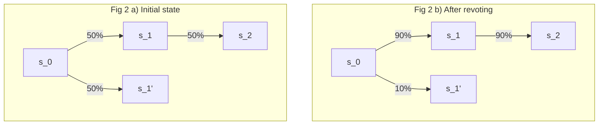
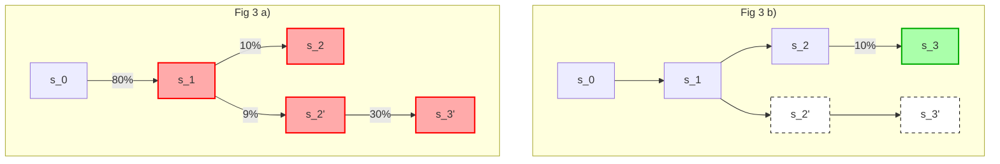
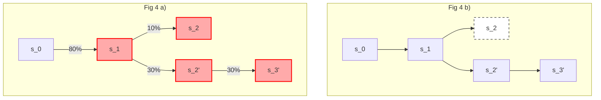

# MD-116: Dongmen Standards - Liveness-favoring Postconfirmation protocol

- **Description**: Provides a set of liveness and correctness requirements for liveness-favoring Postconfirmations protocols.
- **Authors**: [Liam Monninger](mailto:liam@movementlabs.xyz)
- **Approval**: 
- **Etymology**: These standards were originally drafted in the Dongmen neighborhood of Taipei. 

## Overview

We suggest and investigate a protocol which is **quasi-synchronous**, **fork-transferable**, **fork-perfect**, and **minority-aware**. The last three of these terms are introduced and defined in this MD.

However, we already arrive at the conclusion that a protocol that satisfies the **quasi-synchronous** requirement does not provide BFT protection. That is, confirmed branches (created through a state fork) may exist, that do not have a supermajority of support.

For a protocol that does satisfy BFT requirements, see the [MD-117: Ximen Postconfirmations Standards](https://github.com/movementlabsxyz/MIP/tree/l-monninger/dongmen-standards/MD/md-n).

#### Motivation

As identified in [MD-3](https://github.com/movementlabsxyz/MIP/tree/main/MD/md-3), [MD-4](https://github.com/movementlabsxyz/MIP/tree/main/MD/md-4), [MD-5](https://github.com/movementlabsxyz/MIP/tree/main/MD/md-5), [MIP-34](https://github.com/movementlabsxyz/MIP/pulls?page=2&q=is%3Apr+is%3Aopen), and [MIP-37](https://github.com/movementlabsxyz/MIP/pull/37), naive interpretations--such as MCR--of the Postconfirmations protocol fall short of modern BFT expectations. 

We summarize the shortcomings relevant to these standards as follows:

1. **Liveness issues**:
Votes on a given commitment height may never arrive as the postconfirmation attesters may become inactive, which could stall the liveness of the protocol.
Thus, Postconfirmations protocols that do not define synchronization times, timeouts and/or a view change on who is the attester committee, can loose liveness indefinitely.

2. **Temporary forks**:
Failure to come to consensus presents a liveness shortcoming. Permanent disagreement about the state on L2 means that the network will never progress to the next accepted state. We assert indefinite disagreement is unnecessary in the context of Postconfirmations, as attesters may change over time or their view of the state may change.

Certain types of Postconfirmation protocols are, thus, **not in fact BFT consensus protocols.** MCR, for example--if implemented with a single vote per commitment slot height or without any bound on when the slot moves to a new committee--may remain in permanent disagreement.

For more detailed information on these properties, see [BFT Synchronicity and Liveness](#a1-bft-synchronicity-and-liveness).

## Definitions

- **Fork and Branch**: A fork on L2 is the event of a divergence in what is considered the "correct" state on L2. A branch is a chain of blocks (or consensus rounds). A fork creates two or more branches.

- **Quasi-models**: We attempt to transfer the concept of message propagation guarantees in network models to the Postconfirmation protocol. For more details on the models, see [Appendix A1.1]().
  - **Quasi-synchronous**: The protocol assume that all relevant voting messages are delivered within time $\Delta$. Based on the received votes, the protocol will make a decision. Messages destined to be handled within the bound may arrive outside of these bounds, however, they are then ignored. It is **liveness-favoring**.
  - **Quasi-partially synchronous**: A supermajority of votes are delivered within time $\Delta$ at some finite point in the future. Steps are taken to ensure that the protocol can make a decision at some finite point in the future. This is similar to the concept of Global Stabilization Time (GST). This is **safety-favoring**.
  - **Quasi-asynchronous**: There is no bound on when the supermajority of votes will be delivered. This is **safety-favoring**.

- **Branch-transferable**: A property of a protocol that allows consumers to transfer application state from a forked chain of consensus rounds (i.e. a branch) while preserving verifiability and audibility, even in the presence of honest partitions or temporary disagreement.

- **Branch-perfect**: A refinement of PBFT’s intersection safety. A branch is branch-perfect if every round of consensus along the branch intersects with at least one unit of honest voting power *relative to the branch*. This ensures local safety guarantees on a per-branch basis, even in the presence of multiple non-merging branches.

- **Perfect Expert**: A theoretical construct (adapted from [expert learning models](https://people.csail.mit.edu/ronitt/COURSE/S16/notes7.pdf)) which assumes the existence of a strategy (or sequence of decisions) that would have been globally optimal or correct. In consensus, identifying this expert is analogous to identifying a perfect branch. Branch-perfectness aims to localize this ideal to a given branch in the presence of asynchrony or faults.

- **Minority-aware**: A protocol property requiring formal understanding and bounded valuation of consensus decisions made by a Byzantine minority. This property mandates a clear risk model quantifying the probability and cost of such decisions under quasi-synchrony when liveness demands finality at fixed times.

## Desiderata

### D1: Liveness-favoring and quasi-synchronous

**User journey**: Consumers of Postconfirmations can rely on agreement to be achieved within an known time delta w.r.t. to the confirming ledger.

**Justification**: A quasi-synchronous protocol provides predictable points in time by which a decision will be made. It is liveness-favoring. It does not provide guarantees against byzantine actors with respect to selecting the correct state for the L2.

The requirement of **quasi-synchronicity** means that if a supermajority decision is not made by some time $\Delta$, some form of minority decision must effectively be made, for the protocol to make progress. In essence this means that the protocol is **liveness-favoring**, see Appendix [A1.2]().

Regardless, Dongmen Postconfirmation protocols are required to provide a formal model of the expected value of consensus on a Byzantine minority w.r.t. the value of the state and intrinsic rewards. In other words, they must explain the nature of eventual safety (with respect to Byzantine assumptions) or else describe the non-BFT nature of the protocol at quasi-synchronous decision points.

### D2: Branch-transferable

**User journey**: Consumers of Postconfirmations can safely transfer state from the ledger by following a set of standards.

**Justification**: The transfer of value from a BFT system to other systems is critical in the modern DLT landscape. How to do this safely is critical to both application and general ledger usage.

### D3: Branch-perfect

**User journey**: Consumers of Postconfirmations can rely on consensus to identify the assumed perfect expert w.r.t. a given fork.

**Justification**: We assert the perfectness of PBFT argued for in [PBFT and Perfectness](#a2-pbft-and-perfectness) is an essentially quality of modern BFT networks. 

### D4: Minority-aware

**User journey**: Consumers of Postconfirmations can rely on a formalized understanding of Byzantine attacks w.r.t. the resulting state and intrinsic rewards. This may additionally consider [branch-transferrable](#d2-branch-transferable) stipulations.  

**Justification**: We assert that the [**quasi-synchronicity**](#d1-quasi-synchronous) of Postconfirmations complicates BFT assumptions. These complications must be well understood for a given protocol.

## Appendix

### A1: Classification of the Protocol

#### A1.1: Network Synchronicity Models

In Network theory, the following models for message propagation and arrival are considered:

| Property / Feature             | Synchronous               | Partially Synchronous         | Asynchronous          |
|-------------------------------|---------------------------|-------------------------------|------------------------|
| Network Delays Known?         | Yes                       | Yes, after unknown GST                            | No                     |
| Guaranteed bounded message arrival                      | Yes                      | Yes, after unknown GST                | No                     |

Similarly here we define Quasi-metrics for the Postconfirmation protocol that exists on the L1 contract. For this we focus on the timely delivery of votes from the L2 on the L1.

| Property / Feature             | Quasi-synchronous               | Quasi-partially Synchronous         | Quasi-asynchronous          |
|-------------------------------|---------------------------|-------------------------------|------------------------|
| Liveness possible?            | Yes, but unsafe                        | Yes, eventually               | No           |
| Safety Guarantee              | Have to use unsafe majority assumptions  | Safe   | Safe         |
| Byzantine Fault Tolerance               | No | Yes    | Yes          |
| Performance                   | High under tight control  | Adaptive but with delays      | Not applicable         |

#### A1.2: Liveness- and Safety-Favoring Assumptions

We may also consider the protocol in terms of liveness-favoring and safety-favoring assumptions.

| Property / Feature             | Liveness-favoring               | Inbetween Liveness-favoring and Safety-favoring         | Safety-favoring         |
|-------------------------------|---------------------------|-------------------------------|------------------------|
| Liveness possible?            | Yes, but unsafe                        | Yes, eventually               | No           |
| Safety Guarantee              | Have to use unsafe majority assumptions  | Safe   | Safe         |
| Byzantine Fault Tolerance               | No | Yes    | Yes          |

### A2: PBFT and Perfectness

[PBFT](https://pmg.csail.mit.edu/papers/osdi99.pdf) introduced a protocol which ensures consecutive rounds of consensus intersect in at least one unit of honest voting power via the Generalized Pigeon Hole Principle. The transitivity of this property ensures that a chain of consensus rounds must intersect in at least one unit of honest voting power. 

Under an [experts model](https://people.csail.mit.edu/ghaffari/AA19/AAscript.pdf?utm_source=chatgpt.com) understanding of PBFT systems, we can make an assumption that there is a perfect expert and thus that this perfect expert is identified by consensus. This, in turn, renders PBFT a lossless approximate algorithm.

If we consider allowing forks, however, it is initially unclear how perfectness translates. Naively, our assumption that there is globally one perfect expert means that there is one **perfect** branch.

We can, however, apply a reduced criterion and state that a each **branch** be comprised of a chain of consensus rounds each of which intersect in one unit of honest voting power w.r.t. to the fork itself. We call this **branch-perfectness**.

Preserving **branch-perfectness** reduces to ensuring the fraction of stake which was involved in the fork and which resulted in the winning branch maintains a supermajority. If this does not occur, then it is impossible to have the guaranteed intersection. 

### A3: Example Minority-Aware Protocol

Consider the following quasi-synchronous protocol:

1. Votes $v \in V_h$ are cast for states $s \in S_h$ at height $h \in H$.
2. A decision in made on a vote $s, h$ by time $t \in T$.
    1. If $V_{h}(s) > \frac{2*|V|}{3}$, accept $s, h$
    2. Otherwise, begin **Play Foward** algorithm.

The **Play Forward** algorithm is as follows:

Given a duration $d: (t + d) \in T$, and a slot duration $l: (d/l) \in T$, for each slot $l'$ in the duration $t, t + l, ... t + d$ $h' = h + (l'/l)$. 

If $l' > d$, accept the root $s, h$ of the heaviest remaining subtree by weight. 

Otherwise, for each tuple $(s, h') \in V_{h'}$ 

1. If $V_{h'}(s) > \frac{2*|V|}{3}$, accept $s, h$, i.e., the original commitment at the root of the subtree. 
2. If $V_{h'}(s) = \text{argmin} V_{h'}(s)$, remove all tuples $s, h \leq V_{h'}(s)$ and their descendants from the entire tree.

At any given round, the number of ways the Byzantine fraction $\frac{|V|}{3} - 1$ can be eliminated is $n' = (incomplete)$ out of the total number of combinations $n$. 

Thus, the probability of that the Byzantine fraction makes it to the final acceptance is $p =(incomplete)$. 

All other subtrees are considered honest partitions. Accepting any of these is considered **perfect**.

Thus, our protocol now admits a $p$ probability of Byzantine attack. The expected value of Byzantine consensus attack is $p(Val(s) + Val(Rewards(h)))$.

This is **quasiy-synchronous** because a decision will be cast on $h$ by $t + d$. 

### A6: Examples Minority-Selecting Protocols

Consider the following quasi-synchronous protocol:

Voters, where $N$ is the number of voters, cast their votes for states $s$ at slot height $h$. We assume the protocol requires a fullfilled slot at every height. The first recorded vote on height $h$ determines the timestamp $t_h$ of that slot. Let $\sigma(s_h)$ be the number of votes for state $s_h$ at slot height $h$. A voter can cast at most one vote per state per slot height. (So it may be still possible that he has multiple votes for the same slot height).

Slots are handled sequentially, i.e. if slot height $h$ has not been processed, then slot height $h+1$ will not be processed.

The basic protocol looks as follows:

1. Vote and potential vote propagation (described in next subsections)
1. For each undecided height $h^+ < h$
    1. If $\sigma(s_h^+) > \frac{2}{3}N$ AND $t \leq t_h^+ + \Delta$, accept the tuple $(s_h^+, h^+)$. Continue processing slot $h^++1$.
    2. Else If $t > t_h^+ + \Delta$, select the branch with the highest weight. Continue processing slot $h^++1$.
    3. Else Return

Note that 2.ii) is where the **quasi-synchronous nature** of the protocol is used, and which implies a liveness-favoring property.

*Fig 1 a: Committee A (🟥 ). Time = Δ. Committee A (red) was active for (0..Δ]. `s_2` gathers the highest number of votes and will be committed. Votes for `s_2'` and `s_3'` will be ignored.*

*Fig 1 b: Committee B (🟩 ). Time = 2Δ. Committee B (green) was active for (Δ..2Δ]. `s_3` will be committed.*

> :warning: Since nodes could set the timestamp arbitrarily into the future for a given slot height, we MUST require that nodes cannot vote for heights that are too far away from accepted heights. This is important for the quasi-synchronous model.

**Revoting**: We assume that the nodes can become faulty or byzantine, vote for a branch with state $s'_h$ and may acknowledge they voted for the wrong branch. We suggest that these nodes should be permitted to support a different branch (with state $s_h$) that they deem correct (and that is in conflict with their previous vote). In order to vote for $s_h$ they MUST be permitted to cast an additional vote (**revote**) for $s_h$ at height $h$.

*Fig 2 a: Initial state. Vote support is indicated on the arrows.*  
*Fig 2 b: After revoting.*

Since a the choice for a new branch would mean that all previous votes are invalid (from the point of view of the voter itself), this raises the question of how to handle revotes, and in particular the ancestor votes that depend on this.

**Protocol Options**: A combination of the following two properties can be used to achieve the desired protocol:

- **Revoting**
    1. Revoting is not allowed. (Voter can cast one vote per slot height only)
    1. Revoting is allowed.
- **Counting** of votes
    1. Double counting, i.e., all votes count, including votes before revoting.
    1. Only the last vote counts.
- **Propagation** of votes
    1. Votes are cast for a branch, not a state. (less transactions but per transaction more computation)
    1. Votes are cast for a state, not a branch. (more transactions but per transaction less computation)

Lets explore sone of the options:

#### A6.1: Revotes, double counting, no propagation

Step 1 of the above algorithm becomes

1. Given a vote for state $s_h$ at slot height $h$, update
 $\sigma(s_h) \leftarrow \sigma(s_h) + 1$.

**What can go wrong?**

- If no branch is finalized at $t_h^+ + \Delta$, the protocol will select the branch with the highest weight, this may not be secure against a Byzantine minority.
- Honest actors have to take care of apply their votes to all heights, otherwise the protocol will be less safe. See the Figure below, where $s_2'$ is favored over $s_2'$ despite that $s_3$' has much more weight.
- Since votes of a node can double count, it is possible that eventually the wrong branch wins, since a byzantine actor plus the initial wrong "honest" votes can outvote the correct branch.

*Fig 3 a: Committee A (🟥 ). Time = Δ. Committee A was active for (0..Δ]. State `s_2` gathers the highest number of votes and will be committed. Votes for `s_2'` and `s_3'` will be ignored.* 

*Fig 3 b: Committee B (🟩 ). Time = 2Δ. Committee B was active for (Δ..2Δ]. `s_3` will be committed.*

#### A6.2: No Revotes, single-counting, with propagation

Here we would like to entertain that nodes can resubmit their vote for a different branch, but existing votes cannot be changed. We also would like to propagate votes a long a branch to ensure that this branch is maximally supported.

Step 1 of the above algorithm becomes

1. Given a vote for state $s_h$ at slot height $h$, update
    1. $\sigma(s_h) \leftarrow \sigma(s_h) + 1$.
    2. For each ancestor state $s_{h-k}$, $k>0$ of $s_h$ in the tree that is not yet voted on, $\sigma_{h-k}(s_{h-k}) \leftarrow \sigma_{h-k}(s_{h-k}) + 1$.

We note this is marginally different to the previous example. It differs only in that a voter can batch votes for a branch not a state. This is not a meaningful solution but it is the precursor to the next example.

**What can go wrong?**
1. Same problem as previous example.

#### A6.3: Revotes, single-counting, with propagation

Assume the previous protocol, but votes are removed from branches that are not supported any longer. This means we override previous votes.

Step 1 of the above algorithm becomes

1. Given a vote for state $s_h$ at slot height $h$, update
 $\sigma(s_h) \leftarrow \sigma(s_h) + 1$.
2. For each ancestor state $s_{h-k}$ of $s_h$ in the tree that is not finalized and for which the vote has not already been cast, $\sigma_{h-k}(s_{h-k}) \leftarrow \sigma_{h-k}(s_{h-k}) + 1$.
3. For each height $h^+< h$, remove all votes for $s_{h^+}$ from a branch that is not an ancestor of $s_h$.

> :bulb: This has infact similar behavior and properties to [Tangle 2.0 Leaderless Nakamoto Consensus on the Heaviest DAG](https://ieeexplore.ieee.org/document/9907014). However, here we have a tree and an L1 to synchronize and remove problems with partitions, which makes the challenges much easier.

**What can go wrong?**

- If no branch is finalized at $t_h^+ + \Delta$, the protocol will select the branch with the highest weight, this may not be secure against a Byzantine minority.

*Fig 4 a: Committee A (🟥 ). Time = Δ. Committee A was active for (0..Δ]. State `s_2'` gathers at least the minimum number of votes of any state in that branch.*  

*Fig 4 b: Committee B (🟩 ). Time = 2Δ. Committee B was active for (Δ..2Δ]. Nothing happens.*

## Changelog
