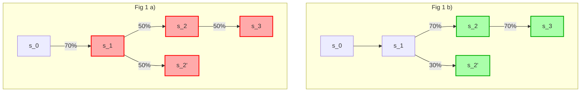

# MD-117: Ximen Standards for Postconfirmation protocols

- **Description**: Provides a set of liveness and correctness requirements for Postconfirmation protocols that may be more safety-favoring than the [Dongmen Standards](https://github.com/movementlabsxyz/MIP/pull/116).
- **Authors**: [Liam Monninger](mailto:liam@movementlabs.xyz)
- **Approval**:
- **Etymology**: These standards were originally drafted as a planned but later alternative to the [Dongmen Standards](https://github.com/movementlabsxyz/MIP/pull/116) and so bear the name of a "younger" Taipei neighborhood, Ximen.

## Overview

The [Dongmen Standards](https://github.com/movementlabsxyz/MIP/pull/116) (MD-116) acknowledge the inability of quasi-synchronous protocols to satisfy traditional BFT assumptions. These standards accept MD-116.D2,3 but reject [MD-116.D1](https://github.com/movementlabsxyz/MIP/tree/l-monninger/dongmen-standards/MD/md-n#d1-fully-synchronous) (quasi-synchronicity) instead proposing [MD-117.D1](#d1-partially-synchronous) (quasi-partial-synchronicity, defined in MD-116) in its place. 

As a result, [MD-116.D4](https://github.com/movementlabsxyz/MIP/tree/l-monninger/dongmen-standards/MD/md-n#d4-minority-aware) (minority awareness) is no longer relevant. However, a request for a clear consideration of attacks on the indefinite nature of the agreement synchronicity is requested. 

## Definitions

- **Commitment Hostage Attack**: An adversarial strategy in which a network or participant delays confirmation of a block (or decision) indefinitely by exploiting asynchrony, forcing the protocol into a state of limbo. These attacks often require post-facto reasoning or off-path resolution to identify and mitigate.

- **Message Timing Attack**: A broader class of strategies in which an adversary manipulates message timing or node behavior to degrade the liveness or fairness of a consensus protocol, often without violating safety directly.

## Desiderata

### D1: Safety-favoring and quasi-partially-synchronous

**User journey**: Consumers of Ximen Postconfirmations consensus can rely on agreement to be achieved at some finite point in time w.r.t. to the confirming ledger. 

**Justification**:
A quasi-partially synchronous protocol, as defined in [MD-116](https://github.com/movementlabsxyz/MIP/tree/l-monninger/dongmen-standards/MD/md-n), provides a way of changing the view on who decides the progress of the protocol. It is safety-favoring.

The requirement of **quasi-partial-synchronicity** means that for a given height, if a supermajority decision is not made by some time $\Delta$, a new committee will be elected for the protocol to make progress. However, it is not known when this progress will happen.

In essence this means that the protocol is **safety-favoring**, see Appendix [A1.2]() of [MD-116](https://github.com/movementlabsxyz/MIP/tree/l-monninger/dongmen-standards/MD/md-n), rather than liveness-favoring. This is because it does not render predictable points in time at which consensus will be known. However, by changing the committee, we give the protocol the chance to recover from an inactive committee.

### D2: Describe attacks on indefinite quasi-asynchronicity

**User journey**: Consumers of Ximen Postconfirmations consensus can interpret a well-considered discussion of attacks on the indefinite nature of quasi-asynchronicity. For a given Ximen Postconfirmation protocol, best efforts should be made to mitigate these attacks. 

**Justification**: The Ximen Standards seek to ensure common synchronicity attacks, such as [Commitment Hostage Attacks](https://github.com/movementlabsxyz/MIP/tree/main/MD/md-3), are well-considered for an adhering protocol. Owing to the complexity and often [off-path](https://economics.stackexchange.com/questions/57998/on-and-off-equilibrium-path-game-theory) nature of these attacks, the Ximen Standards recognize that full and rigorous criteria for protections against these attacks are not practical. 

## Appendix

### A1: Example

We build on the example of [MD-116.A6.3](https://github.com/movementlabsxyz/MIP/tree/l-monninger/dongmen-standards/MD/md-n#a63-revotes-single-counting-with-propagation) to build a simple example of a protocol that satisfies the desiderata above.

We assume the protocol progresses through epochs, which we argue in this this example is similar to a view change. If the epoch changes, new voters must vote on the oldest not decided height.

We change step 2 of the algorithm to be:

1. For each undecided height $h^+ < h$
    1. If $\sigma(s_h^+) > \frac{2}{3}N$ AND $t \leq t_h^+ + \Delta$, accept the tuple $(s_h^+, h^+)$. Continue processing slot $h^++1$.
    3. Else Return

**What can go wrong?**

- Liveness may get stuck for epoch lengths. The L1 synchronizes the committee at epoch boundaries, and if enough committee members are honest and live eventually the protocol will be live again.

*Fig 1 a: Committee A (🟥 ). Time = Δ. Committee A (red) was active in time (0..Δ]. `s_1` gathers 70% of votes and will be committed. Votes for `s_2` and `s_2'` will be ignored.*

*Fig 1 b: Committee B (🟩 ). Time = 2Δ. Committee B (green) was active in time (Δ..2Δ]. `s_3` will be committed.*

## Changelog
