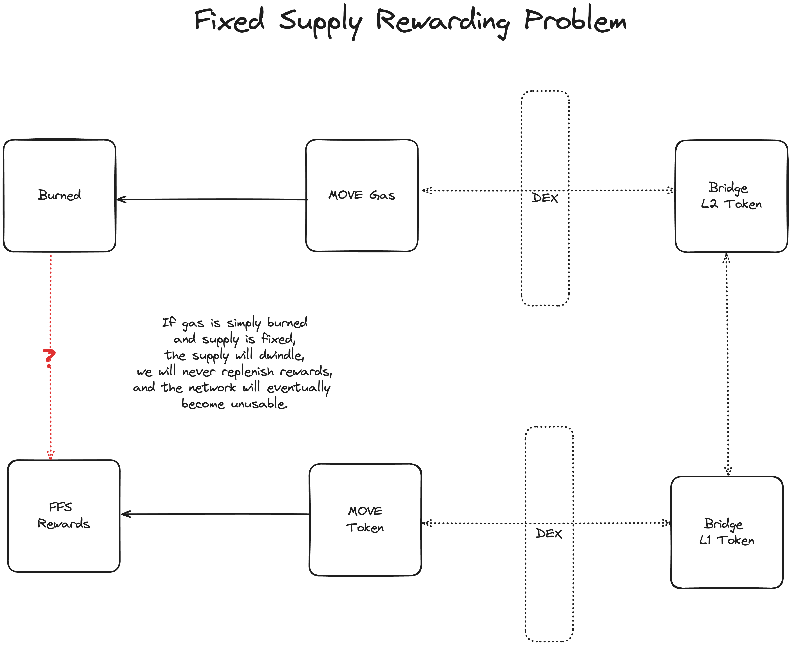

# MD-38: Provide for Fixed Token Supply when Using Native Bridge and Fast Finality Settlement (FFS)
- **Description**: Requests for Movement Improvement Proposals (MIPs) to provide for fixed token supply when using the Native Bridge and Fast Finality Settlement (FFS).
- **Authors**: [Liam Monninger](mailto:liam@movementlabs.xyz)
- **Reviewer**: [Andreas Penzkofer](mailto:andreas.penzkofer@movementlabs.xyz)

## Overview

Using Fast Finality Settlement with the Native Bridge presents a challenge when the token supply is fixed. 

Burning token on the L2 without a way to return it to pools on the L2 or the L1 will result in a **deflationary token**, i.e., the supply decreases over time and eventually reaches 0 rendering any operations relying on gas impossible. 

On the other hand, providing minting capabilities which involve the operation of fallible services can result in the violation of a constant supply principle and lead to **either a deflationary or inflationary token** and the opportunity for **byzantine attacks**.

Using FFS-Postconfirmation requires a reward scheme on L1. On the other hand, users pay fees on L2 into an L2 pool. Namely, in this context, trying to use the same token for both L2 gas and L1 rewards requires that the token be bridged back over from L2 to L1, or else rely on a trusted signer to relay the gas. This document outlines the challenges and potential solutions for this problem.

Users of the Movement SDK should be **informed of different approaches and trade-offs when using the Native Bridge and Fast Finality Settlement with a fixed token supply.** This document provides an initial conceptual framing towards that end. 

This document also seeks a response to the concerns raised in [MD-20](https://github.com/movementlabsxyz/MIP/pull/20).

## Desiderata

### D1: Provide MIPs for Approaches Presented in Appendix A1 and Similar

**User Journey**: Developers can reference MIPs for **different approaches to using the Native Bridge and Fast Finality Settlement with a fixed token supply.** Developers can also **reference rejected MIPs** to understand why certain approaches are not recommended.

**Justification**: Developers need a clear understanding of the different approaches to using the Native Bridge and Fast Finality Settlement with a fixed token supply. MIPs provide a clear and standardized way to document these approaches.

### D2: Provide Staged Approaches for Networks Building on the Native Bridge and Fast Finality Settlement

**User Journey**: Developers can reference approaches spawned from these desiderata to understand how to build networks using the Native Bridge and Fast Finality Settlement with a fixed token supply **in stages.** For example, developers can initially roll out a network using the **"Free Execution" approach and then transition to the "Noble Attester"** approach and so on. Some formats may be more suitable for certain stages of network development and release than others. 

**Justification**: Developers need a clear understanding of how to build networks using the Native Bridge and Fast Finality Settlement with a fixed token supply in stages. This allows developers to roll out networks in a more controlled and manageable way.

**Recommendations**:
- Ensure that achieving upgrades for each execution layer to support these transitions are also documented in MIPs.

### D3: Provide Additional Software Necessary to Achieve Accepted Approaches in Movement SDK

**User Journey**: Developers can use **modules from the Movement SDK** to achieve the approaches presented in Appendix A1 and similar.

**Justification**: Developers need a clear understanding of how to use the Movement SDK to achieve the approaches presented in Appendix A1 and similar. This allows developers to build networks using the Native Bridge and Fast Finality Settlement with a fixed token supply more easily.

### D4: Provide Guides and Software for Genesis Procedures and Initial Conditions of L1 and L2 Networks Using the Native Bridge and Fast Finality Settlement

**User Journey**: Developers can use guides and software from the Movement SDK to understand how to set up the **initial conditions of L1 and L2 networks** using the Native Bridge and Fast Finality Settlement.

**Justification**: Developers need a clear understanding of how to set up the initial conditions of L1 and L2 networks using the Native Bridge and Fast Finality Settlement. This allows developers to build networks using the Native Bridge and Fast Finality Settlement with a fixed token supply more easily. For example, one possible usage approach could be to generate an initial supply on the L1 and run a privileged bridge and voucher swap exchange to the L2 such that overall circulation is grounded in the L1 mint.

### D5: Provide and Argument Agains the Need to Resolve AB-FFS Fixed Supply Concerns

**User Journey**: Developers, exchanges, and users can understand why the bridge can be assumed reasonably secure and inherent fallibility is within network security contraints given a set of assumptions.

**Justification**: We can argue, for example, that many other bridge services use a trusted signer and that said trusted signer is uncomprimised is a fundamental and acceptable assumption. 

## Errata
<!--
  Errata should be maintained after publication.

  1. **Transparency and Clarity**: An erratum acknowledges any corrections made post-publication, ensuring that readers are not misled and are always equipped with the most accurate information.

  2. **Accountability**: By noting errors openly, we maintain a high level of responsibility and ownership over our content. It’s an affirmation that we value precision and are ready to correct oversights.

  Each erratum should briefly describe the discrepancy and the correction made, accompanied by a reference to the date and version of the desiderata in which the error was identified.

  TODO: Maintain this comment.
-->

## Appendix

### A1: Suggested Solutions for Fixed Token Supply

| Name              | Description                           | Gas Destination       | Reward Form          | Challenges                          |
|-------------------|---------------------------------------|-----------------------|----------------------|-------------------------------------|
| **Decoupled**   | • Gas spent on the L2 deposited to pools on the L2.   • Rewards on the L1 are issued in a LP token which is demurrage.   • Ideally, intermediary tokens are used in the bridge to shield gas and staking token from bridge fallibility. | Pool on the L2         | FFS LP Token; voucher periods can be assigned. | • LP Token's demurrage assigns a lifetime to the viability of the settlement protocol which will require a new or asymptotic token voucher or token generation event at some point. |
| **Trickle-back** | • Gas spent on the L2 recirculates to pools on the L2.   • Rewards are provided on the L2 for bridging back to the L1 at the address of the FFS LP Token.   • Ideally, intermediary tokens are used in the bridge to shield gas and staking token from bridge fallibility. | Pool on the L2         | Staking Token               | • Rewards for pool providers to bridge back to the L1 at the address of the FFS LP Token need to be sufficient.   • Pool providers likely need to have only custodial access to token, otherwise intended rewarding game theory would likely be intractable. |
| **Settle with Gas**            | • The settlement messages include the amount of gas spent. The LP for the FFS claims token locked in the L1 bridge.   • Bridge may still benefit from intermediary tokens.                              | FFS LP Token        | Staking Token               | • Unclear how to handle forks.   • Centralization remains as FFS contract needs to have capability to claim token locked in L1 bridge. However, this can be governed on-chain in this case.   • Intermediary tokens can still help reduce attack surface via the bridge. Now attacks would likely focus on exploiting capabilities of the settlement contract to unlock token. |
| **Noble Gasmaster**      | • A trusted signer is responsible for successfully relaying gas spent. The use of intermediary tokens in the bridge is moot.              | FFS LP Token         | Staking Token             | • Centralized signer.   |
| **Free Execution**      | • Execution does not charge gas fees, meaning gas token stays in circulation and supply does not change.             | Nowhere         | Staking Token or FFS LP Token             | • No sybil resistance; not suitable for anything but promotional or initial stages of a network.   Gas fees do not contribute to rewards, so rewards rely solely on initial grant and perhaps LP. Execution does not have cost in token and so cannot drive work-based benefits in token. |
| **Gas Lock**     | • Execution does not charge permanent gas fees, meaning gas token stays in circulation and supply does not change.   Gas for a transaction gets locked away until a time or block lock expires and then is returned to the account.          | Nowhere/Temporary Lock         | Staking Token or FFS LP Token             | • Sybil resistance effectively only applies over the window of the time-lock or the amortized windows of the time-locks. Game theory is more complex for standard gas attacks.   • Gas fees do not contribute to rewards, so rewards rely solely on initial grant and perhaps LP. Execution does not have ultimate cost in token and so cannot drive work-based benefits in token. |

