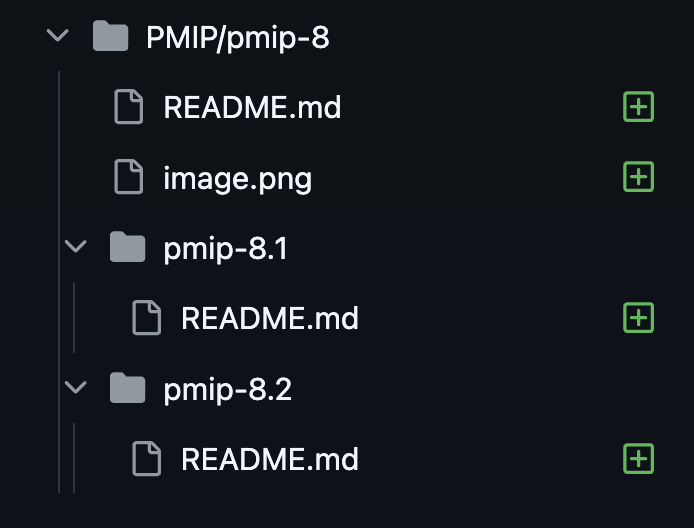

# MD-93: Parent-Child MIPs and PMIPs
- **Description**: Provide formal structure for parent and child MIPs.
- **Authors**: [Andy Golay](mailto:andy.golay@movementlabs.xyz)

## Overview

Provide formal structure for parent-child MIPs. For more complicated MIPs, or MIPs which have implementations specific to various software stacks, infrastructure providers, etc., it can makes sense for the sake of organization to have child MIPs to add specific details, rather than making the parent MIP too verbose or cluttered.

## Definitions

- **Parent MIP**: The main MIP for to a specific improvement proposal. 

- **Child MIP**: Also MAY be referred to as a sub-MIP. Child MIPs give detail on specific domains referenced within a parent MIP. They are substantial enough that they make sense to refactor into MIPs associated with the parent MIP.

- **PMIP**: Private MIP. These MUST follow the same conventions as MIPs for consistency. 

## Desiderata

### D1: Convention for parent and child MIP file organization and naming

**User Journey**: Proposer/Researcher can adhere to a standardized template for substantial, detailed subsections of MIPs which warrant being categorized as their own related child MIP.

**Justification**: The file organization must be consistent. 

For context, one solution that could satisfy this MD is illustrated in [PR 8 to the PMIP repository](https://github.com/movementlabsxyz/PMIP/pull/8/files):

In this example, the parent MIP is `pmip-8`.

The two child MIPs are `pmip-8.1` and `pmip-8.2`, with their `README`s located in child directories named after their respecxtive MIP names.

In above example, the parent and child MIPs are all be submitted as part of the same PR (PR #8 for the PMIP repository). Future child PMIPs COULD use that same number regardless of their PR number.

Other structures MAY also be suitable. Regardless of the specific structure, a universal standard SHOULD be adopted for greater standardization of MIPs.

