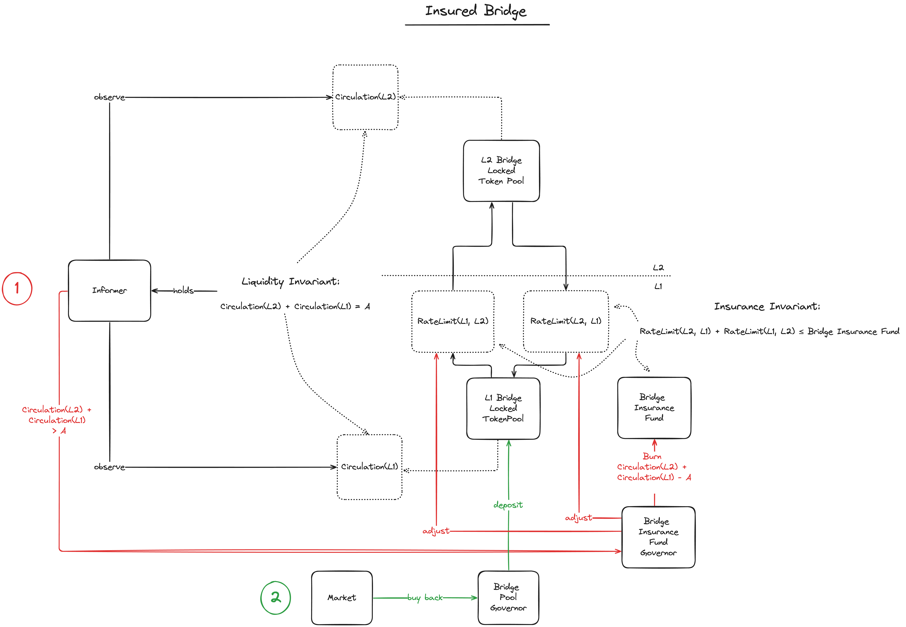

# MIP-56: Rate-Limiter for the Native Bridge
- **Description**: A rate limitation mechanism for the native bridge.
- **Authors**: [Andreas Penzkofer](mailto:andreas.penzkofer@movementlabs.xyz)

## Abstract

The **Rate-Limiter** for the Native Bridge is introduced to de-escalate the risk of double-spends through the bridge by limiting the number of tokens that can be transferred during a certain time frame. The rate limit is determined by the reaction time of the bridge operator, called the **Risk Period**, and the value locked in the **Security Fund**, see [MIP-50](https://github.com/movementlabsxyz/MIP/pull/50).

The Native Bridge Rate Limiter is implemented through a contract on L1. This contract is governed by the Aptos governance framework, see [MIP-48](https://github.com/movementlabsxyz/MIP/pull/48/), and can be updated through a governance process.

## Motivation

The correct operation of the Native Bridge relies on liveness and safety assumptions for the relayer, see [MIP-13](https://github.com/movementlabsxyz/MIP/tree/mip/security_falliblity/MIP/mip-46). If any of these would not hold, the Native Bridge could expose the network to double-spends.

## Specification

The key words "MUST", "MUST NOT", "REQUIRED", "SHALL", "SHALL NOT", "SHOULD", "SHOULD NOT", "RECOMMENDED", "NOT RECOMMENDED", "MAY", and "OPTIONAL" in this document are to be interpreted as described in RFC 2119 and RFC 8174.

*Figure 1: Overview of the Rate-Limiter mechanism for the Native Bridge.*

> [!NOTE] In the following we note that when talk about the Rate-Limiter, we mean the Rate-Limiter contract.

1. The Rate-Limiter SHOULD be implemented as a contract on L1.
1. The Rate-Limiter MUST handle both the **transfer directions** L1 -> L2 and L2 -> L1. 
1. For either transfer direction the transfer value MUST be tracked, i.e. the transferred value for L1->L2 should be recored in `budget_L1L2` and for L2->L1 in `budget_L2L1`.
1. The Rate-Limiter SHOULD be governed by the Aptos governance framework, see [MIP-48](https://github.com/movementlabsxyz/MIP/pull/48/), and can be updated through a governance process.
1. The security fund contract, see [MIP-50](https://github.com/movementlabsxyz/MIP/pull/50), MUST update `security_fund` in the Rate-Limiter contract if the amount of funds changes in the security fund contract.
1. The `risk_period` value SHOULD be set by the governance process and updated through the governance process. It estimates the maximum reaction time to check whether transfers have been completed correctly.
1. For a given transfer direction, the Rate-Limiter should disable transfers across the bridge if the rate limit is exceeded for that transfer direction.
1. The rate limit MUST be set according to the equation `rate_limit = security_fund / risk_period * 0.5`. This is to ensure that each bridge transfer direction is ensured sufficiently.
1. The Rate-Limiter MUST reject a transfer request if the rate limit is exceeded for that transfer direction by that transaction. I.e. for L1->L2 the Rate-Limiter MUST reject any transfer that would violate `budget_L1L2 < rate_limit` and for L2->L1 the Rate-Limiter MUST reject any transfer that would violate `budget_L2L1 < rate_limit`.

### Optimization

1. The Rate-Limiter COULD be implemented as a contract on L2 to save on gas costs. However the security of this approach must be carefully evaluated, as the base truth for the protocol is the L1, which entertains ultimate settlement.
1. The rate limit COULD be unbalanced between the two transfer directions, i.e. `rate_limit_L1L2 = security_fund / risk_period * weight` and `rate_limit_L2L1 = security_fund / risk_period * (1-weight)`. This would allow for a more flexible rate limit, if the network experience higher inflow into or outflow from L2.
1. The Rate-Limiter COULD consider the budget across both directions as a single budget. This would apply the above equation with a dynamic `weight`. However this raises the question of the asynchrony of events between the two directions, and such an approach should be analyzed carefully.
1. The `budget_L1L2` and `budget_L2L1` values COULD be reset, if the governance is convinced that all transfers have been processed correctly and are not revertible, however this is risky due to the introduction of human error. Alternatively, an automated approach could be considered that takes into account all completed transfers. However, this is out of scope for this MIP.
1. Alternatively to the security fund contract updating the `security_fund` value in the Rate-Limiter contract, the Rate-Limter contract could read the `security_fund` value from the security fund contract. However, this raises the question of how regular the Rate-Limiter should update the value, and also it would imply that occasionally the Rate-Limiter could have an outdated value. It is more risky.

### Limitations

#### Security Considerations

The Governance imposes a risk on the Rate-Limiter, as it could be manipulated by the governance which holds control over the `risk_period` value. However, the Governance is also responsible for the security fund and other components in the Network. Furthermore the Governance is designed with the intention of moving to a more decentralized design eventually.

#### Bad user experience when budget is nearly exhausted

If the budget is nearly exhausted, the Rate-Limiter will reject transfers. This could lead to a bad user experience, as users would not be able to transfer tokens across the bridge. However, this is a necessary trade-off to ensure the security of the bridge. User experience could be improved by having warnings issued by a client that reads the remaining budget from the Rate-Limiter contract.

## Reference Implementation

## Verification

If the Rate-Limiter handles each transfer direction budget individually, requests for transfers are applied deterministically through the L1 ordering. Thus no asynchronous assumptions are introduced by the Rate-Limiter.

If the Security Fund contract updates the `security_fund` value in the Rate-Limiter contract, the Rate-Limiter can be sure to have the correct value for the rate limit.

## Errata

## Appendix

## Copyright

Copyright and related rights waived via [CC0](../LICENSE.md).