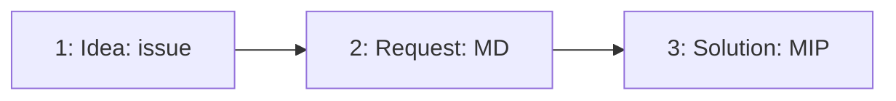
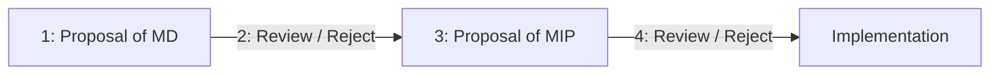

# MIP-0: Formalize Movement proposals

- **Description**: A process through which Movement Improvement Proposals standardize and formalize specifications for Movement technologies.
- **Authors**: [Liam Monninger](mailto:liam@movementlabs.xyz), Andreas Penzkofer
- **Desiderata**: [MD-0](../../MD/md-0)
- **Approval**: :white_check_mark:

## Abstract

This document formalizes the process through which Movement Improvement Proposals standardize and formalize specifications for Movement technologies, through MIPs (Movement Improvement Proposals), MDs (Movement Desiderata), and issues.

## Motivation

Movement technologies continually evolve, and there's a need to ensure that the process of proposing and adopting changes is both organized and standardized. By establishing MIPs, we aim to facilitate the introduction of new features or improvements, making sure they are well-vetted, discussed, and documented. This ensures the integrity of Movement technologies, making it easier for third parties to adopt and adapt to these changes.

## Specification

_The key words "MUST", "MUST NOT", "REQUIRED", "SHALL", "SHALL NOT", "SHOULD", "SHOULD NOT", "RECOMMENDED", "NOT RECOMMENDED", "MAY", and "OPTIONAL" in this document are to be interpreted as described in RFC 2119 and RFC 8174._

### Extensions to this MIP

We treat the following documents as extensions to this MIP:

- [root README](../../README.md)
- [MD template](../../md-template.md)
- [MIP template](../../mip-template.md)
- [MG template](../../mg-template.md)

### High-level process

There are two lifecycle streams: the **github lifecycle** and the **approval lifecycle**. The approval lifecycle is reflective of which MIPs have been approved for implementation. The github lifecycle is reflective of the progress of the MIP in terms of its readiness and review.

#### Github lifecycle

The github lifecycle of a proposal is

1. create a [new issue](https://github.com/movementlabsxyz/MIP/issues) to register the intent to write an MD/MIP and its scope.
2. If 1. achieves enough traction start writing an MD. Create a PR by using [this Draft](../../md-template.md).
3. Ideally the author starts an MIP that addresses an MD, after the MD is approved by governance (see Section [Approval lifecycle](#approval-lifecycle)). However, and in fact in most cases, this restriction will not be implementable and authors MAY start with the MIP in parallel. The author MUST start an MIP using [this Draft](../../mip-template.md). But SHOULD do so in a separate PR to the MD.

**Status terms**
An MIP/MD is proposed through a PR. Each MIP/MD PR should have a status. For additional specification, see the [root README Section "Status terms"](../../README.md#status-terms).

#### Approval lifecycle

An MIP and MD is **approved** (:white_check_mark:) or **rejected** (:x:) by the governance.

The approval lifecycle of a proposal is

1. The author flags their MD to be reviewed by the governance.
1. The governance reviews the MD and approves or rejects it.
1. If approved, the author flags their MIP to be reviewed by the governance.
1. The governance reviews the MIP and approves or rejects it.

### Roles

#### Governance

A governance is responsible for overseeing the Movement Improvement Proposal process. The governance is responsible for approving or rejecting proposals, and for ensuring that the process is followed correctly. The governance is also responsible for maintaining the Movement Improvement Proposal repository, and for ensuring that the proposals are kept up-to-date.

#### Editor

The motivation for the role of the editor is to ensure the readability, layout correctness, and easy access of content. The editor is responsible for the final review of the MIPs. The editor is responsible for the following:

- Ensures a high quality of the MIPs/MDs, e.g. checking language while reviewing.
- Removes content from the MIPs/MDs that is commented out. (e.g. content within <!- -> brackets)
- Ensures the MIP/MD numbering is correct.
- Ensures the MIP/MD is in the correct status.
- Ensures the authors have added themselves to [CODEOWNERS](./.github/CODEOWNERS), see [Code owners](#code-owners).

The editor is NOT responsible for the content.

**Conflict resolution**: In the unlikely case, where an editor requests a change from an author that the author does not agree with and communication does not resolve the situation

- the editor can mandate that the author implements the changes by getting 2 upvotes from reviewers on their discussion comment mentioning the changes.
- Otherwise the author can merge without the editor requested change.

#### Code owners

An author commits to becoming the owner of the MIP/MD they propose. This means that for any future changes to the MIP/MD the author will be notified.

The author MUST add themselves as a code owner in [CODEWONERS](.github/CODEOWNERS).

### Proposal stages

The Movement Improvement Proposal process is divided into three stages: Issue, MD, and MIP.

#### Stage issue

Issues are used to propose trivial changes or improvements to Movement technologies. They are used to discuss and document the rationale behind a proposed change, and to gather feedback from the community. Issues are not formalized and do not require a specific structure. They are used to gauge interest and to start discussions.

#### Stage MD

Movement Desiderate (MDs) are used to request new features, highlight new requirements, or propose new ideas. MDs are formalized and require a specific structure. They are used to provide a standardized means for requesting changes to Movement technologies, and to guide in written structure and by facilitating engagement.

We provide a [template](../../md-template.md) for MDs, which should be used for specifying complex changes to Movement technologies.

**Lifecycle**: An MD starts as a draft, after which it undergoes discussions and revisions. Once agreed upon, it moves to a 'published' status. An MD can also be deprecated if it becomes obsolete. The available statuses are listed in the [root README](../../README.md).

**Storage**: MDs should be stored in the [MDs directory](../../MD/). For each MD a separate directory should be created, containing the MD in markdown format, and any additional files required for the MD.

**Structure**: Each MD must adhere to [this template](../../md-template.md), which requires details like title, description, author, status, and more. An MD also includes sections like Overview, Desiderata and Changelog.

#### Stage MIP

Movement Improvement Proposals (MIPs) serve as a mechanism to propose, discuss, and adopt changes or enhancements to Movement technologies. By providing a standardized and formalized structure for these proposals, MIPs ensure that proposed improvements are well-defined, transparent, and accessible to the wider community.

A Movement Improvement Proposal (MIP) is a design document that provides information to the Movement community, describing a new feature or improvement for Movement technologies.

**Lifecycle**: An MIP starts as a draft, after which it undergoes discussions and revisions. Once agreed upon, it moves to a 'published' status. An MIP can also be deprecated if it becomes obsolete. The available statuses are listed in the [root README](../../README.md).

**Storage**: MIPs should be stored in the [MIPs directory](../). For each MIP a separate directory should be created, containing the MIP in markdown format, and any additional files required for the MIP.
  
**Structure**: Each MIP must adhere to [this template](../../mip-template.md), which requires details like title, description, author, status, and more. A MIP also includes sections like Abstract, Motivation, Specification, Reference Implementation, Verification, Changelog, and Appendix, see next.

**Section reference implementation**: A reference implementation or a sample MIP following the MIP template can be provided to guide potential proposers. This MIP (MIP-0) serves as a practical example, aiding in understanding the format and expectations.
  
**(Optional) section definitions**: Provide definitions that you think will empower the reader to quickly dive into the topic.

**Section verification**:

1. Correctness: Each MIP must convincingly demonstrate its correctness.

This MIP is correct insofar as it uses a structure established by Ethereum for Improvement Proposals which has hitherto been successful.

2. Security Implications: Each MIP should be evaluated for any potential security risks it might introduce to Movement technologies.

The primary security concern associated with this MIP is the exposure of proprietary technologies or information via the ill-advised formation of an MIP which the MIP process might encourage.

3. Performance Impacts: The implications of the proposal on system performance should be analyzed.

The primary performance concern associated with this MIP is its potential for overuse. Only specifications that are non-trivial and very high-quality should be composed as MIPs.

4. Procedures: To the extent possible, formal, analytical, or machined-aided validation of the above should be pursued.

I'm using spellcheck while writing this MIP. You can verify that I am using valid grammar by pasting this sentence into Google Docs.

5. Peer Review and Community Feedback: A section should be included that captures significant feedback from the community, which may influence the final specifications of the MIP.

The Movement Labs team is currently reviewing and assessing this process.

**Section Appendix**: The Appendix should contain references and notes related to the MIP.

**Section Changelog**: Post-publication changes, if any, to the MIP should be documented in this section. This ensures transparency and provides readers with accurate and up-to-date information.

## Changelog

- 2024-12-18: Add information about the process and structure of MDs.
- 2024-02-12: Add information about the governance process and approval status.
- 2025-01-14: Incorporate updates on the process from SF. [PR#76](https://github.com/movementlabsxyz/MIP/pull/76)
