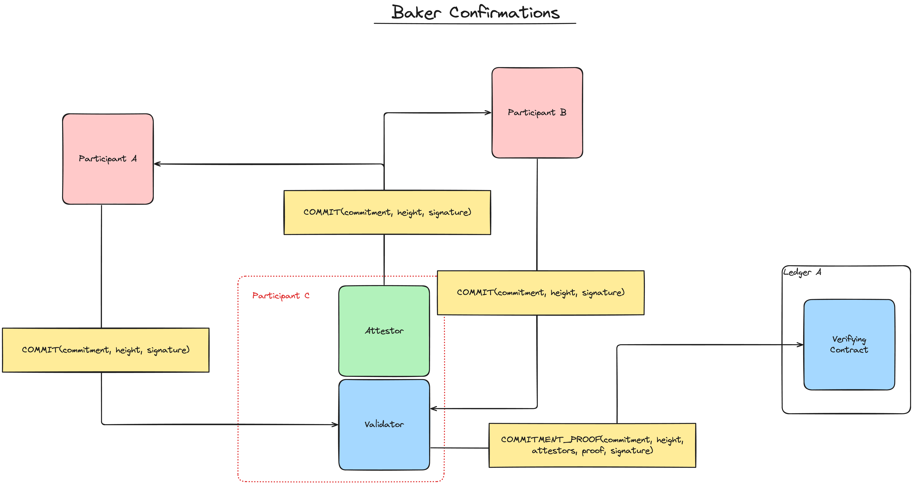

# MIP-103: Baker Confirmations (ZK-FFS)

- **Description**: Proposes a Zero Knowledge means of confirming commitments between layers aligned with the FFS protocol. 
- **Authors**: [Liam Monninger](mailto:liam@movementlabs.xyz)
- **Desiderata**: [MD-34](https://github.com/movementlabsxyz/MIP/pull/34), [MD-3](https://github.com/movementlabsxyz/MIP/pull/3), [MD-4](https://github.com/movementlabsxyz/MIP/pull/4), [MD-5](https://github.com/movementlabsxyz/MIP/pull/5)
- **Etymology**: The first draft of this proposal was written in a cafe on Baker Street in San Francisco.

## Abstract

We propose a Baker Confirmations as a means of generalizing the FFS protocol via a Zero Knowledge proof of consensus mechanism. The benefits of using such a system are threefold: (a) modularity, (b) composability, and (c) scalable or reduced costs. We also briefly propose how Baker Confirmations can be used to solve the problems outlined in [MD-3](https://github.com/movementlabsxyz/MIP/pull/3), [MD-4](https://github.com/movementlabsxyz/MIP/pull/4), and [MD-5](https://github.com/movementlabsxyz/MIP/pull/5) which are difficult to solve when vote tabulation is represented on-chain.

## Motivation

Ultimately, the role of the contracts in the current FFS protocol are simply to verify and mark consensus on a particular commitment at a particular `superBlock` height, or round, on a given ledger. While implementing the actual tabulation of votes on-chain serves to reduce development time and avoid the implementation of an off-chain service, it does not in fact minimize the role of the on-chain contracts. Baker Confirmations instead propose such minimization by ensuring that the contracts simply verify ZK proofs of consensus and dispatch the appropriate onchain events.

## Specification



There are two crucial roles in a Baker Confirmer which we will address individually and in detail:

- **Attesters** generate commitments at a given block-height and sign them before broadcasting them to the Baker Network.
- **Validators** verify the commitments generated by the Attesters, tabulate them in a Zero Knowledge program, and submit the proof of this Zero Knowledge program and its outputs on-chain.

In a simplified model of a Baker Network, all Participants are both Attesters and Validators. However, as we will demonstrate, this is not a strict requirement of the protocol.

For simplicity we specify Baker Confirmations in terms of a simple unidirectional commitment scheme we call [Baker Coin](#baker-coin). We introduce but do not specify generalizations of this scheme which are especially intriguing for their composability, modularity, and multi-directionality.

Finally, we describe how the specification addresses problems [MD-3](https://github.com/movementlabsxyz/MIP/pull/3), [MD-4](https://github.com/movementlabsxyz/MIP/pull/4), and [MD-5](https://github.com/movementlabsxyz/MIP/pull/5), as well as contending with problems inherent to the Baker Confirmations scheme itself. 

### Baker Coin

Baker Coin is a class of unidirectional commitment protocols satisfying the [postconfirmations]() scheme proposed in [MIP-37](https://github.com/movementlabsxyz/MIP/pull/37). It has the following additional constraints:

1. **Unidirectional**: A Baker Coin protocol MUST intend ONLY to post a commitment the state of a given Ledger B onto Ledger A, not vice versa. 
2. **Staked**: A Baker Coin protocol MUST rely on weighted votes, known as stake, to determine whether consensus has been reached amongst a set of participants. These stake weights must be represented over the field of integers from 0 to 2^256 - 1, $\mathbb{F}_{2^{256}}$.
3. **Epoch-bound**: A Baker Coin protocol MUST fix stake weights throughout an epoch $e \in E$ which begins at a Unix timestamp $t_e$ and ends at a Unix timestamp $t_{e+1}$. This has the same effect as fixing the **Attesters** for a given epoch.
4. **Rewarding**: A Baker Coin protocol MAY dispatch events to issue new units of a given token or "coin," Coin A, on Ledger A in the event of a commitment. The value of this coin may range from 0 to 2^256 - 1, $\mathbb{F}_{2^{256}}$.
5. **Slashing**: A Baker Coin protocol MAY also remove or "slash" staked Coin A held in the verification contract on Ledger A in the event of a commitment. The value of this slashed token may range from 0 to 2^256 - 1, $\mathbb{F}_{2^{256}}$.
6. **Observant**: A Baker Coin protocol MUST use a set of trusted **Observing Attesters** to relay valid stake events from Ledger A to validators in the Baker Network. These **Observing Attesters** are not necessarily the same as the **Attesters** for a given epoch.

> [!NOTE]
> The **Observant** constraint is intentionally suboptimal from the perspective of trust. We will be using it to underscore possibilities of **Internal Staking**, **Staked Observing Attesters**, Ledger B certificate summaries, and other composable solutions in this and future MIPs.

There are thus four node types in a Baker Coin protocol:

- **Baker Coin Attesters** perform the basic operations of an **Attester** but also send stake messages to Ledger A. They thus *broadcast* the following messages.
  - $COMMIT(commitment, height, signature) \rightarrow \text{Baker Coin Validators}$ which makes a signed `COMMITMENT` to a given Ledger B state at a given height.
  - $STAKE(amount, epoch, signature) \rightarrow \text{Ledger A Participants}$ which attempts to stake an amount of Coin A on Ledger A for a given epoch.
- **Baker Coin Validators** perform the basic operations of a **Validator** but also receive $TRUSTED\\_STAKE$ messages from **Observing Attesters**. They thus *broadcast* the following messages.
  - $COMMITMENT\\_PROOF(commitment, height, Attesters, proof, signature) \rightarrow \text{Ledger A Participants}$ which attempts to post a commitment to a given Ledger B state at a given Ledger B height on Ledger A.
- **Observing Attesters** perform the role of observing stake events on Ledger A and relaying them to the Baker Network. They thus *broadcast* the following messages.
  - $TRUSTED\\_STAKE(amount, participant, epoch, signature) \rightarrow \text{Baker Coin Validators}$ which indicates a valid stake event on Ledger A as initiated by a Baker Coin Attester via a $STAKE$ message.
- **Ledger A Participants** perform the basic operations of a participant on Ledger A, as defined by Protocol A which MUST include the emission $STAKE\\_RECEIVED$ events. They thus *broadcast* the following messages:
  - $STAKE\\_RECEIVED(amount, participant, epoch, signature) \rightarrow \text{Observing Attesters}$ which indicates a valid stake event on Ledger A as initiated by a Baker Coin Attester via a $STAKE$ message.

We render the following assumptions about knowledge after receiving a given message in the Baker Coin protocol:

1. Once an **Observing Attester** has received sufficient and accordingly verified $STAKE\\_RECEIVED$ messages from Ledger A Participants, the effects of the corresponding $STAKE$ messages on Ledger A SHALL remain fixed for the remainder of the epoch.
2. Once a **Baker Coin Validator** has received sufficient and accordingly verified $TRUSTED\\_STAKE$ messages from **Observing Attesters**, it SHALL correctly update its internal representation of stake weights for the remainder of the epoch.

We may now address the specific and practical behavior of the **Attester** and the **Validator** in a Baker Coin protocol, so as to explain the core mechanism of Baker Confirmations.

### Attesters

An honest Attester in the Baker Coin protocol is assumed to compute a new state root by running a state transition function $T: S \times M \rightarrow S$ on the current state $s \in S$ and a set of messages $m \in M$ to produce a new state $s' \in S$. The Attester then signs the new state root and broadcasts it to the Baker Network.

In order to ensure the proof computed by the Validator can attest to the identity of the commitment, the commitment MUST be signed by the Attester.

Thereby, an honest Attester in the Baker Coin protocol SHOULD simply broadcast messages of the form $COMMIT(commitment, height, signature)$ to the Baker Network that represent honest and attributable computations of the state of Ledger B at a given height.

The form of state transition function MUST be such that for a given height all replicas of Ledger B SHALL produce the same state and thus the same commitment.

### Validators

The role of the Validator is more complex. The Validator MUST:

1. Run a procedure $RECEIVE\\_COMMITMENT$ which accepts a commitment and height from an Attester and updates its internal representation of the commitments.
2. Run a procedure $RECEIVE\\_TRUSTED\\_STAKE$ which accepts a stake amount, participant, and epoch from an Observing Attester and updates its internal representation of the stake weights.
3. Use a heuristic to decide when to run a procedure $COMPUTE\\_PROOF$ which computes a Zero Knowledge proof of consensus on a given commitment at a given height.
4. Use a heuristic to decide when to run a procedure $POST\\_PROOF$ which posts the Zero Knowledge proof of consensus on a given commitment by broadcasting a $COMMITMENT\\_PROOF$ message to Ledger A Participants.

#### $RECEIVE\\_COMMITMENT$

##### Human Language Description of Procedure

$RECEIVE\\_COMMITMENT$ takes a commitment and height from an Attester. It verifies the commitment and stores it in a table indexed by height. It then notifies the heuristic checker to decide whether to run $COMPUTE\\_PROOF$.

##### Pseudocode Description of Procedure

```python
def RECEIVE_COMMITMENT(commitment, height, signature):
    # Verify the commitment and signature
    if not verify_commitment(commitment, height, signature):
        return

    # Store the commitment in a table indexed by height
    self.commitments[height] = commitment

    # Notify the heuristic checker to decide whether to run COMPUTE_PROOF
    self.heuristic_checker.notify()
```

#### $RECEIVE\\_TRUSTED\\_STAKE$

##### Human Language Description of Procedure

$RECEIVE\\_TRUSTED\\_STAKE$ takes a stake amount, participant, and epoch from an Observing Attester. It verifies the stake amount and epoch and stores it in a table indexed by participant and epoch, but MUST only modify stake weights for the next epoch. If this constraint is not applied, then the epoch staking constraint is violated.

> [!WARNING]
> The constraint on the epoch staking above is naive as it does not account for the time it takes for a Validator to receive a $TRUSTED\\_STAKE$ message from an Observing Attester. This will be discussed in more detail below. 

##### Pseudocode Description of Procedure

```python
def RECEIVE_TRUSTED_STAKE(amount, participant, epoch, signature):
    # Verify the epoch 
    if epoch < self.current_epoch + 1:
        return

    # Verify the stake amount and signature
    if not verify_stake(amount, participant, epoch, signature):
        return

    # Store the stake amount in a table indexed by participant and epoch
    self.stake_weights[participant][epoch] = amount
```

#### $COMPUTE\\_CONSENSUS$ and Heuristic

##### Human Language Description of Procedure

$COMPUTE\\_CONSENSUS$ tabulates all of the commitments and stake weights for a given height and epoch and computes a Zero Knowledge proof of consensus on a given commitment at a given height. It additionally outputs slashing and rewarding amounts for the participants who submitted the commitments according to slashing function $S$ and rewarding function $R$. It is run in a ZK execution environment and so outputs a proof of the computation.

##### Pseudocode Description of Procedure

```python
def COMPUTE_CONSENSUS(commitment, height, epoch):
    # Tabulate all of the commitments and stake weights for a given height and epoch
    commitments = self.commitments[height]
    stake_weights = self.stake_weights[epoch]

    # Check if the sum of the stake weights voting on a given commitment is greater than the threshold
    if sum(stake_weights[participant] for participant in commitments if commitments[participant] == commitment) > threshold:
        # Compute the slashing and rewarding amounts
        slashing_amounts = S(commitments, stake_weights, commitment, height, epoch)
        rewarding_amounts = R(commitments, stake_weights, commitment, height, epoch)

        # Return the proof of consensus and the slashing and rewarding amounts
        return proof, slashing_amounts, rewarding_amounts
    else:
        return None, None, None

```

##### Human Language Description of Heuristic

This MIP does prescribe a specific heuristic for deciding when to run $COMPUTE\\_CONSENSUS$. I general, however, the **Validator** would save compute by only running $COMPUTE\\_CONSENSUS$ when it has received a sufficient number of commitments and stake weights, i.e., by precomputing the $COMPUTE\\_CONSENSUS$ procedure outside of the ZK execution environment.

#### $POST\\_PROOF$

Proof posting is intended to be a simple procedure which broadcasts a $COMMITMENT\\_PROOF$ message to Ledger A Participants. The message SHALL include the commitment, height, Attesters, proof, slashing amounts, rewarding amounts, and signature. It does not require any additional computation.

##### Human Language Description of Heuristic

This MIP does prescribe a specific heuristic for deciding when to run $POST\\_PROOF$. In general, however, the **Validator** has to balance on-chain costs with the expected value of the reward.

To avoid disincentivizing honest posting behavior due to reward uncertainty, the on-chain reward mechanism should accept more than simply the initial commit. This phenomenon is addresses more completely in [Phenomena](#phenomena).

### Phenomena 

#### Forking and Asynchrony

In general, forks are easier to represent off-chain than on-chain. We, however, note several distinct simplifications which arise from the Baker Confirmations protocol.

##### Fork Representation

Baker Confirmations for a Baker Coin Protocol remove the need to represent forks on-chain. The on-chain contract must simply verify the Zero Knowledge proof of consensus and dispatch the appropriate onchain events.

##### Fork Stake

The primary problem with stake in an FFS confirmation device, outlined in [MD-3](https://github.com/movementlabsxyz/MIP/pull/3/files) is that--because said device is not inherently designed within the reorganization logic of the confirming ledger itself--rewards, once issued on a given fork, cannot be revoked. In contrast, in more conventional DLT, the rewards exist on the fork of the ledger itself and once that fork is orphaned, the rewards are revoked.

This problem persists under Baker Confirmations for a Baker Coin Protocol. However, it is possible to remove gas attacks associated with these solutions:

1. **Reward Delay**: One partial solution to the Fork Stake problem is to delay the emission of rewards by some number of epochs. The result is that contributing to a fork which does not survive for the duration of the delay period is not profitable. When tabulating on-chain, this delay is, however, problematic because it may lead to the cost of issuing a reward to an honest Partition A being correlated with the cost of issuing a reward to a malicious Partition B. When the delay is applied off-chain, however, these costs are negligible.
2. **Gas Splitting**: Another partial solution to the Fork Stake problem is in fact to split the

##### Liveness Disincentives

As discussed in  [MD-4](https://github.com/movementlabsxyz/MIP/pull/4/files), another issue with on-chain confirmation devices is that it becomes difficult to incentivize liveness because the cost of rolling over a commitment round or epoch is proportional to the size of the Validator set. This means that the last Validator to make a commitment in a round or epoch would need to be properly incentivized in order to cover their costs.

The Baker Coin Protocol still suffers from this problem, as it is provided that the Validator post a proof containing clear-text rewards and slashes. This means that the Validator posting the proof still runs a transaction proportional to the size of the Validator set.

However, instead of a direct reward, the Validator could share the Merkle root of a reward, against which Validators would submit Merkle Proofs to claim their rewards. This then fixes the cost of the commitment transaction. We discuss this possibility further in the [Generalizations](#generalizations) section.

###### Standoffs

[MD-4](https://github.com/movementlabsxyz/MIP/pull/4/files) also presents the problem of standoffs wherein a Validator, upon realizing it is the last Validator needed to reach a super-majority, may choose to withhold its commitment in order to maximize its reward.

The Baker Coin Protocol is not immune to this problem. Commitments are still provided in clear-text and so the Validator can still choose to withhold its commitment with knowledge of the other commitments made. Commitment hiding schemes also do not work because the Validator must still provide a proof of consensus and thus will still be able to compute whether its vote would satisfy the super-majority threshold.

#### Reward Uncertainty

In general, the contracts receiving a Commitment in Baker Confirmations must be able to handle multiple and differing super-majority commitments to the same value. This presents several phenomena which are worthy of note.

##### Proofs of Differing Consensus

In theory, each Validator can receive a different--but intersecting--set of commitments from the Attesters to reach a super-majority. Concerning attester rewards, this simply means that the on-chain contract MUST reward by the union of all accepted proofs of commitment to avoid over-rewarding Attesters.

##### Proofs of Differing Commitments

In theory, Attesters can submit differing commitments to different Validators and arrive at a consensus on a given commitment at each. In simple cases, this behavior would not satisfy our Byzantine assumptions under FFS, and so does not need to be addressed.

However, this problem because more acute when you consider that the Validators may allow for the production of forks. In this case, an Attester could submit different commitments to different Validators to potentially earn rewards on different forks. To Validator A, Attester A may make Commitment A on Fork A. Attester A cannot recommit to Validator A, but could decide to commit to Validator B on Fork B.

Because the on-chain contract must accept multiple commitments, it must also accept multiple proofs of consensus. Thus, Attester A's commitment to both Validator A and Validator B could be accepted on-chain.

### Generalizations

#### Multidirectional Baker Confirmations and Composition

We can conceive of a class of Baker Confirmations which are not unidirectional. These include cases where votes from attester compose the state of multiple ledgers.

We detail this possibility in [MIP-n](mip-n/README.md).

#### Staked Observing Attesters

We can conceive of a class of Baker Confirmations which are not observant. These include cases where the Observing Attesters are themselves staked and thus can be slashed for dishonest behavior.

We detail this possibility in [MIP-n](mip-n/README.md).

#### Stake Checks

We can conceive of a class of Baker Confirmations wherein the proofs contain the stake amounts against which they were computed s.t. these amounts can be checked on-chain before the proof is accepted.

We detail this possibility in [MIP-n](mip-n/README.md).

#### Hooks

We can conceive of a class of Baker Confirmations wherein the proofs contain hooks to trigger arbitrary logic on-chain.

We detail this possibility in [MIP-n](mip-n/README.md).

#### Merkleization and State Certificates

We can conceive of a class of Baker Confirmations wherein--instead of submitting clear-text commitments to readily dispatch on-chain logic--the commitments are submitted as Merkle roots against which Merkle-inclusion gated methods can be triggered by another service to dispatch on-chain logic.

We detail this possibility in [MIP-n](mip-n/README.md).

## Reference Implementation

## Verification

## Appendix

## Changelog
