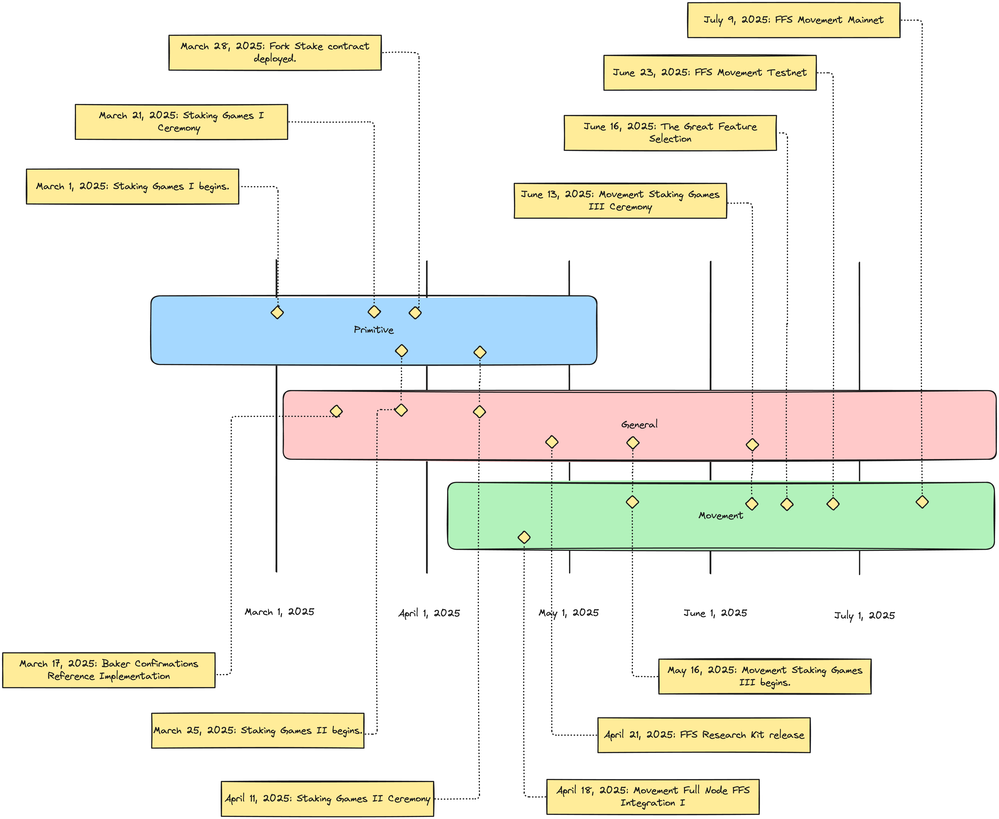

# Roadmap

> [!NOTE]
> The above roadmap diagrams features key milestones. For a more complete treatment, see [Key Milestones](#key-milestones).

This document contains a roadmap for Movement Lab's Fast Finality Settlement (FFS), a proof of stake L2 confirmations system. The roadmap advocates for continual community engagement via Staking Games and sees ultimately delivery of `ffs` to the `movement` mainnet by July 9, 2025.

The roadmap is grouped into three non-consecutive stages:

1. **Primitive**: development and testing of proof of concept implementations of FFS.
2. **General**: development and testing relying on the reference implementation of FFS and which is decoupled from Movement Lab's full node logic or any particular VM.
3. **Movement**: development and testing of FFS integrated with Movement Lab's full node logic and VM.

The grouping is primarily motivated by the opportunities for community participation and usage of the FFS system in a manner that is decoupled from Movement Lab's full node logic.

## Key Concepts
- **Staking Game**: An incentivized period of `ffs` staking participation which does not affect the security of a mainnet. Staking Games are used to collect data and research the outcomes of different `ffs` implementations.
- **Staking Games Ceremony**: A public, community engaged ceremony announcing the end of a period of staking games and reporting some initial results.
- **contract-based `ffs`**: `ffs` implementations which tabulate consensus in the contracts.
- **`baker-confirmations`**: `ffs` implementations which use zero-knowledge proofs to tabulate consensus.
- **acceptor features**: The set of features which are used to program various of the liveness-inducing acceptor role in the `ffs` system.
- **Fork Stake Problem**: the problem or problems relating to forking and distribution of stake under the `ffs` system, particularly concerning the decision by consuming dApps of the correct fork. 
- **Great Feature Selection**: The process of choosing the desired features which will begin rolling out on Movement mainnet.

## Primitive
The **Primitive** stage of the roadmap is focused on the development and testing of proof of concept implementations of FFS. These include various iterations of MCR, early integrations with Symbiotic, and other proof of concept implementations.

The **Primitive** stage breaks the FFS implementation out from under the `movement` monorepo for the first time as the `ffs` repo.

The **Primitive** stage features live contracts on the Ethereum mainnet, testnet, and Movement managed networks. 

The **Primitive** stage uses small allocations of MOVE token to incentivize real user participation. Tooling is skewed towards immediately facilitating user participation.

The complete **Primitive** roadmap is available [here](primitive/README.md).

## General
The **General** stage of the roadmap is focused on the development and testing of implementations of FFS which are decoupled from Movement Lab's full node logic or any particular VM. This primarily means cleaning up existing proof of concept implementations, proving their correctness, and designing a more modular API. The initial implementation [Baker Confirmations (ZK-FFS)](../README.md) also begins under this stage.

The **General** stage seeks to establish the `ffs` repo as not only a reference implementation, but a stable third-party dependency for downstream projects. A separate `baker-confirmations` repo is created to house the implementation of Baker Confirmations (ZK-FFS).

The **General** stage features live contracts on the Ethereum mainnet, testnet, and Movement managed networks as well as the deployment of a Baker Confirmations development network.

The **General** stage uses larger allocations of MOVE token to incentivize real user participation. Tooling is developed for generalized adoption of the `ffs` and `baker-confirmations` repos.

The complete **General** roadmap is available [here](general/README.md).

## Movement
The **Movement** stage of the roadmap is focused on the development and testing of FFS integrated with Movement Lab's full node logic and VM. This primarily means integrating the `ffs` and `baker-confirmations` repos into the `movement` monorepo.

The **Movement** stage features live contracts on the Ethereum mainnet, testnet, and Movement managed networks as well as the deployment of a Baker Confirmations development network.

The **Movement** stage culminates in a the production rollout of Movement mainnet staking.

The complete **Movement** roadmap is available [here](movement/README.md).

## Key Milestones
- **February 23, 2025:** Movement Labs MIP committee approves acceptor features MIPs for `ffs` post-confirmations.
- **February 24, 2025:** Movement Labs Research Team takes over FFS implementation under the `ffs` repo. Work begins to prepare existing MCR contracts for Staking Games I. 
- **March 1-18, 2025:** Movement Labs Research Team launches [Staking Games I](./staking-games/staking-games-i/), planning to actively collect data through the March 18, 2025 deadline.
- **March 3, 2025:** Movement Labs Research team introduces `ffs` General Node type, which is an `ffs` node process decoupled from Movement Lab's full node logic.
- **March 8, 2025:** Movement Labs Research Team introduces the acceptor features upgrade for MCR, adding staking games for each feature combination. 
- **March 10, 2025:** Movement Labs Research Team completes MIPs for contract-based `ffs`, providing an agreed upon set of solutions to the Fork Stake problem.
- **March 15, 2025:** Movement Labs Research Team w/ Symbiotic Releases Symbiotic Stake Staking Game.
- **March 17, 2025:** Movement Labs Research Team publishes Baker Confirmations reference implementation under the `baker-confirmations` repo.
- **March 21, 2025:** Movement Labs Research Team holds the Staking Games I Closing Ceremony, marking an end to active community support while results are reviewed. 
- **March 24, 2025:** Movement Labs Research Team w/ Movement Labs SRE Team introduces FFS testing environment and node spin-up tooling for contract-based `ffs`. This includes a Kurtosis-based ETH testnet.
- **March 25 - April 9, 2025:** Movement Labs Research Team launches [Staking Games II](./staking-games/staking-games-ii/), planning to actively collect data through the April 9, 2025 deadline.
- **March 28, 2025:** Movement Labs Research Team introduces the `ffs` Fork Stake upgrade for contract-based `ffs`. This may immediately apply to Staking Games II. This provides the first stable implementation of post-confirmations in the `ffs` repo.
- **April 3, 2025:** Movement Labs Research Teams introduces first stable release of `ffs` repo.
- **April 7, 2025:** Movement Labs Research Team completes first community-ready version of `baker-confirmations` repo.
- **April 11, 2025:** Movement Labs Research Team holds the Staking Games II Closing Ceremony, marking an end to active community support while results are reviewed. 
- **April 15, 2025:** Movement Labs Research Team stabilizes L2 Confirmations implementation in the `ffs` repo.
- **April 18, 2025:** Movement Labs Research Team and Movement Labs Engineering team release first integration of stable `ffs` with the `movement-full-node`.
- **April 21, 2025:** Movement Labs Research Team and Movement Labs SRE Team introduce FFS Research Kit, a suite of tools for researchers to run and test FFS implementations as will be leveraged in Staking Games III.
- **May 16 - June 10, 2025:** Movement Labs Research Team launches [Staking Games III](./staking-games/staking-games-iii/), planning to actively collect data through the June 10, 2025 deadline.
- **May 24, 2025:** Movement Labs Research Team releases stable implementation of the San Francisco Model in the `ffs` repo.
- **June 10, 2025:** Movement Labs Research Team releases stable implementation of the San Francisco Model in the `baker-confirmations` repo.
- **June 13, 2025:** Movement Labs Research Team holds the Staking Games III Closing Ceremony, marking an end to active community support while results are reviewed.
- **June 16, 2025:** Movement Labs Research Team and Movement Labs Engineering make the Great Feature Selection, choosing the desired features which will begin rolling out on Movement mainnet.
- **June 23, 2025:** Movement Labs Research Team and Movement Labs Engineering team release `ffs` version selected from the Great Feature Selection to `movement` testnet.
- **July 9, 2025:** Movement Labs Research Team and Movement Labs Engineering team release `ffs` version selected from the Great Feature Selection to `movement` mainnet.
