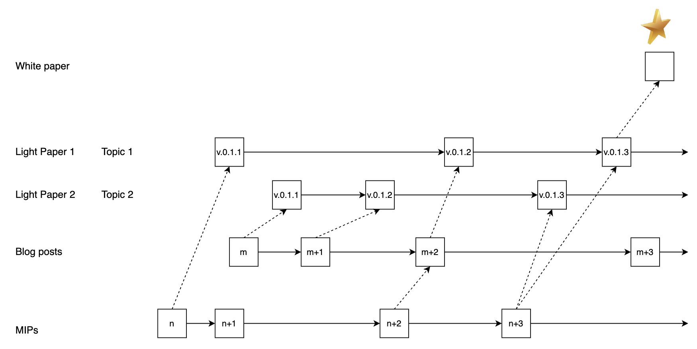

# MIP-113: Technology publication strategy

- **Description**: A single sentence summarizing the contents of the proposal.
- **Authors**: [Author](mailto:author@email.com)
- **Desiderata**: [MD-112](https://github.com/movementlabsxyz/MIP/blob/apenzk/md-technology-publication-strategy/MD/md-112/README.md)
- **Approval**: <!--Either approved (:white_check_mark:) or rejected (:x:) by the governance body. To be inserted by governance. -->

## Abstract

A technology publication strategy is proposed that involves the light papers, white papers, and blog posts and MIPs.

## Motivation

A more clear separation into white paper and light paper permits a streamlined process to provide

- a platform that summarized the current vision and status of the MIPs that are being implemented, which will make the roadmap more transparent and easier to follow.
- a **north star** for the technology, which is the white paper.
- a process to transform MIPs into blog posts and light papers.

## Specification

_The key words "MUST", "MUST NOT", "REQUIRED", "SHALL", "SHALL NOT", "SHOULD", "SHOULD NOT", "RECOMMENDED", "NOT RECOMMENDED", "MAY", and "OPTIONAL" in this document are to be interpreted as described in RFC 2119 and RFC 8174._

*Figure 1: Process of transforming MIPs and blog posts into light papers and white paper.*

### MIPs

MIPs are the specifications for the technology. They are the invocation point for new features and improvements.

**Format**: This repository.

**Target audience**: The core contributors of the technology.

**Process**: An MIP is proposed as described in this repository. If it is a substantial contribution or change it SHOULD be reflected in a light paper of the appropriate topic. It MAY be accommodated by a blog post. MIPs may be relevant for several light papers.

### Blog posts

Blog posts are the public face of the technology. They are used to communicate the latest news and developments, one-by-one.

- **Format**: This repository.

**Target audience**: The general public.

**Process**: A blog post is proposed by the relevant department. If it is a substantial contribution or change it SHOULD be reflected in a light paper of the appropriate topic. Blog posts may be relevant for several light papers.

### Light papers

Light papers, serve to present the current vision for a given topic, and summarize the current innovations and developments.  

**Format**: Light papers are published on the [Movement Labs website](https://movementlabs.xyz/). They are written in latex and compiled to pdf.

**Target audience**: The general public. Business.

**Process**: If a blog post or an MIP is a substantial contribution or change it should be reflected in a light paper of the appropriate topic. The light paper is versioned and the version MUST be updated once a noticeable change is applied. All versions MUST be available on the [Movement Labs website](https://movementlabs.xyz/).

### White paper

The white paper is a technical specification for the key technology differentiator.

**Format**: The white paper is published on the [Movement Labs website](https://movementlabs.xyz/). It is written in latex and compiled to pdf.

**Target audience**: The general public. Technical audience.

**Process**: The white paper is proposed by the relevant department. It is a comprehensive technical specification for the key technology differentiator.

## Reference implementation

## Verification

## Appendix

## Changelog
