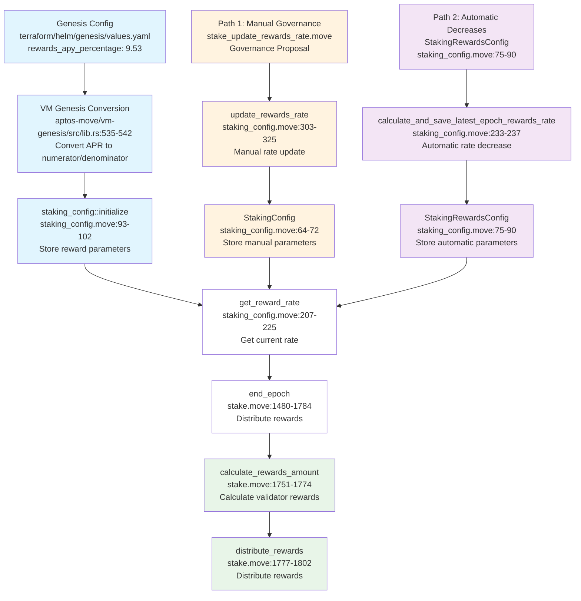

# MIP-124: Configuration of the Reward System for Validators

- **Description**: Documentation of the existing configurable reward system for validators.
- **Authors**: Andreas Penzkofer
- **Desiderata**: 
- **Approval**: <!--Either approved (:white_check_mark:), rejected (:x:), stagnant or withdrawn by the governance body. To be inserted by governance. -->

## Motivation

Validators need predictable rewards to justify their operational costs and stake commitment. A well-documented reward configuration enables transparency for validators, delegators, and governance participants when evaluating or proposing rate changes.

## Abstract

The reward system allows setting validator rewards to a target annual percentage yield (APY) through genesis configuration, with automatic conversion to per-epoch reward rates. The implementation leverages existing infrastructure including genesis configuration, VM conversion logic, and staking framework components.

> **Target Rate**: The target is **10% APY** (Annual Percentage Yield), which requires setting **9.53% APR** (Annual Percentage Rate) in genesis. With 2-hour epochs (4,380 epochs/year), the compounding effect converts the 9.53% APR into approximately 10% APY.

Note, the codebase uses `rewards_apy_percentage` in variable names and comments, but the actual calculation implements **APR** (Annual Percentage Rate), not APY (Annual Percentage Yield). This is a terminology inconsistency in the codebase that we are stuck with for backward compatibility. The APR is the annual percentage rate of the reward system without compounding.

### APR vs APY

**APR** (Annual Percentage Rate) is the simple interest rate without compounding. **APY** (Annual Percentage Yield) is the effective annual rate when compounding is considered.

The relationship between APR and APY depends on the compounding frequency:

\[
\text{APY} = \left(1 + \frac{\text{APR}}{n}\right)^n - 1
\]

where \( n \) is the number of compounding periods per year.

Conversely, to find the APR needed to achieve a target APY:

\[
\text{APR} = n \times \left( (1 + \text{APY})^{1/n} - 1 \right)
\]

**Example with Movement L1 (2-hour epochs, n = 4,380):**

| Target | Calculation | Result |
|--------|-------------|--------|
| 10% APY → APR | \( 4380 \times \left( (1.10)^{1/4380} - 1 \right) \) | **9.53% APR** |
| Per-epoch rate | \( 9.53\% / 4380 \) | **0.2176 bps** |

With 4,380 compounding periods per year, the difference between APR and APY is approximately 0.47 percentage points (9.53% APR yields 10% APY).

**Continuous Compounding Limit:**

As the number of compounding periods \( n \to \infty \), the APY formula converges to:

\[
\text{APY} = e^{\text{APR}} - 1
\]

And the inverse:

\[
\text{APR} = \ln(1 + \text{APY})
\]

For 10% APY, the continuous compounding limit gives:

\[
\text{APR} = \ln(1.10) = 9.531\%
\]

With 4,380 epochs per year, the discrete calculation yields 9.530%, which differs from the continuous limit by only ~0.001%. At this compounding frequency, the continuous approximation is rather precise.

## Specification

_The key words "MUST", "MUST NOT", "REQUIRED", "SHALL", "SHALL NOT", "SHOULD", "SHOULD NOT", "RECOMMENDED", "NOT RECOMMENDED", "MAY", and "OPTIONAL" in this document are to be interpreted as described in RFC 2119 and RFC 8174._

### Reward System

The reward system has two main components: how rewards are calculated per validator, and how the reward rate is determined.

#### Validator Reward Calculation

Validator rewards are calculated using the following formula implemented in `aptos-move/framework/aptos-framework/sources/stake.move`, lines 1751-1774:

```
rewards_amount = (stake_amount * rewards_rate_numerator * num_successful_proposals) / (rewards_rate_denominator * num_total_proposals)
```

where

- `stake_amount`: Validator's active stake
- `rewards_rate_numerator`: Numerator of the reward rate fraction (stored in StakingConfig.rewards_rate)
- `rewards_rate_denominator`: Denominator of the reward rate fraction  
- `num_successful_proposals`: Validator's successful block proposals in the epoch
- `num_total_proposals`: Validator's total block proposals in the epoch

#### Reward Rate Retrieval (`get_reward_rate`)

The `get_reward_rate()` function in `staking_config.move:207-225` is called every epoch end to retrieve the current reward rate. It uses a **two-path system**:

**Path 1: Manual System** (when `periodical_reward_rate_decrease_enabled()` is **FALSE**)

- Loads from `StakingConfig.rewards_rate` and `StakingConfig.rewards_rate_denominator`
- These values are set at genesis and updated only through governance

**Path 2: Automatic System** (when `periodical_reward_rate_decrease_enabled()` is **TRUE**)

- Loads from `StakingRewardsConfig.rewards_rate` (FixedPoint64 format)
- Converts FixedPoint64 to numerator/denominator format for compatibility
- Rate decreases automatically every configurable period (default: 1 year), see below in the Section "Path 2: Automatic Rate Decreases".

**When Called:**

- Every epoch end during `on_new_epoch()` in `stake.move:1469` and `stake.move:1682`
- Used for validator set computation and reward distribution

---

### Setup at Genesis

During genesis initialization, the system converts the configured APR percentage into per-epoch reward rates for validator rewards.

#### APR to Per-Epoch Rate Conversion

The system converts an Annual Percentage Rate (APR) to a **per-epoch reward rate** for actual distribution. This conversion happens only at genesis - runtime updates require manual calculation.

```
reward_rate_numerator = (genesis_config.rewards_apy_percentage * rewards_rate_denominator / 100) / num_epochs_in_a_year
```

where

- `genesis_config.rewards_apy_percentage`: 9.53 (for 9.53% APR → 10% APY)
- `rewards_rate_denominator`: 1_000_000_000 (for precision)
- `num_epochs_in_a_year`: 4_380 (based on 2-hour epochs)

This calculation is implemented in `aptos-move/vm-genesis/src/lib.rs` lines 535-542 and converts the configured APR percentage to the appropriate per-epoch reward rate **only at genesis**. Runtime updates require governance to manually perform this conversion.

#### Required Configuration Change

Update the genesis configuration file to set the target APR to 9.53% (for 10% APY):

- **File**: `terraform/helm/genesis/values.yaml`
- **Change**: Set `rewards_apy_percentage: 9.53`
- **Resulting**: `reward_rate_numerator`: 21_760 (calculated at genesis)

---

### Updates at Runtime

After genesis, there are **two different ways** to update reward rates, depending on which system is active.

> **Note on Governance Status**: Currently, reward rate updates are controlled by the `core_resources` signer rather than community governance. The transition to partial/full governance is planned after Move2 release and mainnet migration completion.

#### Path 1: Manual Governance Updates

**When Active**: `periodical_reward_rate_decrease_enabled()` is **FALSE** (current system)

> **Implementation Decision**: Path 1 is the chosen implementation path due to bugs in Path 2. This provides more control and stability through manual governance updates rather than automatic algorithmic changes.

**Governance Script Example:**

- **File**: `aptos-move/move-examples/governance/sources/stake_update_rewards_rate.move`
- **Function**: `main(proposal_id: u64)`
- **Purpose**: Update reward rate through governance proposal

**Governance Function:**

- **File**: `aptos-move/framework/aptos-framework/sources/configs/staking_config.move`
- **Function**: `update_rewards_rate()` (lines 303-325)
- **Purpose**: Update reward rate parameters during protocol runtime

**Governance Process:**

1. **Proposal Creation**: Community creates governance proposal
2. **Voting**: Validators and token holders vote on the proposal
3. **Execution**: If approved, the `update_rewards_rate()` function is called
4. **Parameter Update**: New reward rate numerator/denominator are set
5. **Immediate Effect**: New rate applies to next epoch's reward calculations

**Control**: Manual, community-driven updates requiring governance votes for each change

#### Path 2: Automatic Rate Decreases

**When Active**: `periodical_reward_rate_decrease_enabled()` is **TRUE** (future system)

> **Implementation Decision**: Path 2 contains bugs and will not be used. Path 1 is preferred for stability and control.

**System Components:**

- **File**: `aptos-move/framework/aptos-framework/sources/configs/staking_config.move`
- **Struct**: `StakingRewardsConfig` (lines 75-90)
- **Function**: `calculate_and_save_latest_rewards_config()` (lines 240-269)

**Automatic Process:**

1. **Time-Based Triggers**: Rate decreases automatically every configurable period (default: 1 year)
2. **Decrease Rate**: Configurable decrease rate (e.g., 0.25% annually)
3. **Minimum Threshold**: Rate cannot go below `min_rewards_rate`
4. **Precision**: Uses `FixedPoint64` for higher precision
5. **No Governance**: Automatic adjustments without requiring votes

**Control**: Algorithmic, time-based adjustments with built-in protections

---

### Function Call Flow Diagram



**Legend:**

- 🔵 **Genesis**: Initial configuration
- 🟠 **Path 1**: Manual governance updates
- 🟣 **Path 2**: Automatic rate decreases
- 🟢 **Final**: Reward calculation and distribution

## Reference implementation

## Changelog

- 2025-10-02: Initial version
