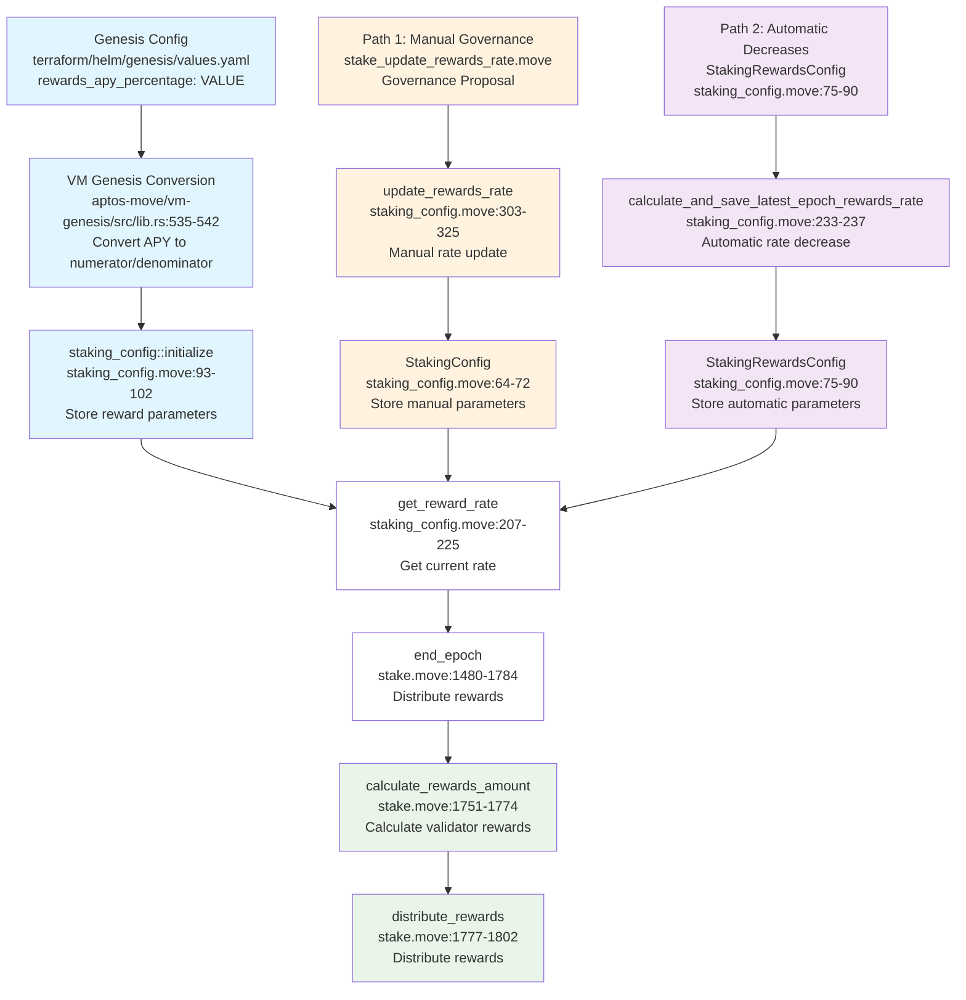

# MIP-125: Configuration of the APR Reward System for Validators

- **Description**: Documentation of the existing configurable APR reward system for validators.
- **Authors**: Andreas Penzkofer
- **Desiderata**: 
- **Approval**: <!--Either approved (:white_check_mark:), rejected (:x:), stagnant or withdrawn by the governance body. To be inserted by governance. -->

<!--
  READ MIP-0 BEFORE USING THIS TEMPLATE!

  This is the suggested template for new MIPs. After you have filled in the requisite fields, please delete these comments.

  Note that an MIP number will be assigned by an editor. When opening a pull request to submit your MIP, please use an abbreviated title in the filename, `README.md`.

  The title should be 44 characters or less. It should not repeat the MIP number in title, irrespective of the category.

  The author should add himself as a code owner in the `.github/CODEOWNERS` file for the MIP.

  TODO: Remove this comment before finalizing.
-->

## Abstract

This document describes the existing configuration of the APR reward system for validators. The system allows setting validator rewards to a specific annual percentage rate through genesis configuration, with automatic conversion to per-epoch reward rates. The implementation leverages existing infrastructure including genesis configuration, VM conversion logic, and staking framework components.

> **Note on Terminology**: The codebase uses `rewards_apy_percentage` in variable names and comments, but the actual calculation implements **APR** (Annual Percentage Rate), not APY (Annual Percentage Yield). This is a terminology inconsistency in the codebase that we are stuck with for backward compatibility.

## Motivation

This document serves to document the existing APR reward system implementation for reference and understanding. The system provides predictable validator rewards through configurable genesis parameters.

## Specification


_The key words "MUST", "MUST NOT", "REQUIRED", "SHALL", "SHALL NOT", "SHOULD", "SHOULD NOT", "RECOMMENDED", "NOT RECOMMENDED", "MAY", and "OPTIONAL" in this document are to be interpreted as described in RFC 2119 and RFC 8174._

<!--
  The Specification section should describe the syntax and semantics of any new feature. The specification should be detailed enough to allow competing, interoperable implementations.

  It is recommended to follow RFC 2119 and RFC 8170. Do not remove the key word definitions if RFC 2119 and RFC 8170 are followed.

  TODO: Remove this comment before finalizing
-->


### Reward System

The reward system has two main components: how rewards are calculated per validator, and how the reward rate is determined.

#### Validator Reward Calculation

Validator rewards are calculated using the following formula implemented in `aptos-move/framework/aptos-framework/sources/stake.move`:

```
rewards_amount = (stake_amount * rewards_rate * num_successful_proposals) / (rewards_rate_denominator * num_total_proposals)
```

This formula is implemented in the `calculate_rewards_amount()` function at lines 1751-1774 in `aptos-move/framework/aptos-framework/sources/stake.move`.

**Parameters:**
- `stake_amount`: Validator's active stake
- `rewards_rate`: Numerator of the reward rate fraction
- `rewards_rate_denominator`: Denominator of the reward rate fraction  
- `num_successful_proposals`: Validator's successful block proposals in the epoch
- `num_total_proposals`: Validator's total block proposals in the epoch

#### Reward Rate Determination

The per-epoch reward rate is automatically calculated using the following formula:

```
rewards_rate_numerator = (target_apr_percentage * rewards_rate_denominator / 100) / num_epochs_in_a_year
```

**Parameters:**
- `target_apr_percentage`: <VALUE> (for <VALUE>% APR)
- `rewards_rate_denominator`: 1_000_000_000 (for precision)
- `num_epochs_in_a_year`: 4_380 (based on 2-hour epochs)

This calculation is implemented in `aptos-move/vm-genesis/src/lib.rs` lines 535-542 and automatically converts the configured APY percentage to the appropriate per-epoch reward rate.

**Example Reward Rate Values**

For a <VALUE>% APR with 2-hour epochs:
- **rewards_rate**: 22_831
- **rewards_rate_denominator**: 1_000_000_000
- **Per-epoch rate**: 0.000022831 (0.0022831%)
- **Annual rate**: <VALUE>% APR

---

### Updates at Genesis (may not be required)

To implement a <VALUE> APR reward system, the following change MUST be made:

#### Required Configuration Change

Update the genesis configuration file to set the target APR to <VALUE>%:

- **File**: `terraform/helm/genesis/values.yaml`
- **Line**: 33
- **Change**: Set `rewards_apy_percentage: <VALUE>`
- **Purpose**: Configure the target APR for genesis

**Derived Parameters:**
- **Target APR**: <VALUE>% per year
- **Epoch Duration**: 2 hours (7_200 seconds) - configured in `epoch_duration_secs: 7200`
- **Epochs per Year**: ~4_380 epochs (=31_536_000 / 7_200)
- **Per-Epoch Rate**: <VALUE>% / 4_380 per epoch (calculated automatically)

**Result**: All other components will automatically use the new reward rate without any code changes.

---

### Updates at Runtime

After genesis, there are **two different ways** to update reward rates, depending on which system is active:

#### Path 1: Manual Governance Updates

**When Active**: `periodical_reward_rate_decrease_enabled()` is **FALSE** (current system)

**Governance Script Example:**
- **File**: `aptos-move/move-examples/governance/sources/stake_update_rewards_rate.move`
- **Function**: `main(proposal_id: u64)`
- **Purpose**: Update reward rate through governance proposal

**Governance Function:**
- **File**: `aptos-move/framework/aptos-framework/sources/configs/staking_config.move`
- **Function**: `update_rewards_rate()` (lines 303-325)
- **Purpose**: Update reward rate parameters during protocol runtime

**Governance Process:**
1. **Proposal Creation**: Community creates governance proposal
2. **Voting**: Validators and token holders vote on the proposal
3. **Execution**: If approved, the `update_rewards_rate()` function is called
4. **Parameter Update**: New reward rate numerator/denominator are set
5. **Immediate Effect**: New rate applies to next epoch's reward calculations

**Control**: Manual, community-driven updates requiring governance votes for each change

#### Path 2: Automatic Rate Decreases

**When Active**: `periodical_reward_rate_decrease_enabled()` is **TRUE** (future system)

**System Components:**
- **File**: `aptos-move/framework/aptos-framework/sources/configs/staking_config.move`
- **Struct**: `StakingRewardsConfig` (lines 75-90)
- **Function**: `calculate_and_save_latest_epoch_rewards_rate()` (lines 233-237)

**Automatic Process:**
1. **Time-Based Triggers**: Rate decreases automatically every year
2. **Decrease Rate**: Configurable decrease rate (e.g., 0.25% annually)
3. **Minimum Threshold**: Rate cannot go below `min_rewards_rate`
4. **Precision**: Uses `FixedPoint64` for higher precision
5. **No Governance**: Automatic adjustments without requiring votes

**Control**: Algorithmic, time-based adjustments with built-in protections

---

### Function Call Flow Diagram



**Legend:**
- 🔵 **Genesis**: Initial configuration
- 🟠 **Path 1**: Manual governance updates
- 🟣 **Path 2**: Automatic rate decreases
- 🟢 **Final**: Reward calculation and distribution

**System Components:**

#### 1. Involved Components

1. **VM Genesis Conversion Logic**: 
   - **File**: `aptos-move/vm-genesis/src/lib.rs`
   - **Lines**: 535-542
   - **Purpose**: Convert APY percentage to per-epoch reward rate numerator/denominator

2. **Staking Config Initialization**: 
   - **File**: `aptos-move/framework/aptos-framework/sources/configs/staking_config.move`
   - **Function**: `staking_config::initialize()` (lines 93-102)
   - **Purpose**: Store the calculated reward rate parameters

3. **Reward Calculation Logic**: 
   - **File**: `aptos-move/framework/aptos-framework/sources/stake.move`
   - **Function**: `calculate_rewards_amount()` (lines 1751-1774)
   - **Purpose**: Apply the reward rate to validator stakes based on performance


## Reference implementation

<!--
  The reference implementation section should include links to and an overview of a minimal implementation that assists in understanding or implementing this specification. The reference implementation is not a replacement for the Specification section, and the proposal should still be understandable without it.

  TODO: Remove this comment before submitting
-->

## Changelog

- 2025-10-02: Initial version