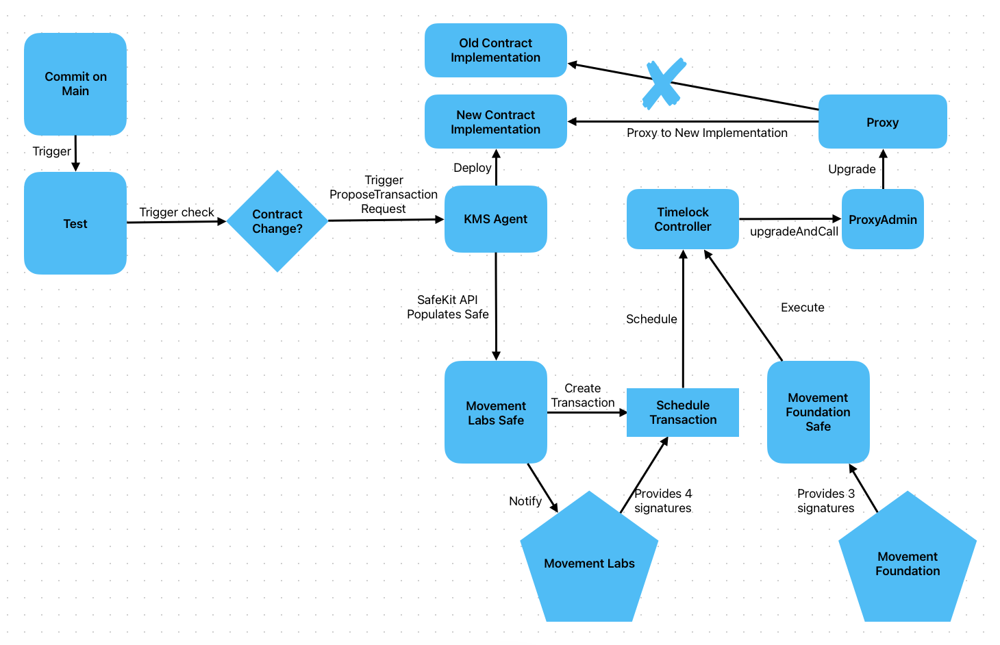

# MIP-18: Stage 0 Upgradeability and Multisigs
- **Description**: Proposal to establish two multisigs, one for engineers and another for the foundation, to facilitate the deployment and upgrade of the Movement Token (MOVEToken) and other upgradeable contracts.
- **Authors**: [Primata](mailto:primata@movementlabs.xyz)
- **Desiderata**:

## Abstract

MIP-18 advocates for the creation of two multisigs: one managed by Core Contributors engineers to propose contract upgrades and another managed by the Movement Foundation to execute them. This proposal enables testing of multisig services while ensuring secure and transparent upgrade processes for the Movement Token. The multisigs will be deployed on Ethereum, Sepolia, and Holesky (if available) networks.

## Motivation

There is an immediate need to deploy the Movement Token (MOVEToken) using a robust, secure, and auditable upgrade mechanism. By creating two multisigs—one for proposal and one for execution—we ensure a transparent and decentralized governance process over upgrades to critical contracts.

The first multisig allows Core Contributors engineers to propose upgrades via Safe’s multisig service. A remote key will automate the population of upgrade proposals. The second multisig, held by the Movement Foundation, will be responsible for executing the scheduled upgrades after a time delay, ensuring community trust and review.

Also, while developing an independent multisig, handling signature showed to be an issue that might be indicative of better letting signature to be handled by safe.global.

## Specification

### Multisig Setup

1. **Core Contributors Multisig** (4/5 signatures required):  
   - Role: Proposing upgrades.
   - Addresses: eth:0xd7E22951DE7aF453aAc5400d6E072E3b63BeB7E2, sep:0x493516F6dB02c9b7f649E650c5de244646022Aa0.
   - Signers: Andy Bell (0x49F86Aee2C2187870ece0e64570D0048EaF4C751), Richard Melkonian (0xaFf3deeb13bD2B480751189808C16e9809EeBcce), Liam Monninger (0x12Cbb2C9F072E955b6B95ad46213aAa984A4434D), Primata (0xB2105464215716e1445367BEA5668F581eF7d063) (Engineers involved with Token), and a KMS Agent (0x0eEd12Ca165A962cd12420DfB38407637bcA4267) for automated transaction proposals via SafeKit API's [proposeTransaction](https://docs.safe.global/sdk/api-kit#propose-a-transaction-to-the-service).
   - Justification: We leave some wiggle room incase one of the engineers is away. We still need 3/4 engineers to sign.

2. **Movement Foundation Multisig** (3/5 signatures required, triggerable after 2-day timelock):  
   - Role: Executing upgrades.
   - Addresses: eth:0x074C155f09cE5fC3B65b4a9Bbb01739459C7AD63, sep:0x00db70A9e12537495C359581b7b3Bc3a69379A00.
   - Signers: Jacques/Mugen1 (0x2801A777E451094c22abCF2c1bBfd0a9c1756831), Joel (0xCd87972D73C3eAC3b12dA31c089cE53DcC066812), Cooper (0x5505070Cf73f8c92Cf79a23C53Be15F55Fb70923), Rushi (0x89A4e685644E5fa0F137BBabc35b7A45a20a90bE) and Marc (0x9d7963F30C27d54e19faA679EF2F5Af105Ac1D75).

3. **Deployer Multisig** (1/2 signatures required):
   - Role: Deploy contracts.
   - Addresses: eth:0x7aE744e3b2816F660054EAbd1a1C4935DA34Ae28.
   - Signers: Primata (0xB2105464215716e1445367BEA5668F581eF7d063) and Marin Digital/Winston (0x3eB69Ef2DbEDD5d58AA5E074131Cd22D5e87Ff53).

Both multisigs are part of a timelock mechanism to enforce a 2-day waiting period between the proposal and execution of upgrades. The engineers' multisig schedules the upgrade, while the foundation multisig executes it after the timelock expires.

### Workflow

1. **Deployment**:  
   - The Contract Pipeline deploys a new contract implementation and generates transaction data for the upgrade.

2. **Proposal**:  
   - The remote key automates the submission of a transaction proposal using SafeKit API’s `proposeTransaction`, populating the transaction for review by Core Contributors engineers.
   - The proposal includes the transaction for `timelock.schedule(proxyAdmin.upgradeAndCall(newContractImplementation))`.

3. **Approval**:  
   - The Core Contributors engineers review and gather 4/5 signatures to approve the proposal.
   - Once approved, the `timelock.schedule` transaction is enacted, holding the upgrade in a 2-day timelock.

4. **Execution**:  
   - After the timelock period, the Movement Foundation multisig gathers 3/5 signatures to execute the upgrade.
   - This triggers the `timelock.execute` transaction, allowing the upgrade to be applied to the ProxyAdmin, which will perform the contract upgrade.

### Multisig Security Considerations

- Believe it is best practice to rely on a service that is fully dedicated to multisigs. Eventual exploits found might open us up to exploits while safe.global could've prevent the exploit for us.
- Having full control of our multisig deployments is dangerous and more engineering debt.
- Having manual verification might stop us from automating a exploit that we did not notice.
- Both multisigs serve as a dual signing authorities, ensuring a strict separation between proposing and executing transactions.
- The timelock ensures a sufficient review window for all parties, with the ability for either multisig to cancel the transaction during the delay period.
- Multisig can fully transition to a fully automated KMS setup once we have that in place. MOVE Token deployment did not follow all procedures, dependency contracts were deployed by an EOA.
- Movement Foundation Safe will have ownership of Token Upgradeability - as far as I understood, please correct me if I'm wrong.

## Reference Implementation

The multisigs will be deployed using the Safe global multisig service, with contracts interacting through the SafeKit API. The remote key will automate transaction proposals for review by Core Contributors engineers.

## Verification

1. **Correctness**:  
   This MIP follows the Safe multisig architecture, which has been extensively vetted in decentralized governance.

2. **Security Implications**:  
   - A remote key introduces automation but requires careful monitoring to prevent unauthorized transactions.
   - The separation of proposal and execution roles reduces the risk of unilateral decision-making.
   - If any of the keys part of each multisig are compromised, we must quickly remove it and substitute it with another key.

3. **Performance Impacts**:  
   - The additional timelock delay adds a slight performance lag but is necessary to enhance the security and transparency of upgrades.
   - Upgrades should not be periodic. This means that manual procedures might be more interesting than full automation.

4. **Validation Procedures**:  
   - The Safe multisig service and timelock mechanisms have been validated by various communities in the Ethereum ecosystem.
   - It's not possible to fully automate this service because Movement Founadtion will always require the final signatures.

5. **Peer Review and Community Feedback**:  
   Current Governance proposals have indicated that we should have full automation and no access to signing keys. Currently we are a bit far from achieving full automation.

## Errata

Any post-publication corrections or updates to this MIP will be documented here to maintain transparency and accuracy.

## Appendix

- [R1] Safe Multisig: https://safe.global/
- [R2] SafeKit API Documentation: https://docs.safe.global/sdk/api-kit
