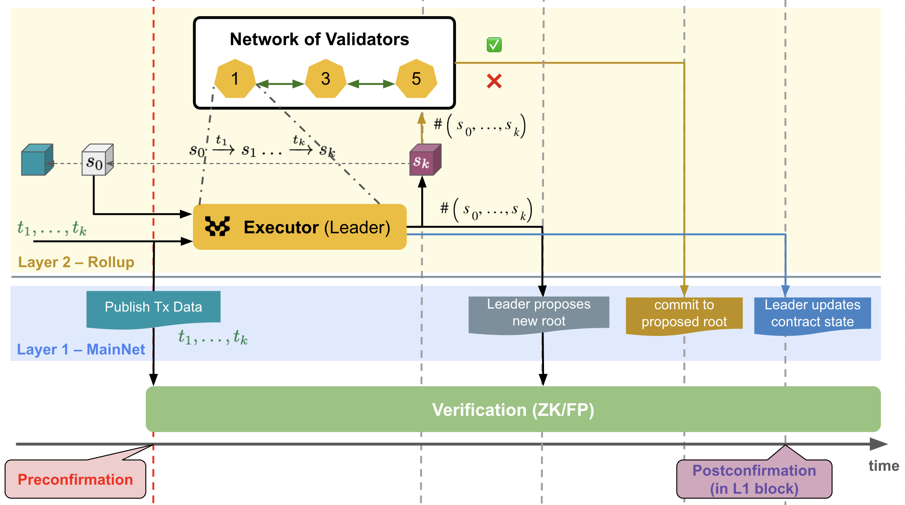
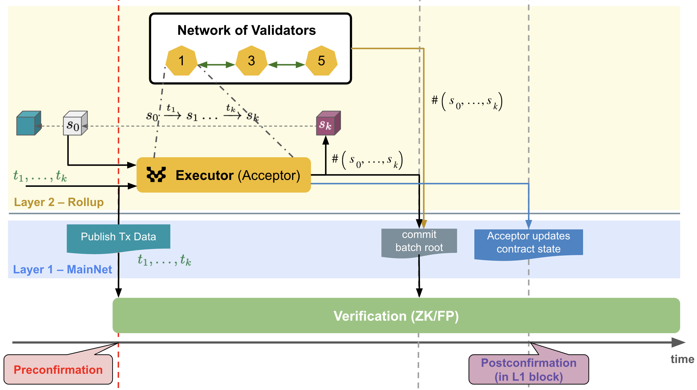

# MIP-34: Fast-Finality Settlement

- **Description**: Establish the scope and components that are part of the Fast-Finality Settlement mechanism.
- **Authors**: [Franck Cassez](), [Andreas Penzkofer](mailto:andreas.penzkofer@movementlabs.xyz)

## Abstract

Fast-Finality Settlement (FFS) is a mechanism that allows for fast _confirmation_ of transactions backed by crypto-economic security. This MIP outlines the high-level specifications and architecture of FFS.

## Definitions

- **L2-block** - See [Overview](#overview)
- **sequencer-batch** - See [Overview](#overview)
- **block-range** - a sequence of blocks that are confirmed together. See [Overview](#overview)  
- **validator** - a node that is responsible for validating transactions and confirming L2-blocks. See [Overview](#overview)  
- **FFS** - Fast Finality Settlement. See [Overview](#overview)  
- **MCR** - Multi-commit Rollup : an implementation of the postconfirmation in FFS. See [Overview](#overview)  
- **L2-finality certificate** - See [Overview](#overview)
- **L2-confirmation** - a finality guarantee related to L2. See [Overview](#overview)
- **postconfirmation** - a finality guarantee related to L1. See [Overview](#overview)  
- **L1-finality** - finality mechanism for layer 1. 
- **L2-finality** -  finality mechanism (confirmation) for layer 2.
- **PoS** - Proof of Stake

In addition we make the note for the following terms:

- **batch** (not recommended)
Less clean, but more common term for sequencer-batch. May be mixed up with the batch of transactions sent to the sequencer, or with the batch of blocks that should be processed by the L1-contract. 
- **block** 
More common term for L2-block. May be mixed up with the batch of transactions sent to the sequencer, the L1-block or with the batch of L2-blocks that should be processed by the L1-contract. Here we mean L2-block when we say block.
- **attester**  (not recommended)
The term attester has been deprecated in favor of validator.
- **quorum certificate** (not recommended)
The term quorum certificate has been deprecated in favor of L2-finality certificate.

## Motivation

Layer 2s (L2), including rollups, publish or secure transaction data in a data availability (DA) layer or at Ethereum mainnet (Layer 1, L1). Validity and optimistic rollups can finalize (confirm) transactions within approximately 30 minutes, resp. ~1 week. Until a transaction is finalized, there is no assurance about its validity and result (success or failure). This can be a limiting factor for certain types of DeFi applications.

Our objective is to enable transaction issuers to quickly get some guarantees that their transactions are correctly included in a block. The crypto-economic security is provided by a PoS protocol.

The mechanism can be deployed independently for a chain, or used in combination with existing settlement mechanisms, such as ZK and optimistic settlements.

As a result, users can rely and trust the **L2-finality**  to use as confirmation, or if the chain is configured to do so, wait for **L1-finality**, such as end of challenge window for fraud proofs (optimistic L2) or verification of a ZK-proof (validity L2).

A introduction to FFS can be found in [this blog post on Fast-Finality Settlement](https://blog.movementlabs.xyz/article/security-and-fast-finality-settlement). A more detailed description of a (partial) implementation of the mechanism is available at [this blog post on postconfirmations](https://blog.movementlabs.xyz/article/postconfirmations-L2s-rollups-blockchain-movement).

This MIP provides an overview of an architecture of FFS, and its main components.

## Specification

### Overview

The objective of FFS is to confirm that transactions are processed correctly. It does not relate to the ordering of transactions.

At an abstract level, the L2-blockchain increases by a new block in each (L2) round, and this block is the successor of the block in the previous round, the _predecessor_. Initially, there is a _genesis_ block with no predecessor.

**Sequencer-Batch**. Each round corresponds to the processing of a _sequencer-batch_ of transactions which is proposed by the _sequencer_ (can be centralised, decentralised, shared). 

**L2-Block**. For the vast majority of cases we mean L2-blocks, thus we will ommit the "L2-" prefix, i.e. by _block_ we mean L2-block. A node with execution capability is in charge of validating the transactions in a sequencer-batch and calculate the new state. Since the sequencer-batches are provided by the sequencer, the new state and the state roots for a block are deterministic. For a sequencer-batch $b$ the state is $S_b$ and the state root is $H(S_b)$. From the sequencer-batch $b$ and the state $S_b$ the block $B$ is computed (which contains the information of the sequencer-batch and the state root). 

**Block-range**. L2-Blocks can be constructed and confirmed on L2 at a higher rate than is feasible for L1. We group L2-blocks into a _block-range_ that is confirmed together. 

**Local validation**. Since a block is deterministically calculated we say a block (and the associated new state) is _validated locally_ once the execution engine calculates it from the sequencer-batch. 

The validity judgement to be made is: 
> [!NOTE]
> Given a block $B$ (predecessor), a sequencer-batch of transactions $txs$ and a successor block $B'$, is $B'$ the^[the MoveVM is deterministic and there can be only valid successor.] _correct_ successor of $B$ after executing the sequence of transactions $txs$?

The term _correct_ means that the successor block $B'$ (and the state it represents) has been computed in accordance with the semantics of the MoveVM, which we denote  $B \xrightarrow{\ txs \ } B'$.

**Validator**. To guarantee the validity of a new block $B'$, we use a set of _validators_ who are in charge of verifying the transition $B \xrightarrow{\ txs \ } B'$.

**Attestation**. A validator _attests_ for a new block $B'$. This can be done, for example, by casting a vote :white_check_mark: or :x: for a proposal by a leader validator. Or by each validator sending the hash of the block they have validated.

**L2-finality certificate**. When enough validators have attested for a new block $B'$, the block is _L2-final_ (i.e. _L2-confirmed_). The accumulation of enough votes is aggregated in an L2-finality certificate. A naive implementation of the L2-finality certificate is a list of votes.

> [!NOTE]
> Until a better definition arises we consider _**confirmation**_ to be defined as _L2-finality_ (i.e. _L2-confirmation_).

**L2-confirmation**. FFS aims to _confirm_ the validity of each produced L2-block, at every L2-block height. 
> [!IMPORTANT]
> If we confirm each successor block before adding it to the (confirmed) L2-chain, there cannot be any fork, except if the sequencer would provide equivocating sequencer-batches for a given height AND there is a sufficiently strong Byzantine attack on the confirmation process.

If the validators can attest blocks quickly and make their attestations available to third-parties, we have a fast confirmation mechanism supported by crypto-econonimic security, the  level of which depends on what is at stake for the confirmation of a block.

**Postconfirmation**. At certain intervals confirmation will also be achieved on L1. The L1 contract will verify the satisfaction of the super-majority critera. This provides an L1-protected _postconfirmation_ that the block (or a batch of blocks, which we call _block range_) is confirmed. This additional anchoring mechanism increases the security of the L2-confirmation as it locks in the L2-confirmation, reduces the risk of long range attacks and provides a way to slash validators that have attested for invalid blocks.

**Slashing**. The security of the mechanism relies on a PoS protocol. Each validator has to stake some assets, and if they are malicious they _should_ be slashed.
The condition for slashing may be met by several quiteria, and not all slashing conditions may be used:
- equivocate (send a different vote to different validators or users)
- vote :white_check_mark: for an invalid block 
- vote :x: for a valid block

### Main challenges

To achieve crypto-economically secured Fast-Finality, we need to solve the following problems:

1. design a _staking_ mechanism for the validators to stake assets, distribute rewards and manage slashing
1. _define and verify_ the threshold (e.g. 2/3 of validators attest :white_check_mark:) for L2-finality
1. _communicate_ the L2-finality status.

In addition the following may require separate discussion, as it is a different procedure (postconfirmations are handled in smart contracts on L1, whereas L2-confirmations are handled off-chain)

4. _define and verify_ the threshold (e.g. 2/3 of validators attest :white_check_mark:) for postconfirmation.

### Components

#### Staking (addresses 1. and 2.)

The staking mechanism is implemented in a contract on L1.
This contract provides the following functionalities:

- join: a new validator can join the set of validators by staking some assets
- exit: a validator exits and  get their stakes back
- vote: receive a vote or a set of votes, verify the integrity of the votes (signatures) and the minimum threshold (e.g. 2/3)

#### Generate an L2-finality certificate (addreses 3.)

To ensure that the L2-finality status is made available to third-parties, we may publish our _proof_  (2/3 of attestations :white_check_mark:) to a data availability layer and get a _certificate_ that the proof is available.  
This DA layer should offer a reliable _mempool_ for example as described [in this paper](https://arxiv.org/pdf/2105.11827).

#### Handle postconfirmations (addresses 4.)

The L1 contract will verify the L2-finality certificate. If the certificate is correct the block (or sequence of blocks) are _postconfirmed_. This requires handling who should send the certificate to the L1 contract, and how to verify the certificate.

## Reference Implementation

To simplify we assume that each validator stakes the same amount.
The set of validators is in charge of validating sequenced batches and producing blocks that also commit to the state root of the sequenced batch.

There may be different protocols for the postconfirmation and the L2-confirmation. Here we focus only on the L1 contract (i.e. postconfirmation).

#### Version A: Leader-dependent blocks

A leader validator is elected for a certain interval. The leader proposes the next transition (block-range $B_r'$):  $B_r \xrightarrow{\ txs \ } B_r'$. The leader can do so by sending a digest of $txs$ (Merkle root) and a digest of $B_r'$ (Merkle root hash of $B_r'$), or a _change set_. The leader commits on L1 to $B_r'$. Every validator checks the validity of $B_r'$ and prepares a vote message (:white_check_mark: or :x:).

**Direct L1 commitments**. The vote messages of each validator are directly sent to the L1 contract. Once enough votes are available on L1, the leader initiates the postconfirmation process.

**Leader collects votes**. The vote messages of each validator are directly sent to the L1 contract. Once the votes reach the required threshold :white_check_mark: for $B_r'$, the leader initiates the postconfirmation process with the proof of the votes. 

*Figure 1: Leader-dependent L2-block generation process in Version A.*

#### Version B: Deterministic blocks

Blocks are deterministically derived from the sequencer-batch, and consequently the block-range $B_r'$ is deterministic. This is in contrast to Version A, where a leader proposes the next transition.Validators then attest for the next transition directly:  $B_r \xrightarrow{\ txs \ } B_r'$. E.g. by commiting to the the hash of $B_r'$.

An additional actor - the `acceptor` - is introduced that initiates the postconfirmation process. This is necessary, as this step requires additional gas costs on L1 and thus this role requires additional rewards. The `acceptor` serves for a specified period and is then replaced by another validator. 

> [!NOTE]
> Since the block derivation is deterministic, $f+1$ may be sufficient to confirm the block. (However, we require $2f+1$ to cover potential edge cases, such as that the sequencer cannot be trusted.)

**Direct L1 commitments**. In the scenario where validators commit individually they send the block hashes of the calculated blocks directly to the L1 contract. 

**Acceptor collects commitments**. In a more optimised scenario, the acceptor sends the super-majority proof to the L1 contract. 

*Figure 2: Leader-independent (deterministic) L2-block generation process in Version B.*

#### Version C: Deterministic blocks and L2-finality certificates

This approach extends Version B. 

A p2p layer is established between validators. Validators communicate to aggregate a threshold of votes on each deterministically determined L2-block. This provides L2-confirmations in the order of seconds.

Since this approach already collects commitments off-L1, the natural choice is to use Version B where the acceptor collects the commitments and sends the super-majority proof to the L1 contract. This provides postconfirmations in the order of minutes.

*Figure 3: Leader-independent (deterministic) L2-block generation process in Version C. Validators co-operate to create a L2-finality certificate before L1 is involved.*

## Verification

### Correctness and Security

A more detailed discussion on the correctness and security is discussed in [this blog post on Fast-Finality Settlement](https://blog.movementlabs.xyz/article/security-and-fast-finality-settlement).

The level of security depends on the total stake of the L2 validators. The higher the more secure.

The correctness of the mechanism relies on a few trust assumptions.

**Byzantine assumption**. 
We assume that at most $f$ of the total $n=3f+1$ (L2) validators can be malicious.
This implies that if more than $2f +1$ attest :white_check_mark: for a new block, at least $f + 1$ honest validators have attested :white_check_mark:, so at least one honest validator has :white_check_mark: $B'$ and $B'$ is valid. Thus, we request that >$\frac{2}{3}n$ (super-majority)  validators have :white_check_mark: $B'$ to validate $B'$.

**Postconfirmations**. We assume that the contract that validates the proof of super-majority is correct (there are no bugs in the implementation of the contract). As a result, when the staking contract verification step is confirmed on L1 (L1-finality), the super-majority proof verification is L1-secure.

Combining the two results above we have: confirmation (L1 contract) that >2/3 of validators have attested :white_check_mark: and if >2/3 have attested :white_check_mark: then $B'$ is valid. So overall, if the >2/3 super-majority is verified by the staking contract, $B'$ is valid.

**L2-confirmation** The L2 validators also publish the proofs to a DA layer and once the proof is available it cannot be tampered with. Thus, we can provide some guarantees about L2-finality when the availability certificate (of the L2-finality certificate) is delivered, and before the actual proof is verified on L1. If validators misbehave, they _will_ be slashed on L1, which provides strong incentives for validators not to act malicious.

This is conditional to:

- ensuring that the validators send the same proof to the L1 staking contract and to the DA.
- validators cannot exit too early (not before the proof they are committeed to are confirmed on L1).

### Performance

There are several aspects that can impact performance and should be properly addressed:

- time to collect the super-majority votes
- time to get an availability certificate for the super-majority proof
- number and size of messages and transactions, specifically containing the signatures

## Detailed plan and implementation

A detailed plan should be proposed addressing the implementation of the different components, and ideally MIPs to capture the requirements for each component.

- **validators network**: how they communicate and build the _super-majority proof_.
- **L2-confirmation**: communication of the super-majority proof to the DA. Validators should certificate in the order of seconds to provide L2-finality in the order of seconds.
- **postconfirmation**: L1 validation contract, how it verifies the super-majority proof and if and how there is interaction with the DA layer.
- **staking**: what crypto-coin is used for staking, safeguards to prevent validators from exiting too early etc

## Optimisations

There are several aspects that could be optimised and refined:

- **super-majority proof**: it can be a list of votes, but could also be a zk-proof (more compact). The suer-majority proof is not a proof of correct execution (as in zkVM) but simply of super-majority and this is cheaper to compute.
- **signatures aggregation**: we want to avoid sending large transcations to the L1 as it increases operational costs. How to aggregate signatures to send more compact messages/trasactions?
- **delegation/weighted stakes**: a mechanism for validators to delegate their voting power to other validators. Ability for validators to stake different amounts (and use weighted stakes super-majority).
- **commit to a sequence of L2-blocks**. The L2-finality certificate could be per block. However, on L1 we may want to commit to a sequence of blocks. This can be done by committing to the state root of the last block in the sequence or more complicated approaches using Merkle roots. 
- **involvement of DA layer**. Validators sent their votes or commitments to a DA layer off-L1. This ensures that votes remain available and can be used for potential slashing. This step should take O(1) second if we use a fast reliable mempool.

<!-- 
4. **Validation Procedures**:

n/a

5. **Peer Review and Community Feedback**:

n/a -->

## Errata

<!--
  Errata should be maintained after publication.

  1. **Transparency and Clarity**: An erratum acknowledges any corrections made post-publication, ensuring that readers are not misled and are always equipped with the most accurate information.

  2. **Accountability**: By noting errors openly, we maintain a high level of responsibility and ownership over our content. It’s an affirmation that we value precision and are ready to correct oversights.

  Each erratum should briefly describe the discrepancy and the correction made, accompanied by a reference to the date and version of the proposal in which the error was identified.

  TODO: Maintain this comment.
-->

n/a

## Appendix

<!--
  The Appendix should contain an enumerated list of reference materials and notes.

  When referenced elsewhere each appendix should be called out with [A<number>](#A<number>) and should have a matching header.

  TODO: Remove this comment before finalizing.

-->

n/a
