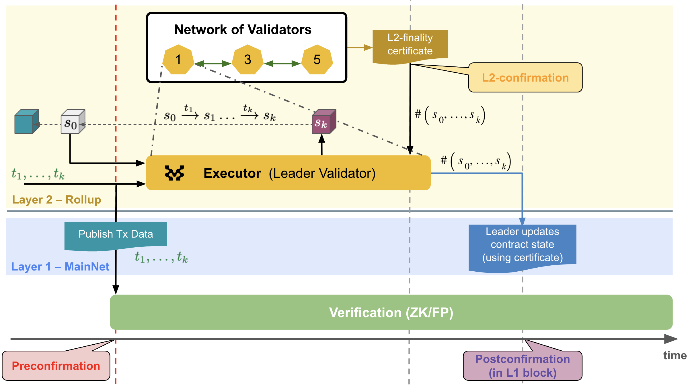

# MIP-34: Fast Finality Settlement

- **Description**: Establish the scope and components that are part of the Fast Finality Settlement mechanism.
- **Authors**: Franck Cassez, Andreas Penzkofer

## Abstract

Fast Finality Settlement (FFS) is a mechanism that allows for fast _confirmation_ of transactions backed by crypto-economic security. Moreover it capitalizes on the economic security from the L1. This MIP outlines the high-level specifications and architecture of FFS.

FFS is divided into

- **Postconfirmation**: a mechanism to confirm the validity of a block on L1, see [MIP-37](https://github.com/movementlabsxyz/MIP/blob/mip/postconfirmation/MIP/mip-37/README.md).
- **Fastconfirmation**: a mechanism to confirm the validity of a block on L2, see [MIP-65](https://github.com/movementlabsxyz/MIP/blob/mip/L2confirmation/MIP/mip-65/README.md).

## Motivation

Two chains are present in our architecture: a base chain (or L1) and a second chain (or L2). Rollups and other types of chains may publish or secure transaction data in a data availability (DA) layer or at Ethereum mainnet (L1).

Validity and optimistic rollups can finalize transactions within approximately 30 minutes and ~1 week, respectively. Until a transaction is finalized, there is no assurance about its validity and result (success or failure). This can be a limiting factor for certain types of DeFi applications.

Our objective is to enable transaction issuers to quickly get some guarantees that their transactions are correctly and successfully included in a block. The crypto-economic security is provided by a Proof-of-Stake (PoS) protocol. This mechanism can be deployed independently for a chain, or used in combination with existing settlement mechanisms, such as ZK and optimistic settlements.

As a result, users can rely and trust the **Fastconfirmation** (sometimes also described as L2-finality) to use as confirmation. If the chain is configured to do so, wait for L1-finality, such as through **Postconfirmation**, end of challenge window for fraud proofs (optimistic rollup), or verification of a ZK-proof (validity rollup).

A introduction to Postconfirmation can be found in [this blog post](https://blog.movementlabs.xyz/article/security-and-fast-finality-settlement) and a more detailed description of a (partial) implementation of the mechanism is available at [this blog post](https://blog.movementlabs.xyz/article/Postconfirmations-L2s-rollups-blockchain-movement).

This MIP provides an overview of an architecture of FFS, and its main components.

## Specification

*The key words "MUST", "MUST NOT", "REQUIRED", "SHALL", "SHALL NOT", "SHOULD", "SHOULD NOT", "RECOMMENDED", "NOT RECOMMENDED", "MAY", and "OPTIONAL" in this document are to be interpreted as described in RFC 2119 and RFC 8174.*

### Overview

**FFS**. The objective of Fast Finality Settlement (FFS) is to confirm that transactions are _processed_ correctly and that the node has *read* the transactions in the correct order. It does not impact the already established order of transactions by the sequencer.

The L2 chain increases by a new block in each (L2) round, and this block is the successor of the block in the previous round, the _predecessor_. Initially, there is a _genesis_ block with no predecessor.

**ProtoBlock**. Each round corresponds to the processing of a batch of transactions, called _protoBlock_, which is proposed by the _sequencer_ (can be centralized, decentralized, shared).

**L2Block**. A node with execution capability can apply the transactions in a protoBlock and calculate the new state and state root. Effectively this results in a block, called *L2Block*.

Since protoBlocks are provided by the sequencer, the new state and the state roots for a block are deterministic. For a protoBlock $b$ the state is $S_b$ and the state root is $H(S_b)$. From the protoBlock $b$ and the state $S_b$ the L2Block $B$ is computed.

**Local validation**. Since an L2Block is deterministically calculated we say that an L2Block (and the associated new state) is _validated locally_ once the execution engine calculates it from the protoBlock.

The validity judgement to be made is:
> Given an L2Block $B$ (predecessor), a protoBlock of transactions $txs$ and a successor L2Block $B'$, is $B'$ the^[the MoveVM is deterministic and there can be only valid successor.] _correct_ successor of $B$ after executing the sequence of transactions $txs$?

The term _correct_ means that the successor L2Block $B'$ (and the state it represents) has been computed in accordance with the semantics of the MoveVM, which we denote  $B \xrightarrow{\ txs \ } B'$.

**Validator**. A node that is responsible for validating transactions and confirming L2Blocks. To guarantee the validity of a new L2Block $B'$, we use a set of _validators_ who are in charge of verifying the transition $B \xrightarrow{\ txs \ } B'$.

**Attestation**. A validator _attests_ for a new L2Block $B'$. This can be done, for example, by committing to a hash of an L2Block. Or by each validator sending the hash of the block they have validated.

**Fastconfirmation certificate**. When enough validators have attested for a new L2Block $B'$, the L2Block is _fastconfirmed_ (sometimes referred to as _L2-final_). The accumulation of enough votes COULD be aggregated in a Fastconfirmation certificate. A naive implementation of the Fastconfirmation certificate is the Postconfirmation, i.e. a smart contract acknowledges a supermajority of votes.

**Fastconfirmation**. FFS aims to _confirm_ the validity of each produced L2Block. For the detailed design, see [MIP-65](https://github.com/movementlabsxyz/MIP/blob/mip/L2confirmation/MIP/mip-65/README.md).

> :bulb: If we confirm each L2Block before adding it to the (confirmed) part of the ledger, there cannot be any fork, except if the sequencer would provide equivocating protoBlocks for a given height AND there is a sufficiently strong Byzantine attack on the confirmation process.

If the validators can attest blocks quickly and make their attestations available, we have a fast confirmation mechanism supported by crypto-economic security, the  level of which depends on what is at stake for the confirmation of a block.

It may also be possible to confirm a sequence of L2Blocks. This may be particularly relevant, if protoBlocks are created in high frequency, e.g., every 500ms.

**SuperBlock**. L2Blocks can be constructed and confirmed on L2 at a higher rate than is feasible for L1. We group L2Blocks into a _superBlock_ that is confirmed together.

**Postconfirmation**. At certain intervals confirmations on L1 are provided. For the detailed design, see [MIP-37](https://github.com/movementlabsxyz/MIP/blob/mip/postconfirmation/MIP/mip-37/README.md).

The L1 contract will verify the satisfaction of the super-majority criteria. This provides L1-protection that that the superBlock has been irreversibly confirmed by the validator network. This additional anchoring mechanism increases the security of the Fastconfirmation as it locks in the Fastconfirmation, reduces the risk of long range attacks and provides a way to slash validators that have attested for invalid L2Blocks.

**Slashing**. The security of the mechanism relies on a PoS protocol. Each validator has to stake some assets, and if they are malicious they SHOULD be slashed.
The condition for slashing may be met by several criteria, and not all slashing conditions may be used:

- equivocate (send a different vote to different validators or users)
- vote for an invalid block
- (if possible) vote against a valid block

### Main challenges

See also [MD-34](../../MD/md-34/README.md).

To achieve crypto-economically secured fast finality, we need to solve the following problems:

**Postconfirmation**

1. design a _staking_ mechanism for the validators to stake assets, distribute rewards and manage slashing
1. verify_ whether a threshold of commitments have been reached for Postconfirmation.

**Fastconfirmation**

3. design a _staking_ mechanism for the validators to stake assets, distribute rewards and manage slashing
1. _verify_ whether a threshold of commitments have been reached for Fastconfirmation.
1. _communicate_ the Fastconfirmation status and compare to the Postconfirmation status.

### Addressing the challenges

**Staking and Rewards for Postconfirmations** (addresses 1.)

For Postconfirmation a staking mechanism is implemented in a contract on L1.
This contract provides the following functionalities:

- join: a new validator can join the set of validators by staking some assets
- exit: a validator exits and  get their stakes back

**Handle Postconfirmations** (addresses 2.)

For Postconfirmation, the following steps are implemented in a contract on L1:

- vote: receive a vote (or commitment), or a set of votes, verify the integrity of the votes (signatures) and the minimum threshold (e.g. 2/3)
- confirm: once the threshold is reached, confirm the block (or sequence of blocks) on L1

**Staking, Rewards and Slashing for Fastconfirmations** (addresses 3.)

For Fastconfirmation a staking mechanism is implemented. Ideally the stakes are determined from the L1 stakes. Rewards are distributed to the validators that have been active and provided work. Slashing is implemented for misbehaving validators.

A contract is implemented on L2 for this. This contract provides the following functionalities:

- record rewards or slash validators for their work.
- synchronize the results with the true stakes on L1.

**Handle Fastconfirmation** (addresses 4.)

For Fastconfirmation, the following steps are implemented in a contract on L2:

- vote: receive a vote (or commitment) or a set of votes, verify the integrity of the votes (signatures) and the minimum threshold (e.g. 2/3)
- confirm: once the threshold is reached, confirm the block (or sequence of blocks) on L2

**Communication of Fastconfirmation status** (addresses 5.)

This step synchronizes the Fastconfirmation with the Postconfirmation. The Postconfirmation is the final confirmation of the blocks on L1, and the Fastconfirmation is the confirmation layer on L2.

To ensure that the Fastconfirmation status is made available to third-parties, we may publish our _proof_  (2/3 of attestations) to a data availability layer and get a _certificate_ that the proof is available. This DA layer should offer a reliable _mempool_ for example as described [in this paper](https://arxiv.org/pdf/2105.11827).

Alternatively we can store the Fastconfirmation on an L2 chain (which also takes use of a DA layer).

## Initial Implementation Proposals

> :warning: :warning: The following proposals are based on initial assumptions and SHOULD be revised upon readiness of [MIP-37](https://github.com/movementlabsxyz/MIP/blob/mip/postconfirmation/MIP/mip-37/README.md) and [MIP-65](https://github.com/movementlabsxyz/MIP/blob/mip/L2confirmation/MIP/mip-65/README.md). Indeed, redundant information should be removed, once later MIPs are available.

#### Postconfirmation with deterministic blocks

L2Blocks are deterministically derived from the protoBlock, and consequently the superBlock $B_r'$ is deterministic. Validators then attest for the next transition directly:  $B_r \xrightarrow{\ txs \ } B_r'$. E.g. by committing to the the hash of $B_r'$.

An additional actor - the `acceptor` - is introduced that initiates the Postconfirmation process. This is necessary, as the Postconfirmation step requires additional gas on L1 and thus this role requires additional rewards. We also don't want to burden regular validators with additional gas costs, as we would like the gas costs for validators to be predictable. The `acceptor` serves for a specified period and is then replaced by another validator.

> :bulb: Since the block derivation is deterministic, $f+1$ may be sufficient to confirm the block. (However, we require $2f+1$ to cover potential edge cases, such as that the sequencer cannot be trusted.)

**Direct L1 commitments**. In the scenario where validators commit individually they send the block hashes of the calculated blocks directly to the L1 contract.

**Acceptor collects commitments**. In a more optimized scenario, the acceptor could also send the super-majority proof to the L1 contract.

*Figure 2: **Postconfirmation**: Leader-independent (deterministic) L2Block generation process.*

#### Fastconfirmation with deterministic blocks

Validators attest for the next transition directly in a contract on L2:  $B_r \xrightarrow{\ txs \ } B_r'$. E.g. by committing to the the hash of $B_r'$. This provides Fastconfirmations in the order of seconds.

Alternatively, a p2p layer could be established between validators. Validators communicate to aggregate a threshold of votes.

*Figure 3: **Postconfirmation + Fastconfirmation**: Leader-independent (deterministic) L2Block generation process. Validators co-operate to create a Fastconfirmation certificate before L1 is involved.*

#### Alternative Version (not implemented): Postconfirmation with leader-dependent blocks

A leader validator is elected for a certain interval. The leader proposes the next transition (superBlock $B_r'$):  $B_r \xrightarrow{\ txs \ } B_r'$. The leader can do so by sending a digest of $txs$ (Merkle root) and a digest of $B_r'$ (Merkle root hash of $B_r'$), or a _change set_. The leader commits on L1 to $B_r'$. Every validator checks the validity of $B_r'$ and prepares a vote message.

**Direct L1 commitments**. The vote messages of each validator are directly sent to the L1 contract. Once enough votes are available on L1, the leader initiates the Postconfirmation process.

**Leader collects votes**. The vote messages of each validator are directly sent to the L1 contract. Once the votes reach the required threshold for $B_r'$, the leader initiates the Postconfirmation process with the proof of the votes.

_Figure 1: **Postconfirmation**: Leader-dependent L2Block generation process._

## Verification

> :warning: :warning: The following may be better placed in the specific MIP of Postconfirmation. This SHOULD be revised upon readiness of [MIP-37](https://github.com/movementlabsxyz/MIP/blob/mip/postconfirmation/MIP/mip-37/README.md) and [MIP-65](https://github.com/movementlabsxyz/MIP/blob/mip/L2confirmation/MIP/mip-65/README.md). Indeed, redundant information should be removed, once later MIPs are available.

### Correctness and Security

A more detailed discussion on the correctness and security is discussed in [this blog post on Postconfirmations](https://blog.movementlabs.xyz/article/security-and-fast-finality-settlement).

The level of security depends on the total stake of the L2 validators. The higher the more secure.

The correctness of the mechanism relies on a few trust assumptions.

**Byzantine assumption**.
We assume that at most $f$ of the total $n=3f+1$ (L2) validators can be malicious.
This implies that if more than $2f +1$ attest for a new block, at least $f + 1$ honest validators have attested, so at least one honest validator has attested to $B'$. Thus, we request that >$\frac{2}{3}n$ (super-majority)  validators have attest for $B'$.

**Postconfirmations**. We assume that the contract that validates the proof of super-majority is correct (there are no bugs in the implementation of the contract). As a result, when the contract verification step is confirmed on L1 (L1-finality), the super-majority proof verification is L1-secure.

Combining the two results above we have: confirmation (L1 contract) that >2/3 of validators have attested to a certain superBlock and if >2/3 have attested then $B'$ is valid. So overall, if the >2/3 super-majority is verified by the L1 contract, $B'$ is valid.

**Fastconfirmation**. The same applies as for Postconfirmations.

In addition the L2 validators also publish the proofs to a DA layer and once the proof is available it cannot be tampered with. Thus, we can provide some guarantees about the irreversibility of transactions when the availability certificate (of the Fastconfirmation certificate) is delivered, and before the actual proof is verified on L1. If validators misbehave, they _will_ be slashed on L1, which provides strong incentives for validators not to act malicious.

This is conditional to:

- ensuring that the validators send the same proof to the L1 staking contract and to the DA.
- validators cannot exit too early (not before the proof they are committed to are confirmed on L1).

## Optimizations

There are several aspects that could be optimized and refined:

- **super-majority proof**: it can be a list of votes, but could also be a ZK-proof (more compact). The super-majority proof is not a proof of correct execution (as in zkVM) but simply of super-majority and this is cheaper to compute.
- **signatures aggregation**: we want to avoid sending large transactions to the L1 as it increases operational costs. How to aggregate signatures to send more compact messages/transactions?
- **delegation/weighted stakes**: a mechanism for validators to delegate their voting power to other validators. Ability for validators to stake different amounts (and use weighted stakes super-majority).
- **commit to a sequence of L2Blocks**. The Fastconfirmation certificate could be per L2block. However, on L1 we want to commit to a sequence of blocks (a superBlock). This can be done by committing to the state root of the last block in the sequence or more complicated approaches using Merkle roots.

## Appendix

## Changelog
