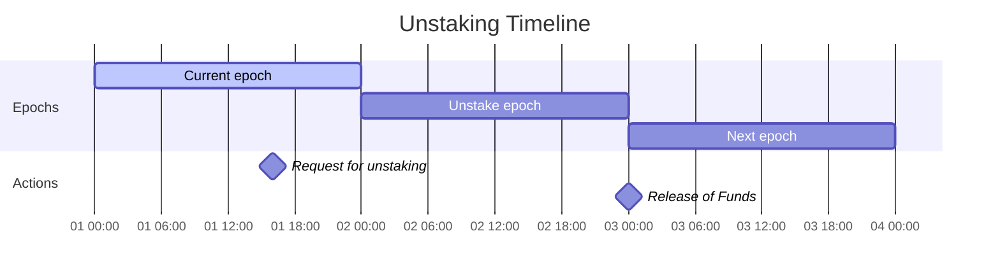

# MIP-37: FFS: Postconfirmation

- **Description**: Confirmations of superBlocks on L1. A sub-protocol of Fast Finality Settlement.
- **Authors**: Andreas Penzkofer
- **Desiderata**: [MD-37](../../MD/md-37)

## Abstract

Fast-Finality-Settlement (FFS) is proposed in [MIP-34](https://github.com/movementlabsxyz/MIP/pull/34), with two confirmation mechanisms, one the base level (L1) and one the chain level (L2). This MIP details the mechanism on Level 1 (L1), which is called ***Postconfirmation***.

L2 produces **L2Blocks**. At certain intervals validators commit a sequence of L2Blocks in a ***superBlock***, to L1. The L1 contract will verify if >2/3 of the validators have attested to a given superBlock height. The action for this validation is called Postconfirmation and it is initiated by the ***acceptor***. The acceptor is a specific validator selected for some interval.

This provides an L1-protected guarantee that a superBlock (i.e. a sequence of L2Blocks) is accepted and correctly executed. This anchoring mechanism increases the security of the L2 as it protects the L2-state against long range attacks and can provide a way to slash validators that have attested against the majority.

## Motivation

We require from the FFS protocol that it is secure and efficient, yet simple in its _initial_ design. In order for the protocol to fulfill the requirement for simplicity, validators only communicate to the L1-contract and not with each other. This is a key design decision to reduce the complexity of the protocol, but can be improved in the future.

We also request that rewards and costs are made more predictable for validators. For this, we propose a special role -- the acceptor -- to perform the Postconfirmation process.

## Specification

_The key words "MUST", "MUST NOT", "REQUIRED", "SHALL", "SHALL NOT", "SHOULD", "SHOULD NOT", "RECOMMENDED", "NOT RECOMMENDED", "MAY", and "OPTIONAL" in this document are to be interpreted as described in RFC 2119 and RFC 8174._

Figure 1 shows the leader-independent (deterministic) block generation process, which is also discussed in [MIP-34: Fast Finality Settlement](https://github.com/movementlabsxyz/MIP/pull/34).


*Figure 1: Leader-independent (deterministic) block generation process.*

Since this document introduces a large number of new terms, we provide a specification by defining the terms and their interactions.

#### Domains - One contract to rule them all

The L1 contract is intended to handle multiple chains. We differentiate between the chains by their unique identifier `domain` (of type `address`).

#### L2Blocks

L2Blocks are deterministically derived from the sequencer-batches, which are called protoBlocks, see the [glossary](../../GLOSSARY.md). Validators calculate the next deterministic transition (imposed through the sequence of transactions $txs$) $B \xrightarrow{\ txs \ } B'$, where $B$ and $B'$ are L2Blocks.

#### SuperBlock

The Postconfirmation protocol cannot attest to each individual L2Block. This restriction derives from the high frequency at which protoBlocks can be created, the low frequency of L1Blocks and the cost of L1 transactions. Therefore, after a certain number of L2blocks, validators calculate the next (deterministic) superBlock and commit to it in the L1 contract. The L1 contract will verify if >2/3 of the validators have attested to a given superBlock height to a superBlock

#### Commitment

Validators commit the hash of the superBlock on the L1-contract. It commits the validator to a certain superBlock at a given height, with no option for changing their opinion. (This is intentional - validators should not be able to revert).

```solidity
struct superBlockCommitment {
  uint256 height;
  bytes32 commitment;
  bytes32 superBlockId;
}
```

#### Epochs

We require epochs in order to facilitate `staking` and `unstaking` of # validators, as well as manage rewards and penalties. The `epochDuration` MUST be set when initializing a chain. It MAY be changeable later on through a governance mechanism.

The `epochDuration` should be set to a value that is large enough to allow for the `staking` and `unstaking` process to be completed. Moreover, it should be long enough for human operators to react.

> :bulb: The initial recommendation for `epochDuration` is 1 day.

There are three relevant epoch types

1. **`presentEpoch`** is the epoch that is currently active on L1. Acceptors exist in the `presentEpoch`.

> :warning: the selection of the acceptor must depend on the stake. but this may conflict with the rollover function which handles epochs that may be far in the past. thus we need to check if this concept conflicts with the rollover function

```solidity
uint256 presentEpoch = getEpochByL1BlockTime();
```

where

```solidity
function getEpochByL1BlockTime(address domain) public view returns (uint256) {
    return block.timestamp / epochDuration;
}
```

2. **`assignedEpoch`**. If a superBlock height is new, the L1-contract will assign the current `presentEpoch` value to the superBlock height.

```solidity
/// map each block height to an epoch
mapping(uint256 blockHeight => uint256 epoch) public superBlockHeightToAssignedEpoch;
superBlockCommitment memory superBlockCommitment

if (superBlockHeightToAssignedEpoch[blockCommitment.height] == 0) {
  superBlockHeightToAssignedEpoch[blockCommitment.height] = getEpochByL1BlockTime();
}
```

Any validator can commit the hash of a superBlock, the height of the superBlock should not be able to be set too far into the future. Note that an adversary could commit to far in the future superBlocks. However, since no honest validator would attest to it, the rollover function should update to the correct epoch for a given superBlock height.

> :warning: TODO leading Block Tolerance. why do we need it? I assume it was meant as a protection against posting too far into the future block-heights but is this really necessary? What in particular does this protect against? Could setting far in the future impose a cost on the honest validators or acceptor in any way?

```solidity
if (lastAcceptedBlockHeight + leadingBlockTolerance < blockCommitment.height) revert ValidatorAlreadyCommitted();
```

The validator has to check if the current superBlock height (off-L1) is within the above window. Otherwise the commitment of the (honest) validator will not be added to the L1 contract.

3. **`acceptingEpoch`**

Votes are counted in the current `acceptingEpoch`. If there are enough commitments for a `superBlockId` the superBlock height receives a Postconfirmation status.

```solidity
??? relevant code
```

#### Staking and Unstaking

Validators can stake and unstake their tokens. The staking and unstaking process is managed by the L1-contract. Validators can stake their tokens for a certain epoch. The staking process is initiated by the validator. The validator can also unstake their tokens to the end of the next epoch. 

The reason for the delay in the unstaking process is to prevent validators from harming the protocol towards the end of an epoch without implications, and to remain accountable for at least one epoch.



We require functions `addStake`, `removeStake`, `addUnstake`, `removeUnstake` to manage the staking and unstaking process.

We require the following mappings

```solidity
// Type aliases for better readability
type Domain is address;
type Epoch is uint256;
type Custodian is address;
type Attester is address;

// Mappings
mapping(Domain => mapping(Epoch => mapping(Custodian => mapping(Attester => uint256)))) public epochStakesByDomain;
mapping(Domain => mapping(Epoch => mapping(Custodian => uint256))) public epochTotalStakeByDomain;
mapping(Domain => mapping(Epoch => mapping(Custodian => mapping(Attester => uint256)))) public epochUnstakesByDomain;

```

For example, the addition functions are

```solidity
function _addStake(
    address domain,
    uint256 epoch,
    address custodian,
    address attester,
    uint256 amount
) internal {
    epochStakesByDomain[domain][epoch][custodian][attester] += amount;
    epochTotalStakeByDomain[domain][epoch][custodian] += amount;
}
```

and

```solidity
function _addUnstake(
    address domain,
    uint256 epoch,
    address custodian,
    address attester,
    uint256 amount
) internal {
    epochUnstakesByDomain[domain][epoch][custodian][attester] += amount;
}
```

#### (Optional) Slashing

> :bulb: Slashing may only be required if we implement Fastconfirmations, see [MIP-65](https://github.com/movementlabsxyz/MIP/pull/65).

With Postconfirmations alone nodes do not need to get slashed if they voted for an invalid commitment. Since only their first vote for a given height gets accepted by the contract, they cannot equivocate. More abstractly the L1 provides consensus on the votes.

Nodes SHOULD get slashed if it has been proven that the validator voted more than once for a given block height on L2. This is a security measure to protect against long-range attacks. However, this is part of the scope of [MIP-65: Fastconfirmations.](https://github.com/movementlabsxyz/MIP/pull/65)

> :warning: :warning: How do we prove that a validator has voted twice for a given block height? Does it involve Merkle proofs?

```solidity
function slash(
    address[] calldata custodians,
    address[] calldata attesters,
    uint256[] calldata amounts,
    uint256[] calldata refundAmounts
) external override {
    for (some sort of loop over the arrays) {
        // Call _slashStake with the specific custodian, attester, and amount
        // ??? how do we get the domain and epoch?
        _slashStake(domain, epoch, custodian, attester, amount);
        // Optionally handle refunds here using `refundAmounts[i]` if applicable
    }
}
```

#### Rollover

The protocol increases the `acceptingEpoch` incrementally by one, i.e. the protocol progresses from one accepting epoch to the next. Whenever, such an incrementation happens, the stakes of the validators get adjusted to account for `staking` and `unstaking` events. This transition is called _Rollover_. On the default path the `rolloverEpoch` function is called by the acceptor. 

A rollover can occur in two types of paths:

1. If the `assignedEpoch` of the next superBlock height falls into the next epoch, the protocol progresses to the next epoch.

```solidity
uint256 NextBlockHeight
uint256 NextBlockEpoch = superBlockHeightToAssignedEpoch[NextBlockHeight];
while (getAcceptingEpoch() < NextBlockEpoch) {
  rollOverEpoch();  // this also increments the acceptingEpoch
}
```

2. If the votes in the current `acceptingEpoch` are not sufficient but there are votes in the subsequent epochs and they are sufficient, the rollover function should be initiated.

> [!NOTE]
> this is a requirement to protect against liveness issues. Either the acceptor (or the volunteer-acceptor) has not been active for a liveness affecting amount of time to initiate Postconfirmations, or over 1/3 of the validators have not been active in the `acceptingEpoch`. Either way, the current acceptingEpoch has not been live and should be skipped.

#### Acceptor

Every interval `acceptorTerm` one of the validators takes on the role to perform the Postconfirmation checks. This acceptor is selected via L1-randomness provided through L1Block hashes. This acceptor is responsible for updating the contract state once a super-majority is reached for a superBlock. The acceptor is rewarded for this service, see the [Rewards section](#rewards). We note that this does not equate to a leader in a traditional consensus protocol, as the acceptor does not propose new states. Its role can also be taken over by a [volunteer-acceptor](#volunteer-acceptor).

> :bulb: We separate the acceptor from the validators to achieve separation of concerns and in particular simplify the reward mechanism.

The L1-contract determines the current valid `acceptor` by considering the current L1Block time (`block.timestamp`) and randomness provided through L1Block hashes. For example,

```solidity
function getCurrentacceptor() public view returns (address) {
  uint256 currentL1BlockHeight = block.number;
  // -1 because we do not want to consider the current block.
  uint256 relevantL1BlockHeight = currentL1BlockHeight - currentL1BlockHeight % acceptorTerm - 1 ; 
  bytes32 blockHash = blockhash(relevantL1BlockHeight);
  address[] memory validators = getValidators();
  // map the blockhash to the validators
  uint256 acceptorIndex = uint256(blockHash) % validators.length;
  return validators[acceptorIndex];        
}
```

##### Volunteer-Acceptor

If the acceptor does not update the contract state for some time, this is negative for the liveness of the protocol. In particular if the `acceptorTerm` is in the range for the time that is required for the `leadingBlockTolerance`. Thus it is recommended that `acceptorTerm` << time(`leadingBlockTolerance`), however such a requirement may not be trivial to solve.

In order to guarantee liveness the protocol ensures that anyone can voluntarily provide the service of the acceptor. However, no reward is being issued for this service.

#### Rewards

Validators are rewarded for their service. The reward is calculated proportional to the validator stake and activity. The reward is issued in the next epoch.

Acceptors are rewarded for their service. The reward is calculated proportional to the activity. The reward is issued in the next epoch.

## Reference Implementation

A reference implementation for Postconfirmation is provided by MCR, see [here](https://github.com/movementlabsxyz/movement/tree/714831820d78b3910729a194cd0508fa1efd9aa9/protocol-units/settlement/mcr).

## Verification

## Appendix

## Changelog
