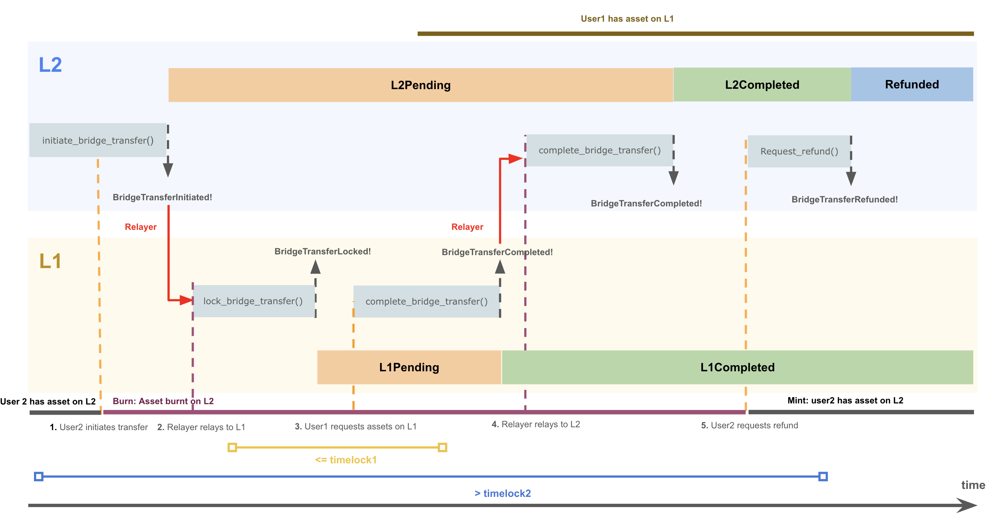

# MIP-39: MOVE Token -- Bridge Design
- **Description**: Architecture of the Native Bridge for Move token.
- **Authors**: [Franck Cassez](mailto:franck.cassez@movementlabs.xyz)

## Abstract

This MIP describes the high-level architecture of the MOVE token native bridge. The architecture describes the main bridge components and high-level requirements.

## Definitions

**Native Bridge**: The bridge that allows the transfer of tokens between L1 and L2, which hold `$L1MOVE` and `$L2MOVE` token, respectively. The native bridge has the capability to mint `$L2MOVE` tokens.

- `$L1MOVE` (or `$MOVE`) : ERC-20 type token with the source contract on L1
- `$L2MOVE` :  Token that is created on L2 after `$L1MOVE` token is locked on L1. We also say `$L1MOVE` is bridged from L1 to L2. `$L2MOVE` may publicly also be called `$MOVE` but as this causes confusion, here we stick to `$L2MOVE` to make clear this token lives on L2.

## Motivation

The Movement chain (L2) uses the `$L2MOVE` token to pay for gas fees. As a result users need to hold `$L2MOVE` tokens to pay for their transactions.

> [!IMPORTANT] 
> The _native_ `$L1MOVE`token is an ERC-20 contract on Ethereum (L1).  By native, we mean that this is the location where the token is minted and burned and where the total supply is set and possibly modified (inflation/deflation). The **`$L1MOVE` token reserve**  is in the L1 contract.

To use the Movement chain and pay for gas fees, a user will acquire `$L1MOVE` (native) tokens on L1, and _bridge_ them to L2. On the L2 they can use the token to pay for gas fees or with any other dApps that transact the `$L2MOVE` token.
Later, a user can choose to migrate their `$L2MOVE` tokens back to the L1 at any time (thereby converting them to `$L1MOVE`).
These cross-chain assets's transfers are usually done through a component called a _bridge_.

### A standard bridge architecture

The process of transferring tokens across different chains is implemented with a _bridge_ (between the chains).

There are several choices for the architecture of a bridge, and we describe here a classical bridge with a  _lock-mint_ protocol (see Chainlink's [What Is a Cross-Chain Bridge?](https://chain.link/education-hub/cross-chain-bridge) for a quick introduction to types of bridges).

> [!WARNING]  
> This is a bridge, not a swap, so transfer is 1 to 1.
> The transfer of tokens is one-to-one: a user bridges $k$ `$L1MOVE` tokens to L2, and they receive $k$ `$L2MOVE` tokens. Same one-to-one ratio applies from L2 to L1.  The bridge does not allow for _swapping_ tokens.

**Lock-and-Mint**. The main idea of the _lock-mint_ protocol is as follows. For the sake of simplicity, assume the two chains (L1 and L2) have only one user and the user has an account `l1acc` on L1, and another account `l2acc` on L2.  We also assume that each transfer is for one token.

If the user wants to bridge one `$L1MOVE` to L2, then

- they _lock_ (one) `$L1MOVE` into a (escrow) contract `L1InitiatorBridge` on the L1 side. To do so they transfer (one) `$L1MOVE` from `l1acc` to the `L1InitiatorBridge` contract;
- once the contract `L1InitiatorBridge` receives the `$L1MOVE` it emits a corresponding event `FundReceivedFrom(l1acc)` to the L1 (append-only) logs,
- a _relayer_ monitors the logs on the L1 side, and when they see the `FundReceived(l1acc)` event, they send a transaction to an L2 contract, `L2CounterPartyBridge` asking the contract to mint (one)  `$L2MOVE`,
- the user requests the transfer of the newly minted `$L2MOVE` to their account `l2acc` on L2.

**Burn-and-Unlock**. The transfer from L2 to L1 is similar:

- the user transfers (one) `$L2MOVE` to the `L2InitiatorBridge` contract. The `L2InitiatorBridge` burns (destroys) the token and emits an event
`TokenBurned(l2acc)` to the L2 (append-only) logs,
- a relayer monitors the L2 logs and when they see the event `TokenBurned(l2acc)`, they send a transaction to the L1 contract `L1CounterPartyBridge` to _unlock_ an `$L1MOVE` token for account `l1acc`,
- the user (on L1)  requests transfer of one `$L1MOVE` from the  `L1CounterPartyBridge` to their account on L1,   `l1acc`.

This protocol can be implemented with three main components:

- two contracts on the L1 side,
- one contract (module) on the L2 (Move) side,
- a relayer.

### Attacks on bridges

As can be seen the protocol above has distinct phases, and many things can go wrong. For example

- **User becomes unable to retrieve funds**. The user locks their funds in the L1 contract, but the relayer never issues the minting transaction. In that case the user may never be able to retrieve their funds. What we want is some _atomicity_ between the steps: if the user locks their funds, then either the corresponding minting transaction occurs, or if it does not (and we may set a time bound), the funds are returned to the user on L1.
- **Crediting the wrong user**. Another source of difficulty is to make sure that only the user `l2acc` can redeem the `$L2MOVE` tokens. i.e. they are not credited to another user.

Many of the possibly issues have been thoroughly studied and bridges have been in operation for several years. However hacks related to bridges account for more than 1/3 of the total hacks value which tends to indicate that bridges are vulnerable, frequently attacked, and should be designed carefully. Infamous attacks are two Ronin bridge attacks and a Nomad bridge attack

- [2022: Crypto Hackers Exploit Ronin Network for $615 Million](https://www.bankinfosecurity.com/crypto-hackers-exploit-ronin-network-for-615-million-a-18810)
- [2024: Ronin Bridge Paused, Restarted After $12M Drained in Whitehat Hack](https://www.coindesk.com/tech/2024/08/06/ronin-bridge-paused-after-9m-drained-in-apparent-whitehat-hack/)
- [August 2022: Hack Analysis: Nomad Bridge ($192M)](https://medium.com/immunefi/hack-analysis-nomad-bridge-august-2022-5aa63d53814a)

Some solutions [XChainWatcher](https://arxiv.org/abs/2410.02029) rely on monitoring bridges and detect attacks.

Designing a safe bridge is a hard problem.

## Specification

### Bridging from L1 to L2

Let `user1` be a user with an account on L1, and `user2` be a user with an account on L2.

> [!NOTE] 
> **Simple context (without loss of generality)**
> Assume `user1` wants to transfer `1` `$L1MOVE` tokens, we refer to as `asset` in the sequel, to `user2` on L2.

#### Transfer steps

A successful transfer requires the following these steps:

1. _user1_ locks their L1`$L1MOVE` tokens in the `AtomicBridgeInitiatorMOVE.sol` contract on L1. The contract emits an event `BridgeTransferPending` to the L1 logs. At this point in time the transfer becomes `INITIALIZED` on L1.
2. A _relayer_ monitors the L1 logs and when they see the `BridgeTransferPending` event, they send a transaction to the `atomic_bridge_counterparty.move` module on L2 asking the module to prepare the minting of `$L2MOVE` tokens. The status of the bridge transfer on L2 becomes `PENDING`. An event `BridgeTransferLocked` is emitted to the L2 logs.

> [!TIP] 
> Check point: This is the end of the first phase. Next phase must be triggered by `user2`.
> At that point the bridge transfers details are known by the L1 and the L2.

3. _user2_ (or anybody with the secret) sends a transaction to the `atomic_bridge_counterparty.move` module on L2 asking to _complete the bridge transfer_. If the transfer has been properly initialised (step 2 above), this results in minting tokens and transfers the minted tokens to the `user2` account. If successful, an event `BridgeTransferComplete` is emitted to the L2 logs. The status of the transfer on L2 becomes `COMPLETED`.

> [!TIP] 
> Check point: The transfer is completed on L2.
> At that stage the `$L2MOVE` tokens are in the `user2` account on L2.

4. The relayer monitors the L2 logs and when they see the `BridgeTransferComplete` event, they send a transaction to the `AtomicBridgeInitiatorMOVE.sol` contract on L1 to _complete the bridge transfer_. This closes the status of the transfer on L1 and the status of the transfer becomes `COMPLETED`. An event `BridgeTransferComplete` is emitted to the L1 logs.

5. `user1` can claim a refund on L1 after a certain time, `timelock1`, has elapsed.
This introduces possible concurrent unwanted behaviours, and a timelock has to be set on L2, `timelock2`, to prevent the relayer from completing the transfer on L2 after the refund has been claimed on L1.

The following diagram (Figure 1) illustrates the steps above:

---

**Figure 1**: Timechart of the bridge protocol from L1 to L2.

---
> [!CAUTION] 
> Fault-tolerance
> As there can be crashes or delays or network partitions, the protocol should be _fault-tolerant_ to a certain extent.
This is done by the use of `timelocks` on the L1 and L2 sides that restrict the operations above to occur within _bounded time windows_.

In order to ensure that the funds can only be transferred from `user1` to `user2`, `user1` locks (step 1. `init_bridge_transfer()`) the funds with a `secret`.
To unlock the funds on L2, `user2` needs to prove they know the secret when they request the funds on L2 (step 3. `complete_bridge_transfer()`).

> [!IMPORTANT]  
> **Requirements for the bridge protocol**
> The desired properties of the bridge protocol (L1 to L2) are  **atomicity** and **liveness**:
>
> - [safety-1] `user1` SHOULD be able to initiate a transfer at any time.
> - [safety-2] `user1` MUST NOT be able to **get a refund** if the transfer **has been completed on L2** and `user2` has the funds on L2.
> - [liveness-1] if the relayer is live and relays all events within a bounded time, `user1` SHOULD be able to complete the transfer on L2 and get the asset on L2.
> - [liveness-2] if the transfer has not been completed by the L2 within a time window `timelock1` since `user1` initiated the transfer, `user1` MUST be able to get a refund on L1.

As can be seen in the diagram above, the safety of the bridge may depend on:

- the relayer being live and **relaying all events within a bounded time**,
- the timelocks' values **being set** correctly.

For instance if `timeLock2` is larger than `timeLock1`, the following scenario can happen:

- the `complete_bridge_transfer()` tx completes on L2 and funds are transferred to `users2`,
- the relayer does not relay the event `BridgeTransferCompleted!` fast enough,
- `user1` on L1 asks for a refund, `request_refund()`, which is successful and gets the asset back.

The correctness of the implementation depends on the timelocks' values and is addressed in the Verification section below.

#### Security & Permissions

Contracts's APIs:

| Layer | Function Name              | Permission      | #Event |
|----| ----------------------------|-------------------|------ |
| L1 | `init_bridge_transfer()`   | User1              | BridgeTransferPending |
| L1 | `request_refund()`         | User1              | BridgeTransferRefunded |
| L1 | `complete_bridge_transfer()` | Relayer          | BridgeTransferCompleted |
||
| L2|  `lock_bridge_asset_transfer()`   | Relayer      | BridgeTransferLocked |
| L2 | `complete_bridge_transfer()` | User2          |  BridgeTransferCompleted |
| L2 | `abort_bridge_transfer()`   | Relayer          | BridgeTransferAborted |

The permissions are set to ensure that only the user who initiated the transfer can request a refund, and only the relayer can complete the transfer on L2.

Other safety considerations include the use of [EIP-55](https://eips.ethereum.org/EIPS/eip-55) (L1 side) checksums for addresses. There is some code immplemented in the L2 Move contract [ethereum_module](<https://github.com/movementlabsxyz/aptos-core/blob/061155119258caab512aec6aa860b086e5f312e0/aptos-move/framework/aptos-framework/sources/atomic_bridge.move#L1> to check EIP-55 compliance so we may enforce EIP-55 compliance at some stage.

### Bridging from L2 to L1

#### Transfer steps

A successful transfer from L2 to L1 requires the following these steps:

1. _user2_ burns their L2\$MOVE tokens in the `atoic_bridge_initiator.move`  contract on L2. The contract emits an event `BridgeTransferInitiated` to the L2 logs. At this point in time the transfer becomes `INITIALIZED` (or pending) on L2.
2. A _relayer_ monitors the L2 logs and when they see the `BridgeTransferInitiated` event, they send a transaction to the `AtomicBridgeCounperPartyMOVE.sol` contract on L1 asking the module to prepare to _unlock_ L1\$MOVE tokens. The status of the bridge transfer on L1 becomes `PENDING`. An event `BridgeTransferLocked` is emitted to the L1 logs.

> [!TIP] 
> Check point. `user2' does not have the asset on L2 anymore.
> At that point the bridge transfers details are known by the L1 and the L2.

3. _user1_ (or anybody with the secret) sends a transaction to the `AtomicBridgeCounterParty.sol` contract on L1 asking to _complete the bridge transfer_. If the transfer has been properly initialised (step 2 above), this results in transferring $L1MOVE tokens to the `user1` account. If successful, an event `BridgeTransferCompleted` is emitted to the L1 logs. The status of the transfer on L1 becomes `COMPLETED`.

> [!TIP] 
> Check point. `User1` has the asset on L1.
> At that stage the L1\$MOVE tokens are in the `user1` account on L1.

4. The relayer monitors the L1 logs and when they see the `BridgeTransferCompleted` event, they send a transaction to the `atomic_bridge_initiator.move` module on L2 to _complete the bridge transfer_. This closes the status of the transfer on L2 and the status of the transfer becomes `COMPLETED`. An event `BridgeTransferCompleted` is emitted to the L2 logs.

5. `user2` can claim a refund on L1 after a certain time, `timelock2`, has elapsed.
This introduces possible concurrent unwanted behaviours, and a timelock has to be set on L2, `timelock2`, to prevent the relayer from completing the transfer on L1 after the refund has been claimed on L2.

The following diagram (Figure 1) illustrates the steps above:

---

**Figure 2**: Timechart of the bridge protocol from L2 to L1.

---

#### Security & Permissions

Contracts's APIs:

| Layer | Function Name              | Permission      | #Event |
|----| ----------------------------|-------------------|------ |
| L2 | `initiate_bridge_transfer()`   | User2              | BridgeTransferPending |
| L2 | `request_refund()`         | User2              | BridgeTransferRefunded |
| L2 | `complete_bridge_transfer()` | Relayer          | BridgeTransferCompleted |
||
| L1|  `lock_bridge_transfer()`   | Relayer      | BridgeTransferLocked |
| L1 | `complete_bridge_transfer()` | User1          |  BridgeTransferCompleted |
| L1 | `request_refund()`   | User2          | BridgeTransferRefunded |

The permissions are set to ensure that only the user who initiated the transfer can request a refund, and only the relayer can complete the transfer on L1.

The key words "MUST", "MUST NOT", "REQUIRED", "SHALL", "SHALL NOT", "SHOULD", "SHOULD NOT", "RECOMMENDED", "NOT RECOMMENDED", "MAY", and "OPTIONAL" in this document are to be interpreted as described in RFC 2119 and RFC 8174.

## Reference Implementation

### Bridging from L1 to L2

The contracts involved are:

- Solidity contract [AtomicBridgeInitiatorMOVE.sol](https://github.com/movementlabsxyz/movement/blob/main/protocol-units/bridge/contracts/src/AtomicBridgeInitiatorMOVE.sol) on L1.
- Move Module [atomic_bridge_counterparty.move](https://github.com/movementlabsxyz/aptos-core/blob/061155119258caab512aec6aa860b086e5f312e0/aptos-move/framework/aptos-framework/sources/atomic_bridge.move#L1163) on L2.

The current implementation is a _lock-mint_ bridge. The user locks their `$L1MOVE` tokens in the `AtomicBridgeInitiatorMOVE` contract, and the `atomic_bridge_counterparty.move` module mints the corresponding `$L2MOVE` tokens.

### Bridging from L2 to L1

The contracts involved are:

- Solidity contract [AtomicBridgeCounterPartyMOVE.sol](http:githug.com/movementlabsxyz/movement/blob/main/protocol-units/bridge/contracts/src/AtomicBridgeCounterPartyMOVE.sol) on L1,
- module [atomic_bridge_initiator.move](https://github.com/movementlabsxyz/aptos-core/blob/061155119258caab512aec6aa860b086e5f312e0/aptos-move/framework/aptos-framework/sources/atomic_bridge.move#L121) on L2.

### Relayer and Services

The (Rust) relayer logics are in [service folder](https://github.com/movementlabsxyz/movement/tree/main/protocol-units/bridge/service).

> [!WARNING]
> If the value of the parameter `timeLockL2` is larger than `timeLockL1`, the following scenario can happen:
>
> - the `completeBridgeTransfer` tx completes on L2 and funds are transferred to the target address on L2,
> - the relayer does not relay the event fast enough,
> - the user on L1 asks for a refund, and the `refund` tx is executed on L1.

User gets funds on L2, and gets their fund back on L1.

<!--
  The Reference Implementation section should include links to and an overview of a minimal implementation that assists in understanding or implementing this specification. The reference implementation is not a replacement for the Specification section, and the proposal should still be understandable without it.

  TODO: Remove this comment before submitting
-->

## Verification

### Bridge L1 to L2

The correctness of the bridge operation from L1 to L2 depends on several factors:

- the timelocks' values,
- the control of the keys to operate the bridge,
- the verification of the `secret`.

We assume that the keys are not compromised, and that the logics in the contracts ensure that the secret `user1` uses is requested by the `complete_bridge_transfer` tx on L2. This can tested on L1 (Solidity) and formally verified on L2 (Move and Move Prover).

In this section we focus on the timelocks' values, as this involves a sequence of operations on L1 and L2.
We model the bridge transactions (L1 to L2) and the transfers of assets with a [network of timed automata](https://www.cis.upenn.edu/~alur/TCS94.pdf).
The safety and liveness properties are defined by temporal logics formulas and can be verified with model-checking tools such as [UPPAAL](http://www.uppaal.org/).

The UPPAAL model is available in [this-file](./uppaal-models/bridge-up-v2.xml).
To reproduce the results and check the properties on the model, you need a working version of UPPAAL.

The results of the model-checking verification are as follows: let $maxRelayerDelay$ be the **maximum delay** for the relayer to relay an event, and $timeLock1$ and $timeLock2$ be the timelocks on L1 and L2 respectively.

> [!IMPORTANT] 
> **Verification results**
> We have **proved** (model-checked with UPPAAL) the following properties (valid using the versions of the contracts below):
>
> - contract (Move): [atomic_bridge.move](https://github.com/movementlabsxyz/aptos-core/blob/movement/aptos-move/framework/aptos-framework/sources/atomic_bridge.move), commit [c1ecd0a](https://github.com/movementlabsxyz/aptos-core/commit/c1ecd0afd250fd71fe9ffc168b2ba7bafa97ffb3)
> - contracts (Solidity): [AtomicBridgeInitiatorMOVE.sol](https://github.com/movementlabsxyz/movement/blob/main/protocol-units/bridge/contracts/src/AtomicBridgeInitiatorMOVE.sol) and [AtomicBridgeCounterpartyMOVE.sol](https://github.com/movementlabsxyz/movement/blob/main/protocol-units/bridge/contracts/src/AtomicBridgeCounterpartyMOVE.sol) in this commit  [200c9f9](https://github.com/movementlabsxyz/movement/commit/200c9f9d10fa8863b096ab3cd5442938c358a091)
> - [safety-1]: there exists an execution path such that `user1` initiates and completes a transfer on L2 within a time window $timeLock1$,
> - [safety-2]: **Provided** the relayer relays the events within a time window $maxRelayerDelay$, **AND** $timelock1 > timelock2 + 2 \times  maxRelayerDelay$, `user1` cannot get a refund on L1 if the transfer has been completed on L2,
> - [liveness-1] if the relayer is not down, `user2` can get the funds on L2, after $timelock1 + 2 * maxRelayerDelay$ time units.
> - [liveness-2] if the transfer is not successful on L2 within $timelock1$, `user1` can get a refund on L1 (after $timelock1$ time units).

Note that [safety-2] does hold if the relayer is down for more than $maxRelayerDelay$, or the timelocks are not set correctly.

### Bridge L2 to L1

The only difference between L1 to L2 is the way assets are created/destroyed. However, the formal model abstracts away this difference and the same properties hold for the L2 to L1 bridge.

<!--

  All proposals must contain a section that discusses the various aspects of verification pertinent to the introduced changes. This section should address:

  1. **Correctness**: Ensure that the proposed changes behave as expected in all scenarios. Highlight any tests, simulations, or proofs done to validate the correctness of the changes.

  2. **Security Implications**: Address the potential security ramifications of the proposal. This includes discussing security-relevant design decisions, potential vulnerabilities, important discussions, implementation-specific guidance, and pitfalls. Mention any threats, risks, and mitigation strategies associated with the proposal.

  3. **Performance Impacts**: Outline any performance tests conducted and the impact of the proposal on system performance. This could be in terms of speed, resource consumption, or other relevant metrics.

  4. **Validation Procedures**: Describe any procedures, tools, or methodologies used to validate the proposal against its requirements or objectives. 

  5. **Peer Review and Community Feedback**: Highlight any feedback from peer reviews or the community that played a crucial role in refining the verification process or the proposal itself.

  TODO: Remove this comment before submitting
-->

<!-- ---

## Errata -->
<!--
  Errata should be maintained after publication.

  1. **Transparency and Clarity**: An erratum acknowledges any corrections made post-publication, ensuring that readers are not misled and are always equipped with the most accurate information.

  2. **Accountability**: By noting errors openly, we maintain a high level of responsibility and ownership over our content. It’s an affirmation that we value precision and are ready to correct oversights.

  Each erratum should briefly describe the discrepancy and the correction made, accompanied by a reference to the date and version of the proposal in which the error was identified.

  TODO: Maintain this comment.
-->

---

## Appendix

The UPPAAL models of the L1 to L2 tranfers are available in the [uppaal-models](./uppaal-models) directory.
The simplest model is [bridge-up-v2.xml](./uppaal-models/bridge-up-v2.xml) and the more complex model is [bridge-up-v3.xml](./uppaal-models/bridge-up-v3.xml) with probabilities.

You can request a license to use UPPAAL at [UPPAAL](http://www.uppaal.org/).
<!--
  The Appendix should contain an enumerated list of reference materials and notes.

  When referenced elsewhere each appendix should be called out with [A<number>](#A<number>) and should have a matching header.

  TODO: Remove this comment before finalizing.

-->
<!-- 
### A1

Nothing important here. -->

---

## Copyright

Copyright and related rights waived via [CC0](../LICENSE.md).
