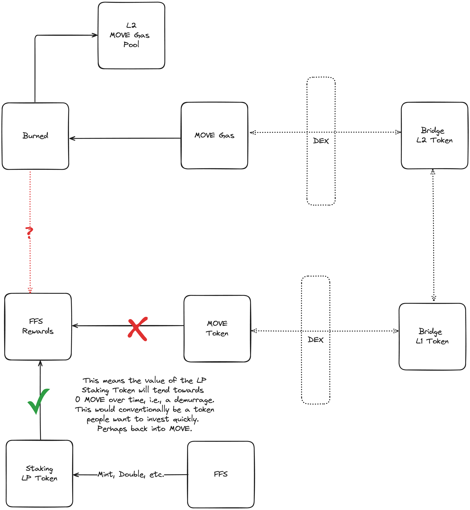

# MIP-40: *AB-FFS Decoupled*
- **Description**: Introduces architectural guide for ***AB-FFS Decoupled***. 
- **Authors**: [Liam Monninger](mailto:liam@movementlabs.xyz)
- **Reviewer**: [Andreas Penzkofer](mailto:andreas.penzkofer@movementlabs.xyz)
- **Desiderata**: [MD-38](https://github.com/movementlabsxyz/MIP/pull/38)

## Abstract

This MIP introduces the architectural guide for implementing ***AB-FFS Decoupled***, a means of using the Atomic Bridge and Fast-finality Settlement with a fixed supply of token. This decoupled approach relies on burning gas on the L2 into an L2 pool and issuing rewards in an LP token on the L1. Details of the L2 pool recirculation and the L1 LP token issuance are largely left to follow-on MIPs, however we do specify general constraints and guidelines. 

We also propose the usage of intermediary tokens for bridging to fully decouple the L1 and L2 systems. This allows for the L2 pool to be recirculated without the need for a direct bridge to the L1 and exposure to fallibility of the bridge on either side. 

Without the usage of intermediary tokens, we refer to this system as ***AB-FFS Partially Decoupled***, for which we do not intend a separate MIP. 

## Motivation

The *AB-FFS Decoupled* system is intended to address [MD-38](https://github.com/movementlabsxyz/MIP/pull/38). That is, *AB-FFS Decoupled* provides a means for using the Atomic Bridge and Fast-finality Settlement with a fixed supply of token. 

Fundamentally, *AB-FFS Decoupled* contends with the fallibility of the Atomic Bridge by (a) removing any need for its involvement in returning funds to the L1 and (b) using intermediary tokens to avoid any locking, minting, burning, or other operations that would potentially modify the total supply of either the L1 staking token or the L2 staking token.

*AB-FFS Partially Decoupled* still removes the need for the Atomic Bridge to return funds to the L1, but does not protect the total supply from all bridge failures. Hence *AB-FFS Partially Decoupled* is not a sound solution for [MD-38](https://github.com/movementlabsxyz/MIP/pull/38).

## Specification

The key words "MUST", "MUST NOT", "REQUIRED", "SHALL", "SHALL NOT", "SHOULD", "SHOULD NOT", "RECOMMENDED", "NOT RECOMMENDED", "MAY", and "OPTIONAL" in this document are to be interpreted as described in RFC 2119 and RFC 8174.

An *AB-FFS Decoupled* system is defined by the following requirements:

1. The L1 staking token MUST be a unique token issued in a fixed supply.
2. The L2 gas token MUST be a unique token issued in a fixed supply.
3. Rewards issued via FFS MUST NOT be issued in the L1 staking token, but instead in an LP token on the L1.
4. The LP Token MAY elect to maintain a supply or value correlated with the L1 staking token or the L2 gas token. But, this supply or value correlation MUST NOT rely on special capabilities of the LP token or trusted third parties.
5. The L2 staking token MUST be burned on the L2 to deposit gas into an L2 pool.

If the LP Token supply is not fixed, the AB-FFS solution implemented is referred to as *AB-FFS Decoupled* Demurrage. [MIP-n](todo) provides a more complete specification for *AB-FFS Decoupled* Demurrage. 

Otherwise, the AB-FFS solution implemented implemented is referred to as *AB-FFS Decoupled* Grant. [MIP-n](todo) provides a more complete specification for *AB-FFS Decoupled* Grant.

### L1 LP Token
1. The L1 LP Token MUST NOT enshrine any special capabilities to mint or otherwise unlock the L1 staking token. That is, the L1 LP token must be independent of the L1 staking token and only effectively be used to purchase the L1 staking token.
2. The governing system MAY provide vouchers or other means of redeeming the L1 LP token for the L1 staking token from a dedicate allocation. The object of these vouchers SHOULD be to peg the value of the L1 LP token to the L1 staking token.

A more complete proposal for the usage L1 LP tokens with FFS is provided in [MIP-n](todo).

### L2 Token Pool (Gas Pool)
1. Burning gas an amount of gas $\alpha$ on the L2 MUST result in depositing that same amount of gas $\alpha$ into an L2 pool.
2. The L2 pool MUST be recirculated to the L2 users in a manner that is not specified in this MIP. Generally, this means the L2 pool must either be used to issue rewards or otherwise be a reliable means of purchasing gas token on the L2. 

A system adhering to these requirements is referred to as a Gas Pool. A more complete proposal for the usage of Gas Pools is provided in [MIP-n](todo).

### Intermediary Tokens
1. A complete implementation of *AB-FFS Decoupled* SHOULD use intermediary tokens to bridge the L1 and L2 systems. An implementation not using intermediary tokens is referred to as *AB-FFS Partially Decoupled*.
2. The intermediary tokens MAY manage their own exchange rates, markets, and fees between each other, the L1 staking token, the L2 staking token, and the L1 LP token.

A more complete proposal for the usage of intermediary tokens is provided in [MIP-n](todo).

### Genesis
[MD-38](https://github.com/movementlabsxyz/MIP/pull/38) requests provisions for genesis for any system addressing its desiderata. The genesis for *AB-FFS Decoupled* is not fully specified in this MIP and such full specification is provided under [MIP-n](todo). However, generally, there are two strategies for genesis:

1. **Separate Mints**: mint the L1 staking token and the L2 gas token simultaneously in fixed supplies amounting to the intended total supply.
2. **Genesis Bridge Transfer**: mint the L1 staking or L2 gas token in a fixed supply and transfer the other token from the L1 to the L2 s.t. a successful bridge transfer occurs before the system is operational.

### On the Nature of the Tokens
Fundamentally, the L1 staking and L2 gas token in an *AB-FFS Decoupled* system are independent, i.e., not constituting a representation of the same token redeemable on different chains. The comprise two closed token systems where assets cannot be lost or gained.

The usage of *AB-FFS Decoupled* is then suitable for systems wherein the governing body wishes to prioritize the security of the total supply of the staking tokens. To the extent the governing body wishes for the economics of the L1 staking token and L2 gas token to remain correlated, the governing body shall make efforts to peg the value of the L1 LP token to the L1 staking token.

In the case that *AB-FFS Decoupled* Grant is implemented, FFS shall require a new token generation event at some point determined by the size of the grant. Thus, FFS has a lifespan w.r.t. to the L1 staking token. This lifespan is further detailed in [MIP-n](todo).

In the case that *AB-FFS Decoupled* Demurrage is implemented, the value of L1 LP Token shall tend to zero over time. This may also be remedies by new token generation events. This phenomenon is further detailed in [MIP-n](todo).

## Reference Implementation

## Verification

## Errata

## Appendix
