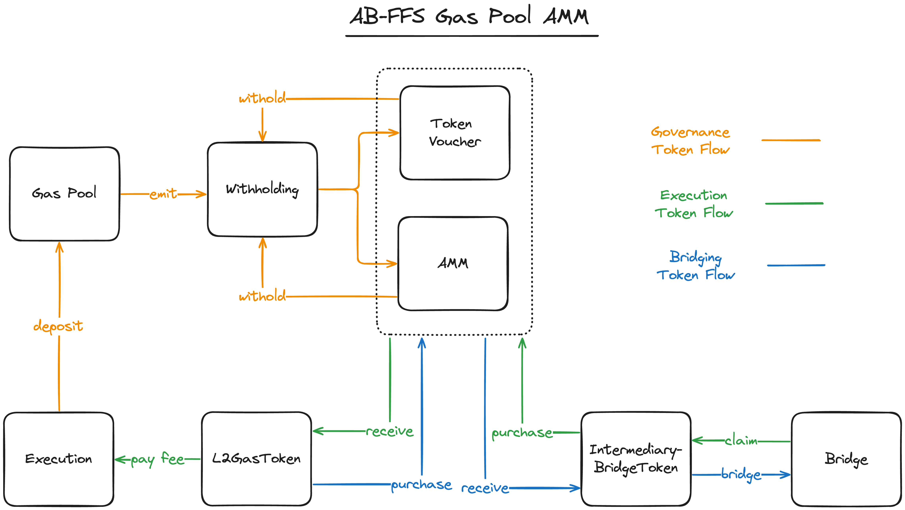

# MIP-42: AB-FFS Gas Pool AMM
- **Description**: Introduces an Automated Market Maker (AMM) to satisfy the needs of the AB-FFS Decoupled Gas Pool.
- **Authors**: [Liam Monninger](mailto:liam@movementlabs.xyz)
- **Reviewer**: Andreas Penzkofer
- **Desiderata**: [MD-38](https://github.com/movementlabsxyz/MIP/pull/38)

## Abstract
We propose a system for achieving availability of the `L2GasToken` from an AB-FFS Decoupled Gas Pool via an Automated Marked Maker using the StableSwap invariant. We additionally propose pegging mechanism to maintain the correlation between the `L2GasToken` and the `L1StakingToken` via token vouchers and supply constraints.

We suggest this system satisfies both recirculation and also creates a market that can handle failures of the bridge which result in small variances in the price or supply of the `IntermediaryBridgeToken`. To manage larger variance, we maintain pegging mechanisms suffice but should be regarded as best-effort.

In the event of an AB-FFS Partially Decoupled Gas Pool, we suggest identifying an appropriate bonding curve is more difficult and that instead direct deposits to the bridge pool may be more appropriate.

## Motivation

## Specification



1. The AB-FFS Decoupled Gas Pool AMM MUST contain a pair of `L2GasToken`s to the `IntermediaryBridgeToken` at genesis.
2. The AB-FFS Decoupled Gas Pool AMM MUST be implemented using the [StableSwap invariant](https://docs.curve.fi/references/whitepapers/stableswap/#how-it-works). The StableSwap invariant is a generalization of the constant product invariant used in Uniswap and Balancer, and is suitable for conditions where the price between two assets should be stable. The StableSwap invariant is defined as:
    ```math
    A \cdot n \cdot \left( \sum x_i \right) + D = A \cdot D + \frac{D^{n+1}}{\prod x_i}
    ```
    where:
    - $A$ is the **amplification coefficient**, which controls the "stretch" of the curve. Higher values of $A$ make the curve behave more like a constant sum, while lower values make it behave more like a constant product.
    - $n$ is the number of assets in the pool (usually 2 in a two-asset pool).
    - $x_i$ represents the quantity of each token in the pool.
    - $D$ is the **StableSwap invariant**, representing the overall balance of the pool.
    - This formula combines both constant sum and constant product behaviors:
    - **Low-Slippage Region**: Around the equilibrium (e.g., a 1:1 price ratio), the formula approximates constant sum behavior, minimizing slippage for small trades.
    - **Transition to Constant Product**: For larger trades, as the price moves away from equilibrium, the formula shifts toward constant product behavior, allowing larger trades with appropriate price adjustment.
3. The AB-FFS Decoupled Gas Pool AMM MUST initialize a 1:1 price ratio between the `L2GasToken` and the `IntermediaryBridgeToken`.
4. The supply of `IntermediaryBridgeToken`s MUST be initialized to the total supply of `L2GasToken`s.
5. The governing body of the AB-FFS Decoupled Gas Pool AMM SHOULD provide a token voucher system to maintain the correlation between the `L2GasToken` and the `L1StakingToken`.
6. The governing body of the AB-FFS Decoupled Gas Pool AMM SHOULD apply supply constraints on the `L2GasToken` and the `IntermediaryBridgeToken`.

From this system, we identify three distinct token flows:
1. **Governance Token Flow**: the token flow from gas consumed at execution through the Gas Pool and withholding to the AMM and the voucher pool.
2. **Execution Token Flow**: the token flow from the bridge to attainment and use of the `L2GasToken`.
3. **Bridging Token Flow**: the token flow from the `L2GasToken` to the `IntermediaryBridgeToken` and into the bridge.

### Token Correlation

#### Normal Market and Network Conditions
Generally, under normal market conditions, we assume co-linearity between the price of two tokens in a StableSwap pair and likewise the two tokens on either side of the bridge.

Given any two collinear relationships:

```math
A = \alpha B \quad \text{and} \quad C = \beta B
```

for constants $\alpha$ and $\beta$, we want to compute $\text{Cov}(A, C)$ in terms of $\text{Cov}(A, B)$, $\text{Cov}(B, C)$, and $\text{Var}(B)$.

Since $A = \alpha B$ and $C = \beta B$, we can express the covariance $\text{Cov}(A, C)$ as:

```math
\text{Cov}(A, C) = \text{Cov}(\alpha B, \beta B)
```

Using the property of covariance for scaled random variables, we get:

```math
\text{Cov}(\alpha B, \beta B) = \alpha \beta \cdot \text{Cov}(B, B)
```

Since $\text{Cov}(B, B)$ is the variance of $B$, denoted $\text{Var}(B)$, we have:

```math
\text{Cov}(A, C) = \alpha \beta \cdot \text{Var}(B)
```

Now, let’s express $ \alpha $ and $ \beta $ in terms of $ \text{Cov}(A, B) $, $ \text{Cov}(B, C) $, and $ \text{Var}(B) $:

```math
\alpha = \frac{\text{Cov}(A, B)}{\text{Var}(B)}
```
```math
\beta = \frac{\text{Cov}(B, C)}{\text{Var}(B)}
```

Substituting these values of $ \alpha $ and $ \beta $ into the equation for $ \text{Cov}(A, C) $:

```math
\text{Cov}(A, C) = \left( \frac{\text{Cov}(A, B)}{\text{Var}(B)} \right) \left( \frac{\text{Cov}(B, C)}{\text{Var}(B)} \right) \cdot \text{Var}(B)
```

Simplifying, we get:

```math
\text{Cov}(A, C) = \frac{\text{Cov}(A, B) \cdot \text{Cov}(B, C)}{\text{Var}(B)}
```
Thus, under the assumption of collinearity, the covariance $ \text{Cov}(A, C) $ is given by:

```math
\text{Cov}(A, C) = \frac{\text{Cov}(A, B) \cdot \text{Cov}(B, C)}{\text{Var}(B)}
```

This result shows that the covariance between $A$ and $C$ depends on the product of their individual covariances with $B$, scaled by the variance of $B$.

Thus, for a system involving the `L2GasToken` $G$, the L2 `IntermediaryBridgeToken` $B$, the L1 `IntermediaryBridgeToken` $B'$, and the `L1StakingToken` $S$, we can express the covariance between $G$ and $S$ in terms of the covariances between $G$ and $B$, $B$ and $B'$, and $B'$ and $S$, scaled by the variance of $B$.

First, we compute the covariance between $G$ and $B'$:

```math
\text{Cov}(G, B') = \frac{\text{Cov}(G, B) \cdot \text{Cov}(B, B')}{\text{Var}(B)}
```


That is, the covariance between $G$ and $S$ is given by the product of the covariance between $G$ and $B'$ and the covariance between $B'$ and $S, scaled by the variance of $B'$:

```math
\text{Cov}(G, S) = \frac{\text{Cov}(G, B) \cdot \text{Cov}(B, B') \cdot \text{Cov}(B', S)}{\text{Var}(B) \cdot \text{Var}(B')}
```

This lends to the intuitive conclusion that the covariance between $G$ and $S$ is predicted positively by the covariance between any two pairs and negatively by the variance of the `IntermediaryBridgeToken`s. 

Tautologically, StableSwap maintains high covariance between the two tokens in the pool, so we can expect under normal market conditions that the terms $\text{Cov}(G, B)$ and $\text{Cov}(B', S)$ are all positive and close to 1.

The bridge itself, while fallible, should maintain a scalar conversion rate between $B$ and $B'$ under normal operating conditions, so we can expect $\text{Cov}(B, B')$ to be positive and close to 1.

It is thus the variance of the `IntermediaryBridgeToken`s that we expect to be the primary determinant of the covariance between the `L2GasToken` and the `L1StakingToken` under normal market conditions.

#### Adverse Market and Network Conditions
Under adverse market conditions or network conditions, the covariance between the `L2GasToken` and the `L1StakingToken` should weaken either temporarily or permanently.

Should this occur on behalf of fallibility of the bridge, which would contribute to the variance of the `IntermediaryBridgeToken`s, this would be a natural and expected outcome of the system--providing an expected temporary sell pressure against misuse of the `IntermediaryBridgeToken`.

Should this occur on behalf of market shifts, e.g., speculative trading of the `IntermediaryBridgeToken`s, the covariance between the `L2GasToken` and the `IntermediaryBridgeToken` would weaken. To recover the covariance between the `L2GasToken` and the `L1StakingToken`, pegging methods, such as the proposed token voucher, may be necessary.

### Token Voucher
As an effort to maintain the covariance between the `L2GasToken` and the `L1StakingToken`, we propose a token voucher system. This system would allow owners of the `IntermediaryBridgeToken` to redeem for the `L1StakingToken` at a periodically adjusted rate and vice versa.

To maintain the token voucher, gas fees should pay into both the StableSwap pool and the voucher pool.

To ensure that market effects are still captured, availability of the voucher pool should be limited. That is, a decided upon fraction of `L2GasToken` trading volume should be available for voucher redemption. A simple way to achieve this is to assign a constant $\mathcal{v} \in [0, 1]$ such that $\mathcal{v}$ of the `L2GasToken` trading volume is sent to the voucher to be made available for redemption while $(1 - \mathcal{v})$ is sent to the StableSwap pool. We refer to this constant $\mathcal{v}$ as the voucher rate.

Because the voucher would allow purchases in both directions, it should be expected to modulate both inflating and deflating market conditions.

In the event of unrecoverable bridge failures or sustained market shifts, the exchange rate, i.e., peg, should be adjusted to match or induce a new equilibrium between the `L2GasToken` and `IntermediaryBridgeToken`.

A more specific design for the token voucher system is provided in [MIP-n](todo).

### Supply Constraints
In addition to the token voucher system, we propose supply constraints on both the `L2GasToken` and the `IntermediaryBridgeToken`. 

Constraints on the `L2GasToken` may be enforced by the Gas Pool, i.e., by limiting deposits of the `L2GasToken` into the StableSwap pool and the voucher pool. We refer to this constraint as the withholding rate and use $\mathcal{w}_s \in [0, 1]$ and $\mathcal{w}_v \in [0, 1]$ to denote the withholding rate for the StableSwap pool and the voucher pool, respectively.

Constraints on the `IntermediaryBridgeToken` may be enforced by the Gas Pool, i.e., by temporarily removing some of the `IntermediaryBridgeToken` swapped or redeemed in the voucher from circulation. We refer to this as another withholding rate and use $\mathcal{w}_b \in [0, 1]$ to denote the withholding rate for the `IntermediaryBridgeToken`.

A more complete treatment of Gas Pool withholding rates is provided in [MIP-n](todo).

Constraints on the `IntermediaryBridgeToken` may also be enforced by the bridge, i.e., by limiting the available balance for bridge transfers. A more complete treatment of supply constraints enforced by the bridge is provided in [MIP-n](todo).

## Reference Implementation


## Verification


## Errata


## Appendix
