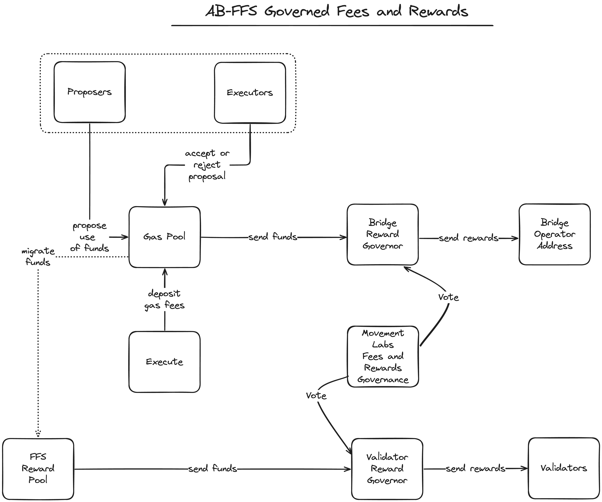

# MIP-49: AB-FFS Governed Fees and Rewards
- **Description**: Proposes a fee model which prioritizes using governance to adjust FFS rewards in an AB-FFS L2 system.
- **Authors**: [Liam Monninger](mailto:liam@movementlabs.xyz)
- **Reviewer**: Andreas Penzkofer
- **Desiderata**: [MD-49](../MD/md-49/README.md)

## Abstract

In response to [MD-49](../MD/md-n/README.md), we propose a fee model for an AB-FFS L2 system which interprets all fees as compensated for in gas fees, bridge fees, or FFS rewards which are adjusted by a governing body. We argue that this approach avoids many of the security and fairness issues that arise in more complex fee models, and is analogous to fee models used in traditional L1 systems. We provide an account of the complexity of other fee models and the limitations from which even theses models suffer. We exemplify these limitations by describing an AB-FFS system which uses Celestia as DA and Ethereum as the Settlement Layer.

## Motivation

[MD-49](../MD/md-n/README.md) requests a means of computing, charging, and distributing gas fees for the Movement L2s which rely on a separate DA and Settlement Layer. We provide such means for an AB-FFS system.

## Specification



### Definitions
- **FFS reward**: a reward paid to a node operator in either the separate `L1RewardToken` or the `L1StakingToken` for participating in the network.
- **L2 client**: the end user of the L2 network who pays gas fees from their L2 wallet.
- **validator**: a node operator who runs a node participating in Execution, DA, and Settlement.
- **delegator**: a staking participant who delegates their stake to a validator.
- **bridge client**: the user of the bridge service who issues transactions on a source chain to be transferred to a destination chain.
- **bridge operator**: the operator of the bridge service who charges fees for transferring assets between chains.

### Requirements 
An AB-FFS **Governed Reward system** will meet the following requirements for fees:

1. An AB-FFS Governed Reward system SHALL idenitfy to whom fees may be charged: L2 clients, Operator
2. An AB-FFS Governed Reward system MUST provide a means for the governing body to adjust the gas fees charged to L2 clients according to a vote. This is intended to ensure that the cost of using the L2 system is competitive with other systems.
3. An AB-FFS Governed Reward system MUST provide a means for the governing body to adjust the fees charged to bridge clients according to a vote. This is intended to ensure that the cost of using the bridge service is competitive with other systems.
4. An AB-FFS Governed Reward system MUST transfer gas fees into a [Governed Gas Pool](https://github.com/movementlabsxyz/MIP/pulls) which SHALL be used to add additional rewards to the FFS rewards pool when needed. 

An AB-FFS **Governed Reward system** will meet the following requirements for rewards

1. An AB-FFS Governed Rewards system SHALL idenitfy 3 operators to whom fees rewards may be paid: validators, delegators, and bridge operators.
2. An AB-FFS Governed Rewards system MUST provide a means for the governing body, e.g., Movement Labs to adjust FFS reward parameters according to a vote. This is intended to ensure the value of the FFS rewards exceeds difficult to compute costs of operating as a participant in the L2 system.
3. An AB-FFS Governed Rewards system SHALL compensate validators as a function of expected settlement and DA costs with FFS rewards, but does not need to recompute this expectations. 
4. An AB-FFS Governed Rewards system SHALL compensate bridge operators with collected gas fees, but does not need to recompute these fees.

### Costs and Computability

#### Execution Costs
Execution costs MAY be computed using a VM gas algebra similar to those used in L1 protocols. These costs are intrinsic to the L2 system and are naturally paid by clients.

For example, under AB-FFS Governed Fees and Rewards, the [Aptos Gas Algebra](https://aptos.dev/en/network/blockchain/base-gas) should be used to compute execution costs.

**Proportionality of Execution Costs to DA Costs**:
In the event that the gas algebra renders a cost proportional to the byte size of the transaction, this cost can be seen as accounting for some of the DA costs. For example, the "payload" summands in the Aptos Gas Algebra can be seen as accounting for some of the DA costs. 

Since gas fees are then paid into the Governed Gas Pool which is eventually used to fund the FFS Rewards Pool, we identify that proper adjustment of the FFS rewards for operators can partially be accounting for by execution gas fees. However, we suggest this as a reliable means of ensuring the availability of proportional funds for the FFS rewards pool, not as a means of directly compensating operators.

**Proportionality of Execution Costs to Settlement Costs**:
We do not expect the gas algebra to account for settlement costs. Under FFS, settlement costs proportional to the number of validators. The size of an individual attestation is fixed and rendered for a **block range**. Thus, larger transactions will not incur larger settlement costs than smaller transactions.

#### DA Costs
Under AB-FFS Governed Fees and Rewards, DA fee computation MUST not actively use an oracle or other live pricing model to introduce DA fees directly as **L2 client** gas fees. The security concerns of using an oracle to compute DA are commented on below. Instead, AB-FFS Governed Fees and Rewards recommends regarding the DA fee passed to **L2 clients** as 0, and the DA fee passed to **validators** as whatever the extrinsic system charges.

As idenitfied in [MIP-19](https://github.com/movementlabsxyz/MIP/pulls), in general, DA costs will be proportional to the byte size of a transaction. However, many DAs implement a gas priority system that effectively introduces additional fees for network congestion. These fees are difficutl to anticiptate and are often unbounded. 

For example, in Celestia, fees take the following [form](https://docs.celestia.org/how-to-guides/submit-data):

```math
\text{Total Fee} = \text{Gas Limit} * \text{Gas Price}
```

where: 

- `Gas Limit` is the maximum amount of gas that can be used for the transaction and is proportional to the byte size of the transaction.
- `Gas Price` is a price set by the user to incentivize validators to include the transaction in the next block.

#### Settlement Costs
Under AB-FFS Governed Fees and Rewards, settlement fee computation MUST not actively use an oracle or other live pricing model to introduce settlement fees directly as **L2 client** gas fees. The security concerns of using an oracle to compute settlement fees are commented on below. Instead, AB-FFS Governed Fees and Rewards recommends regarding the settlement fee passed to **L2 clients** as 0, and the settlement fee passed to **validators** as whatever the extrinsic system charges.

In general, settlement costs can be modeled in the following form:

```math
\text{Settlement Cost} = \text{Number of Validators} * \text{L1 Gas Fee}
```

where:

- `Number of Validators` is the number of validators participating in the settlement.
- `L1 Gas Fee` is the gas fee charged by the Settlement Layer.

While the size of an FFS attestion is constant for any transaction. `L1 Gas Fee` is not. Most L1s including, ETH, have implemented either gas priority systems or dynamic gas fees.


### Comparisons to Other Fee Models

#### Oracle-Based Fee Models
In contrast to AB-FFS Governed Fees and Rewards, oracle-based fee models attempt to actively price **L2 client** gas fees according to the costs of operating the L2 system via both (1) the estimation or computation of DA and Settlement costs and (2) the computation of the value of the L2 gas token in terms of the DA and Settlement Layer gas tokens.

Above, we discussed why it is difficult to anticipate DA and Settlement costs. While the former can be forgone in the event that the DA is always finalized before execution, the latter cannot as execution must occur before settlement.

Additionally, however, using an oracle model introduces complexity and ultimately set of security risks.

If the oracle model is trusted to appropriately account for the conversion rate between the L2 gas token and the DA and Settlement Layer gas tokens, then the oracle model is a single point of failure. If the oracle model is trusted, then the system is vulnerable to manipulation by the oracle.

#### Wrapped Token Fee Models
In contrast to AB-FFS Governed Fees and Rewards, wrapped token fee models attempt to wrap L2 transactions with corresponding DA and Settlement transactions, or else require native inclusion of requisite gas tokens in the L2 system.

However, while DA fees can be known at execution, Settlement fees cannot. Thus, the wrapped token model would only account for tight bound on DA costs and would need to adopt a pessimistic model for Settlement costs. This would result in overcharging for Settlement costs.

## Reference Implementation


## Verification


## Errata


## Appendix
