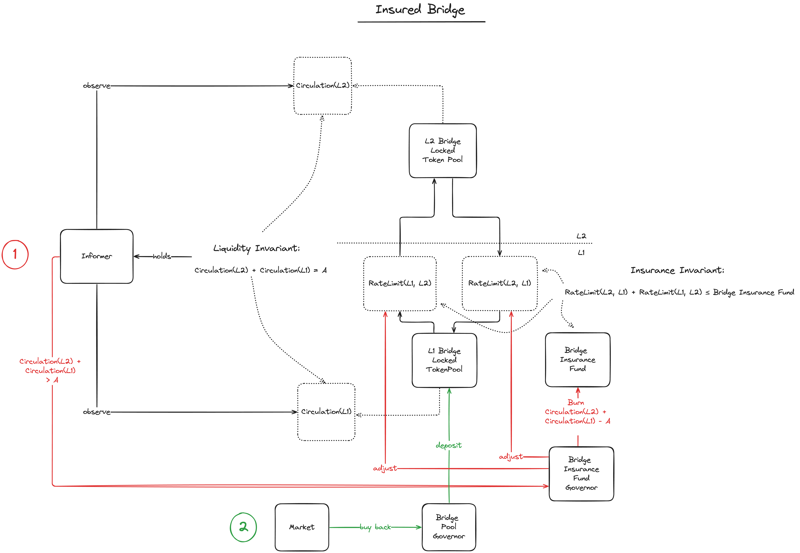

# MIP-50: Insured Bridge
- **Description**: Introduces an Insurance Fund for the bridge which can be used to cover losses.
- **Authors**: [Liam Monninger](mailto:liam@movementlabs.xyz)
- **Reviewer**: [Andreas Penzkofer](mailto:andreas.penzkofer@movementlabs.xyz)
- **Desiderata**: [MD-38](https://github.com/movementlabsxyz/MIP/pull/38)

## Abstract

This MIP introduces an Insurance Fund for the bridge which can be used to cover losses. The Insurance Fund will be used to cover losses in the event of a hack or other catastrophic event and can insure a fixed supply of token is maintained.

## Motivation

[MD-38](https://github.com/movementlabsxyz/MIP/pull/38) requests provisions for use of AB-FFS that enable a fixed supply of token. This MIP introduces an Insurance Fund for the bridge which can be used to cover losses. The Insurance Fund will be used to cover losses in the event of a hack or other catastrophic event and can insure a fixed supply of token is maintained.

## Specification
 

1. The Insurance Fund MUST store a supply of token greater than the sum of all transfer value which can flow over the bridge between during the Risk Period.
1. The Risk Period MUST reflect the time it takes for an informer to recognize the loss between the two chains and the time it takes for the Insurance Fund Governor to trigger the Insurance Fund to burn token.
1. The Insurance Fund Governor MUST trigger the Insurance Fund to burn token in proportion to the surplus of value recorded between the two chains.
1. An Informer SHALL be expected to report to the Insurance Fund Governor that the circulation exceeds the supply of token. 
1. The Insurance Fund Governor MUST account for some error on the value that is recorded on L1 and L2 by the informer. More specifically, due to the asynchrony of the bridge transfer steps as well the asynchrony in finality between L1 and L2, total circulating supply could and will vary at times, within some bounds.
1. The Bridge Pool Governor SHALL be expected to purchase token from the market to recover the loss and replenish the Insurance Fund.

## Verification

## Errata

## Appendix
