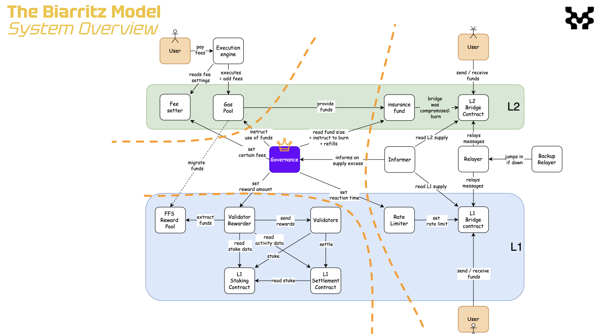

# MIP-54: The Biarritz Model
- **Description**: Proposes an AB-FFS L2 model that features on a Governed Gas Pool, Bridge Insurance Fund, and moderate operational assumptions.
- **Authors**: [Liam Monninger](mailto:liam@movementlabs.xyz)
- **Reviewer**: Andreas Penzkofer
- **Desiderata**: $\emptyset$

## Abstract

We defined the Biarritz Model as an AB-FFS L2 model that features on a Governed Gas Pool, Bridge Insurance Fund, and moderate operational assumptions. At the core of this model is the progressive use of governance to safely perform liquidity operations which are difficult to synchronize in an early AB-FFS L2. 

## Motivation

The Biarritz Model is motivated by the need for a [progressive L2 model](../mip-53/) that can safely perform liquidity and more generally fund-moving operations which are difficult to operate in an early AB-FFS L2. This model is intended to be a stepping stone towards more complex L2 models that require more sophisticated governance and operational assumptions.

The Biarritz Model is a intended as a complete response to [MD-38](https://github.com/movementlabsxyz/MIP/pulls).

## Specification

We acknowledge and apply the conventions of [MIP-53: Conventions for Proposing Progressive L2 Models](https://github.com/movementlabsxyz/MIP/pull/53).

| Category | Criterion | Evaluation |
|-----------|-----------|------------|
| **General** | | |
|| When to use | When a transition from a genesis or centralized phase form of the L2 system towards a more decentralized setting is appropriate, but the security and safeness of design and implementation are still contested.|
|||When a secondary centralized phase of the L2 system is desired alongside increasing transparency of centralized operations.|
|| Suitable preceding models | [MIP-55: The Bilbao Model](https://github.com/movementlabsxyz/MIP/pull/53) |
|| Suitable succeeding models | [MIP-40: AB-FFS Decoupled](https://github.com/movementlabsxyz/MIP/pull/40) INCOMPLETE |
|| Technological motivations | Contends with bridge fallibility under operational assumptions.|
||| Begins formal governance, but continues to allow for manual flexibility and recovery. |
|| Usership motivations | Provides network which is more open than [MIP-55: The Bilbao Model](https://github.com/movementlabsxyz/MIP/pull/53), potentially encouraging adoption. |
| **Components** | | |
|| [MIP-44: AB-FFS Governed Gas Pool](https://github.com/movementlabsxyz/MIP/pulls) | The Governed Gas Pool into which gas fees are deposited and from which the governing body disperses funds.  |
|| [MIP-49: AB-FFS Governed Rewards and Fees](https://github.com/movementlabsxyz/MIP/pull/49) | The means by which gas fees and rewards are adjusted by the governing body. Rewards are migrated manually from the L2 to the L1 by the governing body. |
|| [MIP-50: Insured Bridge](https://github.com/movementlabsxyz/MIP/pull/50) | The Bridge Insurance Fund which is used to cover the cost of failed bridge operations. Insures atomically and synchronously that all losses from bridge failures can be covered. |
|| L1-L2 Token Correlation | The L1 token and the L2 token are bridged 1:1. Moreover the L2 token is the gas token and the L1 token is the staking token. |
| **Operational Assumptions** | | |
|| **Bridge Liveness** | Operators can be relied upon to meet bridge liveness requirements.  |
|| **Security of Governance** | Governing body's powers cannot be exploited.  |
|| **Trust of Governance** | Users are willing to trust governing body.   |

### Pros
1. **Delayed calculation of rewards to cover centralized expenses**: because fees are held in the gas pool, the governing body need not calculate rewards which would be used to cover their own operating expenses until control of the governance is transferred to the community. The governing body can, for example, decide to use a percentage of captured gas to pay the centralized operators when a more stable token price is known some time after the L2 has been operational.
2. **On-chain safety of bridge**: the insurance of the bridge makes on-chain guarantees that all losses from bridge failures can be covered. This is a significant improvement over the Bilbao Model which requires off-chain coordination to cover losses.
3. **Ease of migration**: the model is designed to be easily migrated to a more decentralized model. The governing body can be replaced by a DAO or other decentralized governance model with minimal changes to the operational assumptions.
4. **Delayed migration of rewards**: the model allows for the governing body to manually migrate rewards from the L2 to the L1. This allows for a more gradual transition to a decentralized model and can avoid attacks available in more tightly integrated models.

### Cons
1. **High trust in governance**: the model requires a high level of trust in the governing body. When the governing body is narrowly defined, this may not be significantly more open than the Bilbao Model.
2. **1:1 token correlation**: the model asserts a 1:1 token correlation between the L1 staking and L2 gas tokens. This may not be desirable in all cases as exploits on the bridge may compromise the security of staking on the L1 or sybil resistance on the L2.

## Verification
