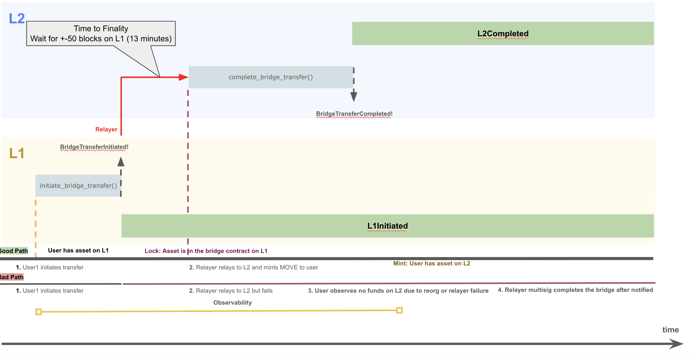
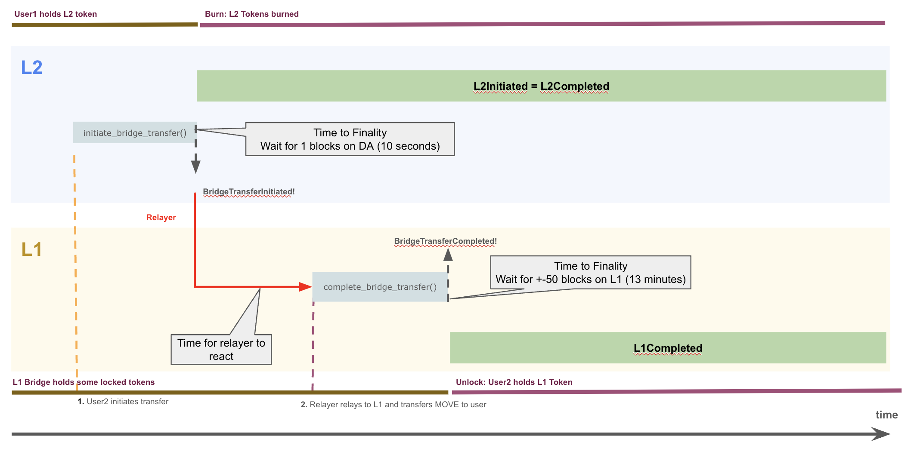

# MIP-58: Trusted-Relayer focused Bridge Design

- **Description**: Proposes a simplified bridge design to address inefficiencies, security risks, and high costs in the current implementation.
- **Authors**: [Primata](mailto:primata@movementlabs.xyz)
- **Desiderata**: [MD-21](../MD/md-21)

## Abstract

This proposal advocates for replacing the current HTLC-based bridge design, which requires four transactions and introduces significant complexity, with a simpler and more efficient two-transaction mechanism. The proposed design reduces costs, enhances security, minimizes user friction, and avoids potential exploits caused by refund logic. It addresses long-standing issues such as reliance on sponsored transactions, outdated audits, and unimplemented fee mechanisms speeding the process to achieve a fully functional bridge that movement yet has been unable to complete, and lots of under issues raised and still pending.

## Motivation

The current bridge design poses numerous challenges, including inefficiency, cost, and user frustration:

1. **Transaction Complexity**: Requires four interactions:
   - Two by the user (initiation and finalization).
   - One by the relayer to complete the transaction.
   - One by a third party (tasked by the relayer) to finalize refunds in case of failure.
   - If any of these fails, users and the protocol face losses.
2. **High Cost**:
   - The multi-transaction setup is expensive for both users and the protocol.
   - Misestimations in fee calculations could result in significant losses.
   - Example: At 16 gwei, bridging costs $20 for 10k transactions. If fees are miscalculated by 25%, this leads to a $25k loss. At 100 gwei, the loss escalates dramatically.
3. **Unfriendly User Experience**:
   - The current design requires users to have funds on the destination chain for finalization. This increases friction and discourages adoption.
   - Sponsored transactions are essential to the current implementation but remain unimplemented, leaving users stranded without funds.
4. **Security Risks**:
   - Relayer keys are a critical point of failure. This assumption cannot be avoided.
   - Refund logic introduces vulnerabilities where attackers could exploit the rate limit and relayer downtime.
   - For instance, if the relayer fails to finalize on the initiator, a malicious actor could:
     - Take over the refund keys.
     - Exploit both directions of the bridge (e.g., ETH→MOVE and MOVE→ETH) repeatedly, draining funds.
5. **Maintenance Burden**:
   - The current audit is outdated and does not reflect the significant changes made since.
   - The current design requires a complete UI/UX overhaul, adding complexity and delay.
6. **Unnecessary Complexity**:
   - HTLC-based bridges are largely abandoned in favor of simpler, more effective designs.
   - Examples like the [Consensys HTLC](https://github.com/Consensys/htlc-bridge) bridge demonstrate the [pitfalls of such approaches](https://entethalliance.org/crosschain-bridges-overview-where-we-are-now/).
7. **Infrastructure Simplification**:
   - Infrastructure is still incomplete for the current HTLC bridge design and we are struggling to find sound solutions that balance UI/UX and security. For example, [this issue](https://github.com/movementlabsxyz/movement/issues/838) regarding UX vs number of confirmations to require on the Ethereum side, is still under debate.
   - Because of the over-engineered design, infrastructure is prone to error and we might end up being damaged by the amount of infrastructure we have not built yet and has to be built for the relayer to fully function.
   - We could strip down the Relayer code and achieve a final design much more quickly.

The proposed two-transaction design mitigates these issues, creating a safer, faster, and user-friendly bridge while maintaining operational reliability.

## Specification

The simplified bridge design focuses on minimizing complexity and maximizing security:

### Protocol Description

The bridge is a simpler version of the current implementation, which relies on the assumption that the Relayer Keys are not to be compromised.

L1 -> L2

1. User initiates a bridge transfer on L1. Contract stores a mapping of the user bridgeTransferIds for easy access. It transfers from the user MOVE amount to the contract. Transaction emits originator, recipient, amount and nonce.
2. Relayer awaits for finalization of the transaction on L1.
3. Relayer completes the bridge on L2.
4. Completion transaction verifies that the transaction is truthful by comparing the provided bridgeTransferId hash and the emitted values of originator, recipient, amount and nonce. Finally, it mints MOVE to the recipient address.
5. User is notified on the frontend that their transaction has been completed.
6. In case of a rare case of a reorg on the recipient network that leads to the transaction removal from the user perspective, the transaction can be redone and relayer multisig can handle it.



L2 -> L1

1. User initiates a bridge transfer on L2. Contract stores a mapping of the user bridgeTransferIds for easy access. It transfers from the user MOVE amount to the contract and burns it. Transaction emits originator, recipient, amount and nonce.
2. Relayer awaits for finalization of the transaction on L2.
3. Relayer completes the bridge on L1.
4. Completion transaction verifies that the transaction is truthful by comparing the provided bridgeTransferId hash and the emitted values of originator, recipient, amount and nonce. Finally, it transfers MOVE to the recipient address, which has been previously bridged from L1.
5. User is notified on the frontend that their transaction has been completed.
6. In case of a rare caase of a reorg on the recipient network that leads to the transaction removal from the user perspective, the transaction can be redone and relayer multisig can handle it.



### Key Features

1. **Two-Transaction Model**:
   - **Initiation**: User sends a transaction to initiate the bridge containing recipient and amount.
   - **Completion**: A relayer or multi-signature group completes the transfer on the counterparty contract with the originator, recipient, amount and noce for hash verification.
   - **No Funds Requirement**: User is not required to have funds on receiving chain and we do not have to build sponsored transactions.
   - **Delivery by Relayer**: Because the relayer delivers the funds, there is no requirement for the user to complete the transaction on receiving chain, therefore massively simplifying the user experience and allowing a smooth onboarding on the network for bridges from L1 to L2. User only has to await for the finalization on the source chain and for the relayer to perform the completion on receiving chain. This is standard practice for every major bridge in the ecosystem.
   - **Less parameters**: Because there is no exchange of secrets between the user and relayer, we have a substantial reduction of logic.
   - **Only Completable**: Currently we reserve a refunder role to revert transactions. This approach is different where we guarantee delivery of funds through the same party that would guarantee funds being refunded, because bridges can ONLY be completed.

2. **Consolidation of Logic**:
   - Merge lock and completion functionality on the counterparty contract. Once lock is called, funds are already in the control of the user. On the HTLC implementation, once the timelock is over and complete on initiator has not been called, both the initiator and counterparty funds are available to the user, opening up for an exploit.
   - Remove refund functionality entirely to eliminate associated exploits.

3. **Parameter Validation**:
   - Ensure parameter validation on the counterparty to prevent invalid transactions.

4. **Relayer Redundancy**:
   - Use two types of relayers:
     - **Automated Relayer**: Operated with minimal human involvement; its private key is highly secured.
     - **Multi-Signature Relayer**: Managed by the team to guarantee transaction completion in case of failures.

5. **Cost Efficiency**:
   - Minimize gas costs by reducing the number of interactions and simplifying fee calculations.

6. **Enhanced Security**:
   - Avoid refund logic to close exploit windows.
   - Protect against key compromise through key isolation or known by no parties and multi-signature relayer setups.
   - There is no scenario where a bridge could lead to double-spending. It's either completed by relayers or not.
   - User currently can loose its bridge `preImage` which could lead to them being unable to complete the bridge. By not relying on a `preImage` from the user, it minimizes issues. It is not a loss in security because the purpose of the `preImage` is solely for refunding.

7. **Batch Processing for Downtime**:
   - Multi-signature relayers can process multiple pending transactions in a single batch during downtime.

8. **BridgeTransferId**:
   - Continue using unique identifier to prevent double-spending and track transactions securely.

9. **Bridge Fee**:
   - On the L1 to L2 bridge, do not charge fees.
   - On the L2 to L1 bridge, charge a fee estimated by admin. It's set to the gas spent in ethereum in move. This requires an oracle and can only be implemented after oracles are live and we are able to have a maintainer that is able to set the fees on L2.
   - Bridge fee should be a estimated by being a threshold between the current cost to perform the completeBridgeTransfer transaction on L1 (aka. `cost`) + 20%. Then, we set `cost` as the `upperbound`. The `lowerbound` is the `cost` - 10%. This prevents us from updating the fee too often and guaranteeing profit on bridges. We do have to consider gas spikes, but it should be a momentarily loss compensated by the extra charged and maintained by the `upperbound` and `lowerbound`.

   ```
   entry fun set_fee(caller: &signer, fee: u64) {
      assert_is_maintainer(caller);
      borrow_global<BridgeConfig>(@aptos_framework).fee = fee;
   }
   ```

10. **Best Practices**:
   - Adopt currently used bridge designs from established designs like Arbitrum, LayerZero and Blast bridges which use a relayer to finalize the bridge.
   - User is not required to have funds on counterparty contract to finalize the bridge.

## Exploits and Potential Losses

1. **Key Compromise**:
   - The compromise of the Relayer keys would lead to unauthorized transactions up to the rate-limit value. The protocol must absorb the losses and rotate Relayers.
2. **Fee Misestimation**:
   - Incorrect fee calculations (e.g., underestimating gas) can cause significant financial losses for the protocol.

## Reference Implementation

1. **Two-Transaction Flow**:
   - User initiates the transfer.
   - Relayer or multisig completes the transfer with parameter validation.
   - Current HasuraDB built internally can provide enough infrastructure for users to know if their transaction has been completed. It does not differ from the current design in any way since user is not able to see if their transaction is in-flight. We could introduce this by notifying the user if the relayer has been ordered to complete the transaction.
   - There would be two states for user to reference, initiated or completed and those are the only two possible states. Funds can only be returned by bridging back.

   
   Here users would be able to see if the bridge has been completed. It's either pending or completed.

2. **Batch Completion**:
   - Multisig relayers process pending transactions in batches during downtime, ensuring timely resolution.

3. **Contract Simplification**:
   - Combine lock and completion functionality on the counterparty contract.
   - Remove refund logic to streamline operations and improve security.
   - Cheaper transactions because of reduction of logic.
   - Consolidate Initiator and Counterparty into a single contract (this might be the most dangerous thing proposed but it has already been proposed for current implementation).

4. **Rate Limiting**:
   - Rate limiting & insurance fund has been a very fruitful and important security aspect that secures the ecosystem as a whole and should be implemented here.

Solidity

```solidity

import {OwnableUpgradeable} from "@openzeppelin/contracts-upgradeable/access/OwnableUpgradeable.sol";
import {RateLimiter} from "./RateLimiter.sol";
import {INativeBridge} from "./INativeBridge.sol";

contract NativeBridgeMOVE is INativeBridgeMOVE, OwnableUpgradeable {
   
   struct OutgoingBridgeTransfer {
      address originator,
      bytes32 recipient,
      uint256 amount,
      uint256 nonce
   }
   mapping(bytes32 bridgeTransferId => OutgoingBridgeTransfer) outgoingBridgeTransfers;

   struct IncomingBridgeTransfer {
      bytes32 originator,
      address recipient,
      uint256 amount,
      uint256 nonce
   }
   mapping(bytes32 bridgeTransferId => IncomingBridgeTransfer) incomingBridgeTransfers;

   bytes32 public constant RELAYER_ROLE = keccak256(abi.encodePacked("RELAYER_ROLE"));
   uint256 private _nonce;

    function initialize(address _admin, address _relayer, address _maintainer) public initializer {
        if (_admin == address(0)) revert ZeroAddress();
        _grantRole(_admin, DEFAULT_ADMIN_ROLE);

        // relayers can be set afterwards
        _grantRole(_relayer, RELAYER_ROLE);
        _grantRole(_maintainer, RELAYER_ROLE);
    }

 function initiateBridge(uint256 recipient, uint256 amount) external returns (bytes32 bridgeTransferId)
    {
        _l1l2RateLimit(amount);
        address originator = msg.sender;

        // Ensure there is a valid amount
        require(amount > 0, ZeroAmount());

        // Transfer the MOVE tokens from the user to the contract
        if (moveToken.transferFrom(originator, address(this), amount)) revert MOVETransferFailed();

        // Generate a unique nonce to prevent replay attacks, and generate a transfer ID
        bridgeTransferId =
            keccak256(abi.encodePacked(originator, recipient, amount, ++_nonce));

        // We have all bridgeTransferIds available by user because we don't have to re-access it.
        bridgeTransfers[bridgeTransferId] = OutgoingBridgeTransfer({
         originator,
         recipient,
         amount,
         _nonce
        });

        emit BridgeTransferInitiated(bridgeTransferId, originator, recipient, amount, _nonce);
        return bridgeTransferId;
    }

function completeBridge(
        bytes32 bridgeTransferId,
        bytes32 originator,
        address recipient,
        uint256 amount,
        uint256 nonce
        ) external onlyRole(RELAYER_ROLE) {
         _completeBridge(bridgeTransferId, originator, recipient, amount, nonce);
         
    }
function batchCompleteBridge(
   bytes32[] bridgeTransferIds,
   bytes32[] originators,
   address[] recipients,
   uint256[] amounts,
   uint256[] nonces
) external onlyRole(RELAYER_ROLE) {
   uint256 length = bridgeTransferIds.length;
   require(originators.length == length && recipients.length == length && amounts.length == length && nonces.length == length, InvalidLenghts());
   for (uint256 i; i < length; i++) {
      _completeBridge(
         bridgeTransferIds[i],
         originators[i],
         recipients[i],
         amounts[i],
         nonces[i]
      )
   }
}

function _completeBridge(
   bytes32 bridgeTransferId,
   bytes32 originator,
   address recipient,
   uint256 amount,
   uint256 nonce
) internal {
   _l2l1RateLimit(amount);
   require(bridgeTransferId == keccak256(abi.encodePacked(originator, recipient, amount, nonce)), InvalidBridgeTransferId());
   require(bridgeTransfers[bridgeTranserId].amount == 0);
   incomingBridgeTransfers[bridgeTranserId] = ({
   originator,
   recipient,
   amount,
   nonce
   });

   if (moveToken.transfer(recipient, amount)) revert MOVETransferFailed();

   emit BridgeTransferCompleted(bridgeTransferId, originator, recipient, amount, nonce);
   }
}
```

```move
// Based on https://github.com/movementlabsxyz/aptos-core/blob/movement/aptos-move/framework/aptos-framework/sources/atomic_bridge.move  

    /// Module-level resource to store the nonce  
    struct Nonce has key {  
        value: u64,  
    }  

    /// Creates bridge transfer details with validation.  
    ///  
    /// @param initiator The initiating party of the transfer.  
    /// @param recipient The receiving party of the transfer.  
    /// @param amount The amount to be transferred.  
    /// @param nonce The unique nonce for the transfer.  
    /// @return A `BridgeTransferDetails` object.  
    /// @abort If the amount is zero.  
    internal fun create_details<Initiator: store, Recipient: store>(  
        initiator: Initiator,  
        recipient: Recipient,  
        amount: u64,  
        nonce: u64  
    ): BridgeTransferDetails<Initiator, Recipient> {  
        assert!(amount > 0, EZERO_AMOUNT);  

        BridgeTransferDetails {  
            addresses: AddressPair {  
                initiator,  
                recipient  
            },  
            amount,  
            nonce
        }  
    }  
    
    /// Increment and get the current nonce  
    fun increment_and_get_nonce(signer: address): u64 {  
        let nonce_ref = borrow_global_mut<Nonce>(signer);  
        nonce_ref.value = nonce_ref.value + 1;  
        nonce_ref.value  
    }  
    
          
    /// Initiate a bridge transfer of MOVE from Movement to the base layer  
    /// Anyone can initiate a bridge transfer from the source chain  
    /// The amount is burnt from the initiator and the module-level nonce is incremented  
    /// @param initiator The initiator's Ethereum address as a vector of bytes.  
    /// @param recipient The address of the recipient on the Aptos blockchain.  
    /// @param amount The amount of assets to be locked.  
    public entry fun initiate_bridge_transfer(  
        initiator: &signer,  
        recipient: vector<u8>,  
        amount: u64  
    ) {  
        let initiator_address = signer::address_of(initiator);  
        let ethereum_address = ethereum::ethereum_address(recipient);  
    
        // Increment and retrieve the nonce  
        let nonce = increment_and_get_nonce(initiator_address);  
    
        // Create bridge transfer details  
        let details = atomic_bridge_store::create_details(  
            initiator_address,  
            ethereum_address, 
            amount,  
            nonce  
        );  
    
        // Generate a unique bridge transfer ID  
        let bridge_transfer_id = bridge_transfer_id(&details);  
    
        // Add the transfer details to storage  
        atomic_bridge_store::add(bridge_transfer_id, details);  
    
        // Burn the amount from the initiator  
        atomic_bridge::burn(initiator_address, amount);  
    
        // Emit an event with nonce  
        event::emit(  
            BridgeTransferInitiatedEvent {  
                bridge_transfer_id,  
                initiator: initiator_address,  
                recipient,  
                amount,  
                nonce,  
            }  
        );  
    }  

    /// Completes a bridge transfer by the initiator.  
    ///  
    /// @param caller The signer representing the bridge operator.  
    /// @param initiator The initiator's Ethereum address as a vector of bytes.  
    /// @param bridge_transfer_id The unique identifier for the bridge transfer.  
    /// @param recipient The address of the recipient on the Aptos blockchain.  
    /// @param amount The amount of assets to be locked.  
    /// @param nonce The unique nonce for the transfer.  
    
    /// @abort If the caller is not the bridge operator.  
    public entry fun complete_bridge_transfer(  
        caller: &signer,  
        bridge_transfer_id: vector<u8>,
        initiator: vector<u8>,  
        recipient: address,  
        amount: u64,  
        nonce: u64  
    ) {  
        atomic_bridge_configuration::assert_is_caller_operator(caller);  
        let ethereum_address = ethereum::ethereum_address(initiator);
        let details = atomic_bridge_store::create_details(  
            ethereum_address,  
            recipient,  
            amount,  
            nonce  
        );

        // asserts that parameters are correct  
        assert!(bridge_transfer_id == bridge_transfer_id(&details), 0x1);
        atomic_bridge_store::add(bridge_transfer_id, details);
        
        // Mint to recipient  
        atomic_bridge::mint(recipient, amount);  

        event::emit(  
            BridgeTransferCompletedEvent {  
                bridge_transfer_id,  
                initiator,  
                recipient,  
                amount,  
                nonce,  
            },  
        );  
    }  

```

## Verification

1. **Correctness**:
   - Simulate multiple transaction scenarios to ensure robustness.
   - Test edge cases, including relayer downtime and batch processing.

2. **Security Implications**:
   - Conduct audits focused on the simplified design.
   - Implement rate-limiting safeguards and validate parameters in contracts.

3. **Performance Impacts**:
   - Benchmark gas costs and transaction throughput.

4. **Validation Procedures**:
   - Perform an audit and thorough testing, alongside an open invite to the community to verify the bridge.
   - Seek community feedback and incorporate suggestions.

## Appendix

### A1: Related Issues

- [Movement Issue #838](https://github.com/movementlabsxyz/movement/issues/838)
- [Movement Issue #842](https://github.com/movementlabsxyz/movement/issues/842)

### A2: Gas Cost Comparison

- **Current Design**: ~400k gas per bridge round trip.
- **Simplified Design**: ~200k gas per bridge round trip.

### A3: Referenced Designs

- [Arbitrum Bridge](https://bridge.arbitrum.io/?destinationChain=arbitrum-one&sourceChain=ethereum)
- [Blast Bridge](https://docs.blast.io/building/bridges/mainnet)

---

## Copyright

Copyright and related rights waived via [CC0](../LICENSE.md).
