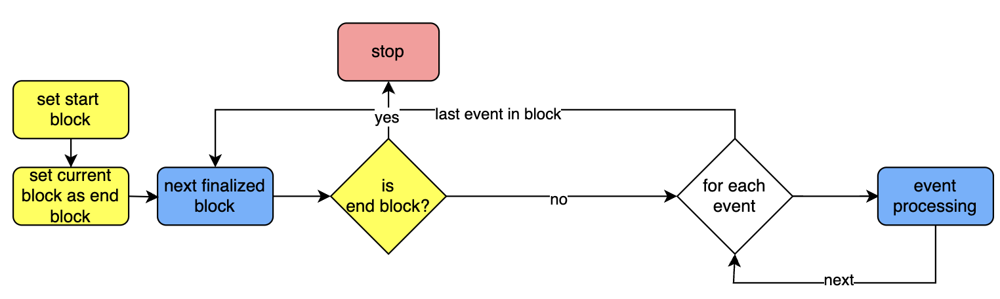

# MIP-61: Relayer in the lock/mint bridge - Algorithm and Bootstrapping 
- **Description**: This MIP describes the process for continuous operation as well as the bootstrapping of the relayer in the lock/mint bridge. 
- **Authors**: [Andreas Penzkofer](mailto:andreas.penzkofer@movementlabs.xyz), [Phillipe]()

## Abstract

We describe an algorithm that

- Continuously checks for `initiate_transfer` events on the source chain.
- Issues a `complete_transfer` transaction on the target chain if not done so far.
- Records the height, before which all transfers are completed.
- Checks on the completion of transfers on the target chain.
- Provides a bootstrap algorithm for the relayer.

In this algorithm the contract's complete transfer function verifies that a transfer hasn't been already done. This is to protect against re-issuance of complete_transfer more than one time for the same transfer.

## Motivation

We would like to minimize the number of trusted components. In a minimal solution the relayer should only trust the chains and itself. Other trusted sources can be proposed optionally, but ideally no other trust assumptions should be utilized.

Several complications:

- Complete-messages to the target chain for bridge transfers may fail, get lost, or other. Hence we cannot rely on delivery.
- The relayer may loose local memory.
- The relayer may have to be replaced.
- The relayer MUST not ignore a single transfer.
- The relayer MUST deliver eventually all transfers.
- The finality criteria on the source chain and target chain MUST be considered.

**Bootstrapping**
The relayer can go offline or crash. It needs to automatically understand from where it should start with sending messages to the target chains, i.e. what is the lowest nonce for which the transfer is not complete.

Currently, when the relayer starts, it doesn't reload the state that it has when it shuts down. If transfers are processed when the relayer stops, the transfers are lost and the relayer is not able to continue the transfer.

Moreover, even if the data would be stored on where to continue, the relayer may crash for a variety of reasons. It needs to automatically understand from where it should start with sending messages to the target chains.

## Context

This algo is defined using the lock/mint-type Native Bridge protocol, described in [MIP-58](https://github.com/movementlabsxyz/MIP/pull/58).This bridge protocol has two function calls :

- `Initiate_transfer` on the source chain (called by user)
- `Complete_transfer` on the target chain (called by relayer)

This algo is compatible with using finalized blocks (see the remark on L2 complete verification). By pulling only finalized source blocks, the  nonce are always updated on finalization.

In this MIP we consider the lock/mint Native Bridge, see [MIP-60](https://github.com/movementlabsxyz/MIP/pull/60). We will discuss a single direction of transfer - from **source chain** to **target chain**.

## Specification

The key words "MUST", "MUST NOT", "REQUIRED", "SHALL", "SHALL NOT", "SHOULD", "SHOULD NOT", "RECOMMENDED", "NOT RECOMMENDED", "MAY", and "OPTIONAL" in this document are to be interpreted as described in RFC 2119 and RFC 8174.

!!! . The algorithm is the same in both directions. Hence each algorithm has to be implemented twice. Once for the transfer direction L1 --> L2, and once for the L2 --> L1 direction.

The relayer can get its state from the source chain and target chain. The algo has three parts:

**1. Continuous-Processing**: The relayer pulls transfer events from the source chain and processes them. For each transfer the relayer has to check if the transfer is completed on the target chain, and if not it has to complete the transfer.

**2. Bootstrap:** The relayer initiate the event polling at some point in the past. This point is either the genesis, some configurable source block height, or some checkpoint (possibly on-chain)

#### Event-Processing

The relayer manages only one state of transfer: pending, which exists during the time between the reception of the `initiate_transfer` event from the source chain and the success of the `complete_transfer` tx on the target chain.

The Native Bridge protocol MUST implement the assignment on the source chain of an incrementing `nonce`. Since there are two directions there MUST be two counters - one for each direction. The `nonce` is used to order the transfers.

For each `initiate_transfer` event do the following:

1. Get the `nonce`.
1. If a nonce has been skipped this should not happen and we should report / throw an error.
1. If nonce already is recorded check the `status_transfer`.
    1. If completed set status transfer as `transfer_completed` and return.
    1. Else create `nonce` entry locally and query target chain if `complete_transfer` transaction has been submitted.
        1. If `complete_transfer` transaction is on target chain
            1. If the transaction is final, set `transfer_complete` for the status of the `nonce`
            1. Else set status us `transfer_pending` and set a timeout, for the relayer to check later again.
        1. Else 
            1. send `complete_transfer` transaction to target chain
            1. set the status as `transfer_pending`.
            1. set a timeout after which the timeout-process should trigger for the transfer.

#### Continuous-Processing

!!! . TODO insert structure example from target chain here

Next describe the processing of source blocks and the completion of a transfer on the target chain, assuming the relayer is always online. Since this is a strong assumption, we reduce this requirement in the next section.

!!! . Only finalized source blocks should be considered. So there is need for implementing a trigger for when a block is finalized.

1. Receive new non-processed finalized `source_block`.
1. If a block height is missing put the block into a queue. DO NOT process blocks out of order.
1. Get `initiate_transfer` events from the `source_block`.
1. For each `initiate_transfer` event run the event_processing script.
1. Set the block height as `block_processed`.

**Optimizations to consider errors in the above procedure**
This step is optional but should be considered.

Introduce a status `transfer_init` to differentiate a state between nonce creation locally and sending successfully a `complete_transfer` transaction.

**Calculation-Completed-Block-Height**
In this section the process is defined to calculate the completed part of the source chain `completed_block_height` and `completed_nonce_height`.

1. If completed set status transfer as `transfer_completed` and return.

is replaced by

1. If completed set status transfer as `transfer_completed`.
1. If the nonce is not `completed_nonce_height + 1` then return.
1. Else
    1. Set `completed_nonce_height += 1`.
    1. If this nonce is the last nonce in the source block set `completed_block_height += 1`.
    1. If the next nonce is completed start from step 1.
    1. Else return.

### Timeout algorithm

1. Whenever the timeout of a transfer (which has `transfer_pending` status) is triggered. Start the event processing.

### Bootstrapping

Next we describe how the bootstrap algorithm works and differs from the above.

!!! . A node that is bootstrapping MUST start the [Continuous-Processing](#continuous-processing) algorithm in parallel.

The Algorithm differs from the Continuous-Processing in that it runs in parallel and will catch up with missing transfers eventually. While not hindering the Continuous Operation of the Relayer. It implements a delay to start at the beginning, which conveniently prevents that `complete_transfer` transactions would be sent accidentally twice to the target chain.

1. Start the Continuous-Processing protocol.
1. Set the first processed source block by the Continuous-Processing protocol as `first_continuous_processed_block`.
1. Set `end_source_block = first_continuous_processed_block - 1`
1. Set `start_source_block` according to some input.
1. Wait for some time `wait_time`, e.g. 10 minutes. This is to ensure that all relevant source blocks have arrived. It may be not necessary but it also does not hurt.
1. For each source block between `start_source_block` and `end_source_block` perform the same algorithm as Continuous-Processing (apart from using the next source block height in the loop rather than a new source block)

#### Bootstrap input types

**Manual input**
Based on knowledge of when the relayer stopped, we can inject a parameter about the source block height from which the relayer should start to bootstrap. Default is the genesis or some arbitrary long interval in the past, e.g. 2 weeks.

**Reading from local memory**
In the Continuous-Processing Algorithm the Relayer can record the height of the source block `completed_block_height` as described in the Calculation-Completed-Block-Height algorithm. When rebooting or bootstrapping the node, the relayer can start from the last point it left.

**Reading from chain**
The relayer records on the source or target chain (whichever is cheaper) the `completed_block_height` (see Calculation-Completed-Block-Height algorithm). This can happen infrequent. A separate algorithm needs to be spelled out which records the highest source block, below which all source blocks with transfers are completed.

## Considered Alternatives

1. Use of indexer DB.

This creates a dependency to another component. For example, if the postgres db has an issue, the relayer has an issue. Even thought the relayer doesn't need the db to process.

## Reference Implementation

<!--
  The Reference Implementation section should include links to and an overview of a minimal implementation that assists in understanding or implementing this specification. The reference implementation is not a replacement for the Specification section, and the proposal should still be understandable without it.

  TODO: Remove this comment before submitting
-->

## Verification

Needs discussion.

---

## Errata

## Appendix

---
## Copyright

Copyright and related rights waived via [CC0](../LICENSE.md).
