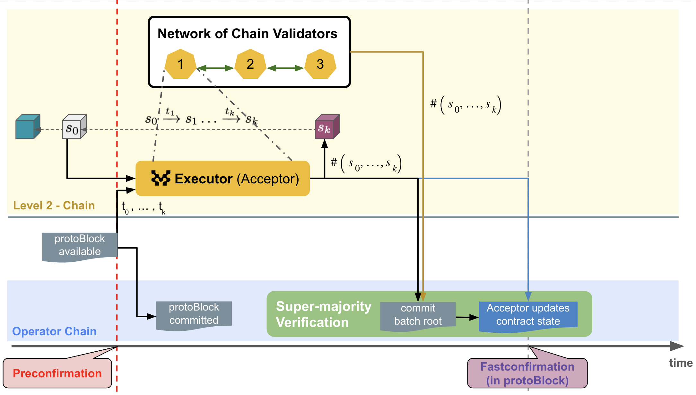

# MIP-65: FFS: Fastconfirmations

- **Description**: Fast-Finality Settlement : Fastconfirmations as confirmations on the L2.
- **Authors**: Andreas Penzkofer
- **Desiderata**: [MD-65](https://github.com/movementlabsxyz/MIP/blob/mip/L2confirmation/MD/md-65/README.md)

## Abstract

This MIP introduces Fastconfirmations on L2 as confirmations in addition to Postconfirmations. Fastconfirmations are a way to settle transactions on the L2 with fast confirmation times, but with potentially lower security (e.g., lack of long-range attack protection). This is achieved by using the L2 as a confirmation layer for the [Fast Finality Settlement mechanism](https://github.com/movementlabsxyz/MIP/pull/34).

## Motivation

We introduce Postconfirmations on L1 in [MIP-37](https://github.com/movementlabsxyz/MIP/pull/37). While Postconfirmations partially draw from Ethereum security and provide protection against particular attacks (such as long-range attacks, see [MD-4)](https://github.com/movementlabsxyz/MIP/pull/5) they are slow due to the finality time on Ethereum, and also expensive due to high fees.

In contrast, finality times on the L2 are much faster and fees are much lower. This justifies the introduction of Fastconfirmations on the L2 as a way to confirm transactions on the L2 with low latency, but without any additional security guarantees from the L1.

Postconfirmations are a simple yet elegant design which permits implementation with

- high decentralization capability
- no requirements on p2p networking between validators
- no consensus required.

Postconfirmations can draw from the consensus progress on L1, where the consensus is driven by a BFT protocol. Similarly, Fastconfirmations can draw from the consensus progress on protoBlocks on L2, which is similarly driven by a BFT protocol.

## Specification

*The key words "MUST", "MUST NOT", "REQUIRED", "SHALL", "SHALL NOT", "SHOULD", "SHOULD NOT", "RECOMMENDED", "NOT RECOMMENDED", "MAY", and "OPTIONAL" in this document are to be interpreted as described in RFC 2119 and RFC 8174.*

### Components

Abstractly an L2 chain consist of the following main components:

- a ledger
- a sequencer with Data Availability (DA)
- a validator set that confirms the ledger.

The sequencer outputs protoBlocks, which are ingested by validators. From these protoBlocks, the validators calculate the state of the ledger and calculates the next L2Block.

*Figure 1: Fastconfirmation design.*

### Operator chain

The *operator chain* is a ledger that is dedicated to

- handling reward distribution for sequencer,
- handling reward distribution for FFS validators,
- verification and recording Fastconfirmations.

We require the operator chain

- is protected by a high security level.
- has low latency to finality.
- has low fees.
- Throughput and fees should not be impacted by load on other chains in the cluster that is operated by a shared sequencer.

> :warning: At this point it is not clear, whether the VM that drives the operator chain should be operated by the FFS mechanism or the sequencers. The former has lower security, as the security then depends on both FFS validators and sequencers. The latter adds complexity, as it requires the sequencers to run a VM, albeit potentially a simple one.

### Fastconfirmation

We take inspiration from the Postconfirmation design, see [MIP-37](https://github.com/movementlabsxyz/MIP/pull/37). Similarly to recording confirmations on the L1, here we record the commitments of FFS validators on the operator chain, see Figure 1.

The design is rather similar to the Postconfirmation design. However it requests additional properties from the operator chain, see above. The sequencer chain acts as the settlement layer and we thus inherit the security properties of the operator chain for the supermajority check.

### Shared sequencing and multi-chain clusters

We design for a cluster-based solution with a shared sequencer at the core. This means that a sequencer serves multiple ledgers (also called chains).

Validators can query for new protoBlocks and separate their transactions out by namespace. (Or alternatively validators could request based on namespace and receive a transaction stream specific to the chain.) For simplicity we refer to a protoBlock when discussing the pre-stage of the next L2Block, but in a shared setting protoBlock[namespace] would be more accurate.

Nodes can choose to specialize on a given chain, which significantly reduces hardware requirements. With the introduction of the operator chain, the node has to follow the operator chain in addition to its specialized chain. Thus the load on the operator chain should be kept low.

### ProtoBlock to L2Block mapping

The protoBlock output by the sequencer is the input to the L2Block calculation. The mapping from protoBlock to L2Block is deterministic and can be calculated by any validator. The mapping is a function of the state of the ledger and the transactions in the protoBlock.

The protoBlock production may be high frequent, e.g., every 500ms. The L2Block production may be less frequent, e.g., every 4 seconds. And thus an L2Block may contain multiple protoBlocks.

## Alternative considerations

**Operator chain vs own chain for Fastconfirmations**
It could be considered that Fastconfirmations are recorded on the chain itself. However, we carefully must consider the security implications of this. The operator chain is a dedicated chain that is optimized for guaranteed throughput for confirmations and low fees.

## Reference Implementation

## Verification

## Changelog

## Appendix

## Copyright

Copyright and related rights waived via [CC0](../LICENSE.md).
