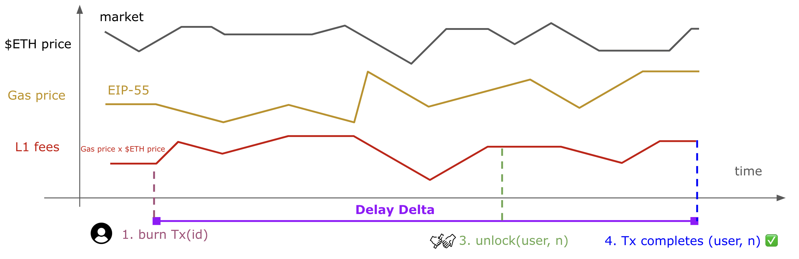

# MIP-69: Bridge Fees

- **Description**: How to charge bridges fees when bridging \$L2MOVE to \$L1MOVE.
- **Authors**: [Franck Cassez](mailto:franck.cassez@movementlabs.xyz)
- **Desiderata**: [MD-69](../../MD/md-69/README.md)
- **Approval**: Stagnant

## Abstract

As pointed out in [MD-69](../../MD/md-69/README.md), bridging \$MOVE tokens from Movement Chain to Ethereum (L1) requires the _relayer_ to pay for Ethereum (L1) part of bridge transaction, the _L1 fees_.
Ethereum's transaction fees are substantially higher than Move Chain fees, and we may not sponsor the L1 fees but instead charge the user
for the L1 fees.
As a result the operator has to charge some transfer fees on top pf the Move Chain _initiate_ transaction fees.

The requirements for the bridge fees from Move Chain to L1 are gathered in  [MD-69](../../MD/md-69/README.md) and this
MIP proposes some strategies to satisfy these requirements.

More specifically, this MIP covers the following topics:

- adjusting bridge fees dynamically,
- sources of uncertainty in fees,
- using oracles to collect trustworthy and recent estimates of prices,
- possible strategies to avoid/reduce deficit.

## Motivation

### Bridging mechanism

Bridging \$L2MOVE to \$L1MOVE involves the 4 following steps (Figure 1):

1. User request a transfer of `n` \$L2MOVE, which initiates a _burn_ transaction on Move Chain. D1 in [MD-69](../../MD/md-69/README.md).
1. the _burn_ transaction executes and completes and an event `FundsBurnt!` is appended to the Move Chain logs. `n` tokens are burnt on Move Chain.
1. The relayer _relays_ the `FundsBurnt!` event to the L1 by submitting a _unlock_ transaction.
1. The _unlock_ transaction executes and completes and an event  `FundsUnlocked!`. `n` tokens are transferred from the L1 Bridge to the user (on L1).

---


---

**Figure 1.** The 4 steps to bridge funds from Move Chain to Ethereum (L1)

---

### Fees

The relayer pays the L1 fees (D2, [MD-69](../../MD/md-69/README.md)) and it is hard to predict them _at the time_ the user requests the funds transfer. Indeed the fees depend on the L1 _gas price_ that evolves dynamically according to rules that take into account the network congestion (how full blocks are, gas-wise), which is described in [EIP-1559](https://github.com/ethereum/EIPs/blob/master/EIPS/eip-1559.md). On top of that, the L1 fees are paid in \$ETH by the relayer and the price of \$ETH is also time-dependent.

Figure 2 below examplifies the changes in gas price, \$ETH price and their effect on the L1 fees paid by the relayer.

---



---

**Figure 2**: L1 fees fluctuate per block according to [EIP-1559](https://github.com/ethereum/EIPs/blob/master/EIPS/eip-1559.md)

---

> [!WARNING]
> To cover the L1 fees, we need to collect some fees from the user (D3, [MD-69](../../MD/md-69/README.md)), and adjust the fees to 1) cover the costs incurred by the relayer to submit the _unlock_ transaction (D4, [MD-69](../../MD/md-69/README.md)), and 2) minimise the difference between what we charge the user and what we actually pay (D5, [MD-69](../../MD/md-69/README.md)).

This MIP proposes strategies to satisfy the requirements D1-D5, [MD-69](../../MD/md-69/README.md).

## Specification

> [!NOTE]
> We charge the user some bridging fees to cover the cost of the (relayer) L1 fees. This section reviews some possible solutions.

As the fees are charged in \$MOVE but the transaction on the L1 are paid in \$ETH, we need to track the ratio $r = \text{\$ETH price}/\text{\$MOVE price}$.
Assuming we have two pools of tokens for the Move to L1 bridge, $A$ (\$MOVE) and $B$ \$ETH, we pay with the tokens in $B$ and get revenues in $A$.
We should try to ensure that

$$
Balance(A) \times \text{\$MOVE price} \times r \approx Balance(B) \times \text{\$ETH price}
$$
to balance the funds in the two pools.

More precisely we may try to bound the difference in value in the two pools by a given constant:

$$
| Balance(A) \times \text{\$MOVE price} \times r - Balance(B) \times \text{\$ETH price} | < \text{MaxDeficit} \mathpunct.
$$

### Request to transfer \$L2MOVE (Move Chain)

1. The user pays for the Move Chain request transaction fees, `ReqTxFees` in \$L2MOVE,
1. The user MUST be able to request the transfer of `n` \$L2MOVE provided their account balance is larger or equal to `n` (after taking into the `ReqTxFees`).
1. The user SHOULD be charged some _bridging fees_ and MUST be able to provide a maximum fee bound, `MaxBridgeFee`, they agree to be charged.
1. `n` MUST be larger than `MaxBridgeFee`
1. The bridging fees MUST be charged in \$MOVE and deducted from the user initial amount `n` during the transfer of assets.

### Completion of transfer (L1)

6. The relayer MUST pay the L1 fees, `L1Fees`, in \$ETH.
1. The user MUST get at least `n - MaxBridgeFee` \$L1MOVE.
1. The relayer (operator) gets `L1BridgeFees` \$MOVE, and `L1BridgeFees` MUST be at most `MaxBridgeFee`.
1. The L1 fees `L1Fees` (in \$ETH) paid by the relayer SHOULD be _covered_ by the equivalent bridge fees `L1BridgeFees` in \$MOVE.

The previous requirements imply:

10. We MUST track or estimate the \$ETH price and the L1 gas price.
10. We MUST track or estimate the \$MOVE/\$ETH ratio.

The key words "MUST", "MUST NOT", "REQUIRED", "SHALL", "SHALL NOT", "SHOULD", "SHOULD NOT", "RECOMMENDED", "NOT RECOMMENDED", "MAY", and "OPTIONAL" in this document are to be interpreted as described in RFC 2119 and RFC 8174.

## Reference Implementation

### Request to transfer \$L2MOVE (Move Chain)

The user (or a dedicated front-end) submits a transaction to request the transfer of `n` \$L2MOVE with a maximum bridge fees expressed in \$MOVE.
As a result we expect the `initialize` (bridge transfer) on the Move Chain to have the following signature:

```Rust
/// Provides MOVE native bridge 
module native_bridge {

/// User submits a transfer request
///
/// @param user         The initiator on Move Chain of the transfer
/// @param recipient    The recipient on L1 of the transfer
/// @param amount       The amount (\$L2MOVE) to be transferred
/// @param max_fess     The maximum amount the `user` agrees to be charged for bridging fees.
///
/// Aborts if (not exhaustive): max_fees > amount, user balance is less than `amount`.
public entry initialize(user: &signer, recipient: ethereum_address, amount: u64, max_fees: u64) 
{
    assert!(max_fees <= amount>);
    ...
    // 3 in Figure 1, FundsBurnt
    event::emit_event(user, recipient, actual_amount, max_fees,...);
    
}
...
}
```

To compute the bridge (and charge) fees we have three options:

- **[Option 1]**: compute the bridge fees at the time of the request. In that case the `actual_amount` takes into account the bridge fees.  **The contract on the Move Chain must keep track of the L1 gas price and the \$ETH/\$MOVE prices.**
- **[Option 2]**: the bridging fees are computed at the time of the `unlock` transaction, and the fees are a parameter of the `unlock` (Figure 1). The Relayer computes the fees and relays the `actual_amount`. **The relayer must track the L1 gas price and the \$ETH/\$MOVE prices.**
- **[Option 3]**: the bridging fees are computed and **charged in the L1** contract that executes the `unlock` (Figure 1). **The L1 contract  must track the L1 gas price and the \$ETH/\$MOVE prices.**

> [!IMPORTANT]
> Overall, the bridging fees can be computed at different times, but we charge them in the L1 `unlock` (complete transfer) transaction.
> We also need an oracle to provide a trustworthy estimate of the \$ETH price and L1 gas price.

> [!NOTE]
> The resource consumption of the `unlock` transaction is **fixed** and depends on the _size_ of the `calldata` (fixed for unlock`). The computation of the L1 transaction fees is explained in [MIP-16](https://github.com/movementlabsxyz/MIP/tree/gas-fee-calculation/MIP/mip-16).

### Comparisons

#### Quality of the estimates

The quality of the estimates for \$ETH price ad L1 gas price depends on two main factors:

- how and where we get the estimates. We can assume that we use trusted _oracles_ or an average on many oracles to solve this issue.
- the _age_ of the estimates. The older the estimates the less accurate they may be.

As a result, if we use the same oracle device for the three options, the quality of the estimates solely depends on the _age_ and:

Option 3 > Option 2 > Option 1.

#### Flexibility in implementation

Options 1 and 3 require the contracts to query the oracle. This is doable to query _on-chain_ oracles as explained in this [Ethereum developers section](https://ethereum.org/en/developers/docs/oracles/).
These options are _trusted_ provided the oracle is trusted too.

Option 2 is an _off-chain_ solution and may provide more flexibility but probably requires that **the relayer** can query the estimates and **is trusted**.

### Completion and adjustment of bridge fees

If we follow Options 1 (resp. 3), the bridging fees are adjusted either in the Move (resp. Solidity) contract that provides the `initialize` (resp. `unlock`) function.
For option 2, the Relayer keeps track of the estimates and implements the adjustment.

### When do we make an adjustment?

There are several options:

- at each request (every transaction), or every $k$ transactions,
- at time intervals (to be defined).

> [!IMPORTANT]
> In between two adjustments, the fees remain constant. We refer to the **adjustment window** as the intervals in which the fees are constant.

The choice may depend on the frequency of bridging requests: if bridging are rare, we may update at every request at most.
If they are frequent and we cannot afford to query oracles too frequently, we may decide on a time interval.

### Strategies to adjust the bridge fees

To adjust the bridge fees dynamically, we may want to ensure:

$$
| Balance(A) \times \text{\$MOVE price} \times r - Balance(B) \times \text{\$ETH price} | < \text{MaxDeficit} \mathpunct.
$$

We need to design a _strategy_ (in the sense of a two-player game) that guarantees the above safety property.

> [!WARNING]
> Ideally, our solution should be better with recent estimates rather than older ones, but it may not be easy to guarantee.

The most powerful state-based strategy can be obtained by recording the values of the L1 gas price, \$ETH and \$MOVE prices since the genesis.
It also depends on the funds in both pools $A$ and $B$.
However, we cannot reasonably store all these data, and we have to base our strategy on a smaller quantity of information.

To start with we may use:

- the estimated max gas price, \$ETH/\$MOVE prices when the next `unlock` transaction will be processed,
- the current difference between the revenues (in \$MOVE) and expenses (in \$ETH), i.e. the gap surplus or deficit in our pools,
- the time (seconds or blocks or transactions) we would like to cover a deficit.

As discussed during the co-location we may start with a simple strategy limited to increasing the fees by a constant factor. The decision to increase or decrease can be taken using oracles or simply based on the funds in pools $A$ and $B$.

### Simple strategies

Denote $Balance(A, B)$ the difference of the balances, in USD, of pools $A$ and $B$.

$$ Balance(A, B) = Balance(A).USD - Balance(B).USD \mathpunct. $$

If $Balance(A, B) \geq 0$ we are running a _surplus_, otherwise a _deficit_.

#### Balance based strategy

A simple strategy is to increase/decrease the bridge fees by a $K$ (\$MOVE) tokens every time we update the fees.
If $Balance(A, B) == 0$, we keep the fees as they are, if $Balance(A, B) > 0$, we increase and otherwise decrease.

Assume we want to adjust the fees according to:

- the most recent value of $Balance(A, B)$,
- estimates of L1 gas price, \$ETH/\$MOVE prices in the next window.

If we run a deficit we want to cover it by the next time window, and if we run a surplus, we may keep the fees unchanged or decrease them.

#### Estimate and balance based strategies

## Verification

Needs discussion.

---

## Change Log

---

## Appendix

### A1: Notes from [MIP-58](https://github.com/movementlabsxyz/MIP/pull/58)

!!! warning These notes were present in MIP-58. However they do belong here instead. Please consider how to incorporate these.

- When bridging from L1 to L2, the protocol, through the Relayer, sponsors the gas cost on Movement. We do not need to make any modification on contracts or Relayer to support it.
- When bridging from L2 to L1, we have a few viable solutions but it's preferable to highlight two.
   1. Relayer sets a fee on L2, a global variable that can be set at any given time. Considering that block validation time on L1 is bigger than on L2, it becomes a viable approach since L2 can rapidly adjust the fee according to the current block and always charge an above L1 gas cost fee to attempt that the bridge is net positive. \$L2MOVE is deducted from the amount of tokens that are currently being bridged and transferred to a funds manager. This gives the protocol a very reliable way to estimate how much MOVE will be charged and feed to the user a precise amount of tokens. However, bridge transfers cannot always immediately be initiated on the L1, e.g. if there is a surge in transactions. 
   2. Enable the Relayer to specify on the L1 `completeBridgeTransfer` transaction, the bridge fee per transaction. The amount is deducted from the total amount of tokens that were bridged and transferred to a funds manager. The dangerous situation is that we expect is this takes much more than 10 minutes before the transfer can occur, and this could lead to a big disparity between the expected amount of funds and the actual amount of tokens received.

---

## Copyright

Copyright and related rights waived via [CC0](../LICENSE.md).
