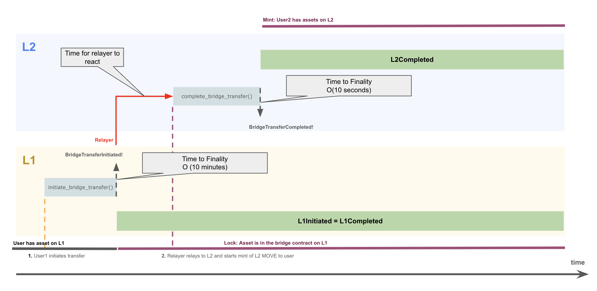
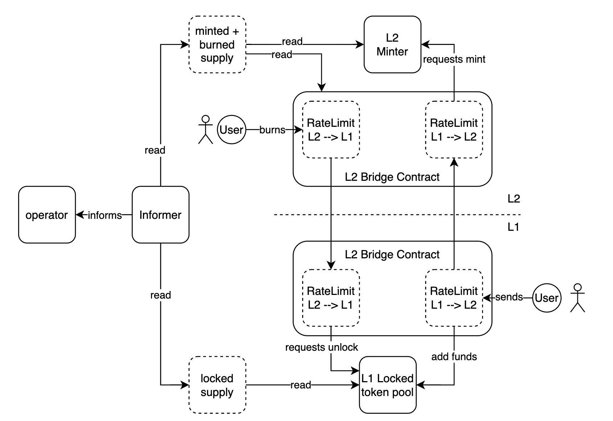

# MIP-71: Informer for the Operation of the Lock/Mint Native Bridge

- **Description**: The Informer collects data from L1 and L2 about the supply of \$MOVE tokens and forwards the information to relevant parties, which is critical for the safe operation of the Native Bridge.
- **Authors**: [Andreas Penzkofer](mailto:andreas.penzkofer@movementlabs.xyz)
- **Desiderata**: [MD-71](../../MD/md-71)

## Abstract

The Informer for the Lock/Mint-Native Bridge (in the following simply referred to as Native Bridge) is introduced to collect information about the state from L1 and L2 and provide this information to components of the **Governance** or the **Governance Operator**. The provided information is critical for the safe operation of bridge components such as the Rate Limiter, the Security Fund, and the Bridge Operator.

## Motivation

Several components should react if the bridge is under attack or faulty. In particular, the considered components are the Security Fund, see [MIP-50](https://github.com/movementlabsxyz/MIP/pull/50) and the Rate Limiter, see [MIP-56](https://github.com/movementlabsxyz/MIP/pull/56).

The Operator that controls these components requires knowledge about the states of minted or locked tokens on L1 and L2. Moreover, the operation of these components may be handled via a governance, which could also rely on state information.

## Context

We refer to the following illustration for a bridge transfer from L1 to L2, which is taken from [MIP-58](https://github.com/movementlabsxyz/MIP/pull/58).

*Figure 1: Illustration of L1 to L2 token transfer process.*

## Specification

The key words "MUST", "MUST NOT", "REQUIRED", "SHALL", "SHALL NOT", "SHOULD", "SHOULD NOT", "RECOMMENDED", "NOT RECOMMENDED", "MAY", and "OPTIONAL" in this document are to be interpreted as described in RFC 2119 and RFC 8174.

*Figure 1: Dependencies of components on the Informer mechanism in the Native Bridge.*

The Informer collects information about the state of \$L1MOVE and \$L2MOVE and provides this information to the Governance Operator who controls relevant components of the Native Bridge. The Informer is a trusted component that is critical to the safe operation of the Native Bridge.

1. The Informer is a component that MUST run a node or client on L1 and on L2 to be able to extract information about the states of the chains.
1. On L1 the Informer SHOULD read the supply `L1MOVE_locked` of \$L1MOVE token at the finalized state.
1. On L2 the Informer SHOULD read the circulating supply `L2MOVE_minted` of \$L2MOVE token at the finalized state. The `L2MOVE_minted` value MUST consider the amount of burned tokens through transfers from L2 to L1 (`initiate_transfer` calls on L2), such that the `L2MOVE_minted` represents the circulating supply of \$L2MOVE on L2.
1. Since L1 blocks have timestamps we say the Informer reads `L1MOVE_locked` at time `t_L1`.
1. We assume that L2 blocks acquire timestamps from the sequencing protocol, e.g. Celestia. Thus the Informer reads `L2MOVE_minted` at time `t_L2`.

> [!NOTE]
Instead of the finalized state we could also consider the $k$-confirmed state for the L1. The definition of $k$-confirmed is given in [Issue-838](https://github.com/movementlabsxyz/movement/issues/838). Similarly, for the L2, we could assume some different confirmation level like the fast-confirmation, see [MIP-65](https://github.com/movementlabsxyz/MIP/pull/65).

Since the Relayer may use a confirmation level that is not the finalization, we add the following requirement:

6. The confirmation levels for the Informer MUST be the same as for the Relayer.

#### Locked and minted supply difference

The Informer MUST provide the information about the difference of locked \$L1MOVE and minted \$L2MOVE supply `MOVE_diff`. This indirectly informs, whether there is an issue with the total circulating supply of \$MOVE across the L1 and L2. The Informer provides this information at time `t'`, where `t' ~ max{t_L1,t_L2}`). It is approximate, since the local time of the informer may differ from the chain clocks. However, it can only provide guarantees for `t = min {t_L1,t_L2}`, which is discrete block time.

The Informer MUST measure `MOVE_diff(t) = L1MOVE_locked(t_L1) - L2MOVE_mint(t_L2)` and the condition `is_MOVE_diff_safe = (MOVE_diff < 0)`.

> [!NOTE]
`CONDITION_1` :  The Informer warns if `is_MOVE_DIFF` is false. This is because in this scenario the circulating supply exceeds the maximum circulating supply `MOVE_Max`.

#### Inflight tokens

The Informer MAY calculate the in-flight tokens. Inflight tokens are tokens that are locked (burned) on L1 (L2) but that are not yet minted (unlocked) on L2 (L1) with a **finalized state**. With respect to finalized states it should be `MOVE_inflight = MOVE_diff`.

We can further differentiate the inflight tokens, however this considers non-finalized events and thus results may not be precise or may even revert.

We can differentiate the following types of inflight tokens:

1. transfer is processed by the Relayer and the `complete_transfer` transaction is recorded on the target chain but not finalized. This includes the sets `L1MOVE_inflight_processing` and `L2MOVE_inflight_processing`.
1. transfer is initiated on source chain but the Relayer has not yet processed the transfer. This includes the sets `L1MOVE_inflight_init` and `L2MOVE_inflight_init`.

The Informer can measure `L1MOVE_inflight_processing` and `L2MOVE_inflight_processing` by reading the non-finalized state of the respective chain.

## Recommendations

#### Possible measurement errors

The timestamps of the two layers are not synchronized. We assume that the difference is negligible, however, for correctness, the implications of a drift between the L1 and L2 clocks should be considered. Moreover, the clocks of the layers progress discretely. This means that the Informer reads events from L1 and L2 with slightly different time stamps. This timestamp difference can introduce errors in the calculation of circulating token.

It is recommended that the Informer SHOULD not rely on timestamps.

#### Slow chain

The Informer may receive block events delayed from one of the chains. Consequently, finalized `complete_transfer` transactions on the target chain could be read before their respective `initiate_transfer` counterpart from the source chain. In this case the `MOVE_diff` could trigger `CONDITION_1` albeit the chains are safe. To improve on this, the Informer SHOULD only consider transfers for which the `initiate_transfer` is on the target chain.

We currently have a counter called `nonce` implemented. Since this counter strictly increases on the source chain, we could improve the Informer by keeping two types of lists locally off-chain: `LtargetMOVE_completed_but_init_missing` and `LtargetMOVE_completed_with_init`. The Informer SHOULD only consider `LtargetMOVE_completed_with_init` and updates the list when the corresponding `initiate_transfer` becomes available.

#### UNSAFE Relayer operation and reorg protection

The postconfirmation process is a synchronization mechanism for L2 to L1, see [MIP-37](https://github.com/movementlabsxyz/MIP/pull/37). It is also an anchoring mechanism that protects against reorgs. If the Relayer only processes postconfirmed states, this forces synchronization between L2 to L1.

If the Relayer is set up to operate in an UNSAFE mode and completes transfers based on only fast-confirmations, see [MIP-65](https://github.com/movementlabsxyz/MIP/pull/65), or even simply based on states computed from protoBlocks that are issued by the sequencer, the Relayer SHOULD warn about this or the operator MUST at least be aware of this.

## Reference Implementation

## Verification

Needs discussion.

---

## Errata

## Copyright

Copyright and related rights waived via [CC0](../LICENSE.md).
