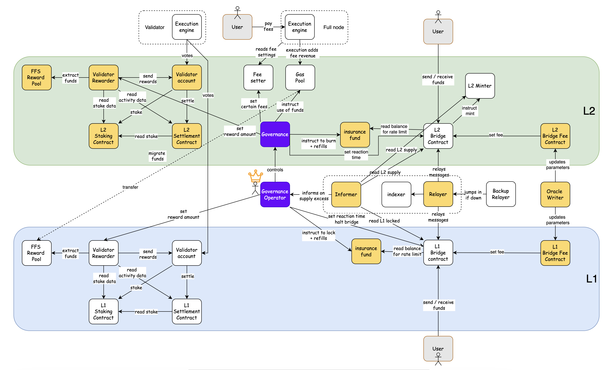

# MIP-73: The San Fran Model

- **Description**: Proposes an L2 model that improves the Biarritz model. It transitions to a Lock/Mint-Native Bridge, adds Bridge fees, and proposes changes to existing components.
- **Authors**: [Andreas Penzkofer](mailto:andreas.penzkofer@movementlabs.xyz)

## Abstract

The San Fran Model applies the changes to the type of the Native Bridge to lock/mint. It proposes bridge fees, a relayer, an informer, a rate limiter and fastconfirmations.

## Motivation

The [MIP-54: Biarritz Model](https://github.com/movementlabsxyz/MIP/pull/54) has been a starting point to this model. The San Fran Model is a further development of the Biarritz Model, which includes the Lock/Mint-Native Bridge, and adds the features or components mentioned in the Abstract. It focuses on providing fast finality settlement, see [MIP-37](https://github.com/movementlabsxyz/MIP/pull/37), as well as a sustainable operation of the bridge.

## Specification

_The key words "MUST", "MUST NOT", "REQUIRED", "SHALL", "SHALL NOT", "SHOULD", "SHOULD NOT", "RECOMMENDED", "NOT RECOMMENDED", "MAY", and "OPTIONAL" in this document are to be interpreted as described in RFC 2119 and RFC 8174._

_The conventions of [MIP-53: Conventions for Proposing Progressive L2 Models](../mip-53) are applied._

_Modified or added components, compared to [The Biarritz Model](https://github.com/movementlabsxyz/MIP/pull/55) are shown in orange._

### Summary Table

| Category / _Criterion_ | Evaluation |
|-----------|------------|
| **General** | |
| _When to use_ | When the governance is trusted. |
| _Suitable preceding models_ | [MIP-54: The Biarritz Model](https://github.com/movementlabsxyz/MIP/pull/54), [MIP-55: The Bilbao Model](https://github.com/movementlabsxyz/MIP/pull/54) |
| _Suitable succeeding models_ | NONE |
| _Technological motivations_ | Contends with bridge fallibility under high operational assumptions, but with increased security compared to previous models. |
| | Permits fast conformations. |
| _Usership motivations_ | User receives fast confirmations and has increased guarantees of system protection compared to previous model. |
| **Components** | |
| _[MIP-58](https://github.com/movementlabsxyz/MIP/pull/58): Lock/Mint-Native Bridge_ | Factually the Lock/Mint-Native Bridge has been introduced prior to the co-location. However, to categorize it within a model, the San Fran Model seems suitable.    We are moving away from the HTLC Native Bridge, see [MIP-39](https://github.com/movementlabsxyz/MIP/tree/main/MIP/mip-39) to the subjectively simpler design of a Lock/Mint Native Bridge, see [MIP-58](https://github.com/movementlabsxyz/MIP/pull/58). For a general overview of bridge designs, see [MIP-60](https://github.com/movementlabsxyz/MIP/pull/60). |
| _[MD-69](https://github.com/movementlabsxyz/MIP/pull/69): Bridge fees_ | In order to operate sustainably we require that the bridge fees cover expenditures of the operator sufficiently. We propose an approach for appropriate fee calculation in [MIP-58](https://github.com/movementlabsxyz/MIP/pull/58). |
| _[MIP-61](https://github.com/movementlabsxyz/MIP/pull/61): Relayer algorithm_ | Introduce an algorithm for continuous operation and bootstrapping for the Relayer. |
| _[MIP-71](https://github.com/movementlabsxyz/MIP/pull/71): Adjust Informer to Lock/Mint Bridge_ | With the change of the Native Bridge design the requirements, conditions and parameters have changed for the Informer. |
| _[MIP-74](https://github.com/movementlabsxyz/MIP/pull/74): Adjust Rate Limiter to Lock/Mint Bridge_ | With the change of the Native Bridge design the requirements, conditions and parameters have changed. |
| _[MIP-65](https://github.com/movementlabsxyz/MIP/pull/65):  Fastconfirmations on L2_ | In order to facility fast confirmations as requested by the Fast-Finality Settlement mechanism, we require confirmations on the L2 in addition to the confirmations on the L1 (postconfirmations, see [MIP-37](https://github.com/movementlabsxyz/MIP/pull/37)). This mechanism is called fastconfirmation. |
| **Operational Assumptions** | |
| _Trust of Governance_ | Users are willing to trust governing body with important operations.  |
| _Trust on Relayer_ | The Relayer is largely trusted, albeit measures are taken to protect against major failures.  |
| _Trust on Informer_ | The Informer is trusted, however its task is limited.  |

### Pros

1. **Fast confirmations**: There is need to provide extremely fast confirmations. This is a step in the right direction.
2. **Additional Native Bridge description**: The specification of the Native Bridge is improved.
3. **Introduces bridge fees**: Adds important discussion on the bridge fees.

### Cons

1. **High trust in governance**: the model requires complete trust in the governing body.

## Reference Implementation

## Verification

## Appendix

## Changelog
