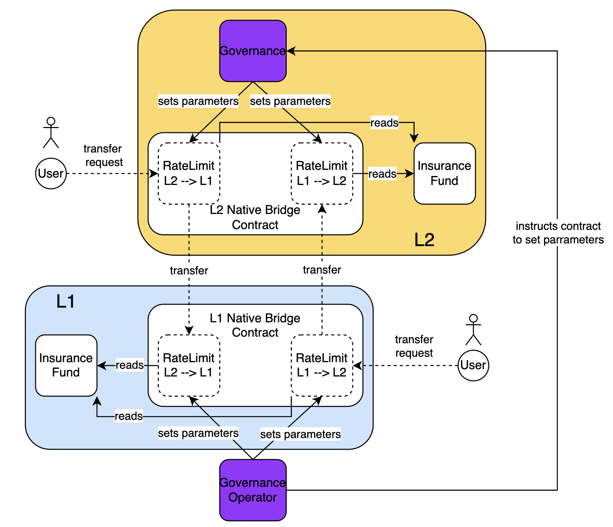

# MIP-88: Simplified Rate Limiter for the Lock/Mint Bridge

- **Description**: A simplified design for the rate limiter of the Lock/Mint bridge.
- **Authors**: Andreas Penzkofer, Primata
- **Desiderata**: [MD-74](https://github.com/movementlabsxyz/MIP/pull/74/files/MD/md-74/README.md)

## Abstract

The design in [MIP-74](https://github.com/movementlabsxyz/MIP/pull/74) considers that the insurance fund differs between the L1 and the L2. This MIP proposes a simplified design where the Insurance Fund is guaranteed to be the same on both sides.

## Motivation

In the design in [MIP-74](https://github.com/movementlabsxyz/MIP/pull/74) the rate limit is determined by the Insurance Fund on the target chain. The Governance Operator must ensure that the rate limit on the source chains is also set correctly. This means the Governance Operator is already active on both chain.

Moreover, we may assume that the inflow to and outflow from \$MOVE tokens is the same on average.

## Specification

_The key words "MUST", "MUST NOT", "REQUIRED", "SHALL", "SHALL NOT", "SHOULD", "SHOULD NOT", "RECOMMENDED", "NOT RECOMMENDED", "MAY", and "OPTIONAL" in this document are to be interpreted as described in RFC 2119 and RFC 8174._

The Insurance Fund MUST hold the same balance on L1 and L2. If so the rate limit on the source chain can be determined by the same method as on the target chain. This has the advantage, that the Governance Operator does not have to set the rate limint on the source chain, as requested in [MIP-74](https://github.com/movementlabsxyz/MIP/pull/74).

_Figure 1: Architecture of the Rate Limitation system_

We define

- **incoming** as the direction for which funds are released / minted. I.e., the considered chain is a target chain for the given direction.
- **outgoing** as the direction for which funds are locked / burned. I.e., the considered chain is a source chain for the given direction.

The Insurance Fund on a given chain thus MUST be used to

- one half for the rate limit for incoming direction
- one half for the rate limit for outgoing direction

Moreover, if we reset the budget on a daily basis, for security reasons, we MUST only utilize one half of each direction's Insurance fund budget per day.

## Reference Implementation

- [Solidity](https://github.com/movementlabsxyz/movement/pull/992)
- [Move](https://github.com/movementlabsxyz/aptos-core/pull/113)

## Verification

## Appendix

## Copyright

Copyright and related rights waived via [CC0](../LICENSE.md).
