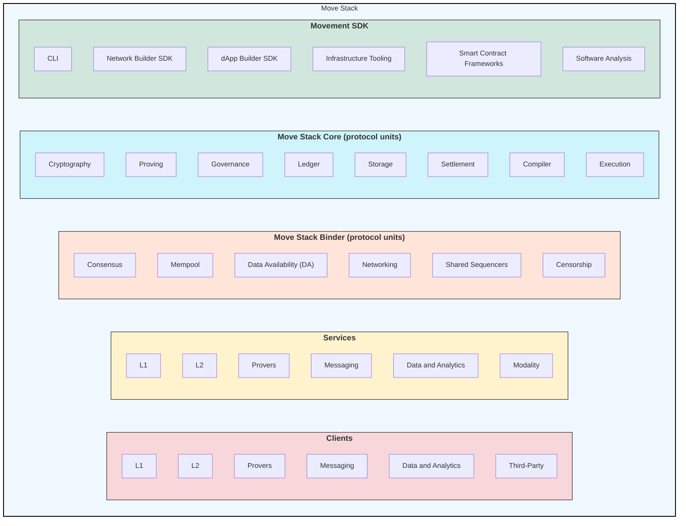

# MIP-92: Move Stack

- **Description**: This document defines the Move Stack and its components such as the Movement SDK.
- **Authors**: Andreas Penzkofer
- **Desiderata**: [MD-91](../../MD/md-91/README.md)

## Abstract

The Move Stack and its components, such as Movement SDK, are core foundational components for Movement technologies. The Move Stack provides a structured categorization of software components, one example of which is the Movement SDK.

## Motivation

The Move Stack's definition and its components, such as the Movement SDK, address key challenges outlined in [MD-91](../../MD/md-91/README.md) to improve the developer experience and standardize Movement technologies. By aligning with these goals, this MIP aims to:

[D1](../../MD/md-91/README.md#d1-standardization-of-development-stack): **Standardization**: Provide a well-documented stack with clear categorization of components to standardize the language and interfaces for Movement technologies.

[D2.1](../../MD/md-91/README.md#d2-create-categories-for-move-stack-components): **Accessibility**: Enable developers to easily locate and understand relevant components through structured categorization and intuitive organization.

[D2.2](../../MD/md-91/README.md#d2-categorization-of-software-components): **Alignment**: Establish consistent terminology and documentation to create a unified understanding across the ecosystem.

[D3](../../MD/md-91/README.md#d3-vizualization-of-the-move-stack): **Visualization**: Offer visual representations to help developers quickly grasp the structure and relationships within the Move Stack.

[D4](../../MD/md-91/README.md#d4-reduce-confusion-between-sdk-and-stack): **Clarity**: Clearly define the scope and relationships between the Move Stack and the Movement SDK, reducing ambiguity and confusion about their roles.

## Specification

The Move Stack is the set of all software components and tools. It is, in effect, a dependency for all Movement Labs' networks and dApps.

The Move Stack is organized into first-order and second-order categories:

### First-Order Categories

1. **Movement SDK**: Tools for interacting with Movement technologies and its deployment. For more, see Section [Movement SDK](#movement-sdk).
1. **Move Stack Core (protocol units)**: Core components required for the operation of a Move-based Chain, as well as principal components.
1. **Move Stack Binder (protocol units)**: Components to which the Move-based chains can connect and that provide a greater environment for the chains to operate in. Such as cross-chain communication, FFS Validators, and decentralized shared sequencing:
1. **Services**: Modular components providing network or dApp remote APIs.
1. **Clients**: Interfaces for low-level interaction and components providing network or dApp remote APIs.

### Second-Order Categories

!!! warning The following categories are not exhaustive and are subject to change.

Each first-order category is further categorized into second-order categories:

**Movement SDK**

1. **CLI**: Command-line interfaces.
1. **Network Builder SDK**: Tools for network development.
1. **dApp Builder SDK**: Tools for building dApps.
1. **Infrastructure Tooling**: Deployment and monitoring tools.
1. **Smart Contract Frameworks**: Frameworks for staking and governance.
1. **Software Analysis**: Tools for formal verification and analysis (e.g., Move Prover).

**Move Stack Core (protocol units)**
For a code example, see [movementlabsxyz/movement/protocol-units](https://github.com/movementlabsxyz/movement/tree/main/protocol-units).

1. **Cryptography**: Cryptographic functions (e.g., hash functions, encryption).
1. **Proving**: Proving systems (e.g., ZK-SNARKs).
1. **Governance**: Mechanisms for network governance (e.g., RunningVote).
1. **Ledger**: Tools for ledger operations, state transitions, and state management.
1. **Storage**: State storage solutions (e.g., TrailerPark).
1. **Settlement**: Settlement mechanisms (e.g., R0M ETH Settlement).
1. **Compiler**: Smart contract compilers for the Move language (e.g., Move LLVM).
1. **Execution**: Virtual machines and block executors (e.g., Aptos Block Executor).

**Move Stack Binder (protocol units)**
For a code example, see [movementlabsxyz/movement/protocol-units](https://github.com/movementlabsxyz/movement/tree/main/protocol-units).

1. **Consensus**: Components for consensus mechanisms (e.g., HotStuff).
1. **Mempool**: Transaction memory pools (e.g., JellyRoll).
1. **Data Availability (DA)**: Proofs and layers for data availability (e.g., SOV Labs DA).
1. **Networking**: Networking utilities (e.g., MovePackets).
1. **Shared Sequencers**: Components enabling decentralized sequencing of transactions.
1. **Censorship**: Components addressing transaction censorship.

**Services**

1. **L1**: Core network services (e.g., block producers).
1. **L2**: Layer 2 services (e.g., rollup validators).
1. **Provers**: Proving system services.
1. **Messaging**: Cross-ledger messaging services (e.g., Hyperlane Aptos).
1. **Data and Analytics**: Indexing services (e.g., M1 Indexer Service).
1. **Modality**: Services enabling different modes (e.g., light clients).

**Clients**

1. **L1**: Core network clients.
1. **L2**: Layer 2 clients.
1. **Provers**: Clients for proving systems.
1. **Messaging**: Messaging clients.
1. **Data and Analytics**: Indexer clients.
1. **Third-Party**: Bespoke clients for external integrations.

### Movement SDK

The Movement SDK provides:

1. A unified interface for interacting with Movement technologies.
1. A curated toolkit for developers to deploy networks and dApps.

The SDK includes smaller, specialized SDKs that offer ergonomic tools for:

- Command-line operations.
- Network and dApp development.
- Infrastructure deployment and observability.

## Reference Implementation

For the reference implementation of the Move Stack refer to the [Movement GitHub repository](https://github.com/movementlabsxyz).

## Verification

## Changelog

## Appendix

### A1 RFC-1

RFC-1 in [RFCs](https://github.com/movementlabsxyz/rfcs) is an initial document that outlines the components of the Move Stack and Movement SDK. It provides a detailed enumeration of components, their aliases, and purposes.

## Copyright

Copyright and related rights waived via [CC0](../LICENSE.md).
