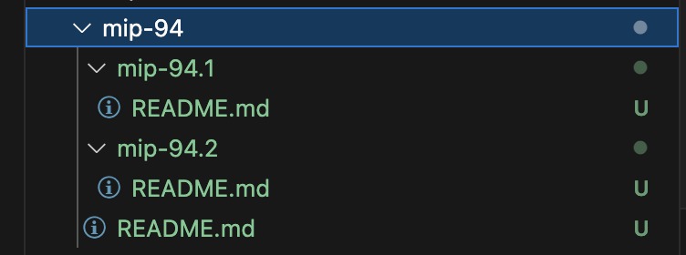

# MIP-94: Parent-Child MIPs

- **Description**: A process through which Movement Improvement Proposals standardize and formalize specifications for Movement technologies.
- **Authors**: [Andy Golay](mailto:andy.golay@movementlabs.xyz)
- **Desiderata**: [MD-93](../../MD/md-93)

## Abstract

This document formalizes parent-child MIPs.

## Motivation

For more complex MIPs, or MIPs which have implementations specific to various software stacks, infrastructure providers, etc., it can makes sense for the sake of organization to have child MIPs to add specific details, rather than making the parent MIP too verbose or cluttered.

## Specification

To create a child MIP:

1. Create a folder within the directory of an MIP. That MIP will be the "parent MIP" for the child MIP.
2. Name the folder `mip-n.k` where `n` is the MIP's number. An editor will assign the numuber, so it's fine for authors to leave it as `n` on the first draft of an MIP. `k` represents the index of the child MIP.

**Example:** If the child MIP is the 1st child MIP of MIP 5, the child MIP will will be `mip-5.1` 

3. Add a `README.md` fill containing the child MIP contents. Follow the [MIP template](../../mip-template.md) but don't repeat redundant information from the parent MIP.

## Reference Implementation

This MIP contains a reference implementation of parent-child MIPs:

- The parent MIP is MIP 94.
- Within the `mip-94` directory are two folders: `mip-94.1` and `mip-94.2`, each with their own `README.md` file.

## Verification

The verification of this MIP depends on the opinions of the MIP committee to evaulate whether the convention is satisfactory, because it is more of a simple consideration of how parent-child MIPs are structured, rather than a complicated technical proposal.

---

## Changelog

---

## Appendix

---
## Copyright

Copyright and related rights waived via [CC0](../LICENSE.md).