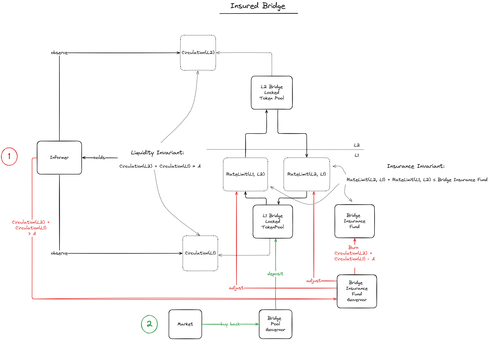

# MIP-\<number\>: Informer for the Native Bridge 
- **Description**: The Informer collects data from L1 and L2 that is critical to the safe operation of the Native Bridge.
- **Authors**: [Andreas Penzkofer](mailto:andreas.penzkofer@movementlabs.xyz)

## Abstract

The Informer for the Native Bridge is introduced to collect information about the state from L1 and L2 and provide this information to components of the Native Bridge. The provided information is critical to the safe operation of bridge components such as the Rate-Limiter, the Security Fund, and the Bridge Operator.

## Motivation

Several components should react if the bridge is under attack. However these components require knowledge about the states of L1 and L2. In particular, the considered components are the insurance fund, see [MIP-50](https://github.com/movementlabsxyz/MIP/pull/50) and the Rate-Limiter, see [MIP-56](https://github.com/movementlabsxyz/MIP/pull/56). In addition the operation of these components may be handled via a governance, which could also rely on state information.

The Informer is a trusted component that provides this information.

## Specification

The key words "MUST", "MUST NOT", "REQUIRED", "SHALL", "SHALL NOT", "SHOULD", "SHOULD NOT", "RECOMMENDED", "NOT RECOMMENDED", "MAY", and "OPTIONAL" in this document are to be interpreted as described in RFC 2119 and RFC 8174.

*Figure 1: Dependencies of components on the Informer mechanism in the Native Bridge.*

The informer collects information about the state of liquid `$L1MOVE` and `$L2MOVE` and provides this information to components of the Native Bridge. The Informer is a trusted component that is critical to the safe operation of the Native Bridge.

1. The Informer is a component that MUST run a node or client on L1 and on L2.
1. On L1 the Informer SHOULD read the liquid supply `L1MOVE_liquid` of `$L1MOVE` token at the $k$-confirmed state. The definition of $k-confirmed$ is given in [Issue-838](https://github.com/movementlabsxyz/movement/issues/838).
1. On L2 the Informer SHOULD read the liquid supply `L2MOVE_liquid` of `$L2MOVE` token at the $m$-confirmed state.
1. The values for $k$ and $m$ MUST be the same as the value of $k$ and $m$ in the bridge parameters.
1. Since L1 blocks have timestamps we say the Informer reads `L2MOVE_liquid(t_L1)`.
1. We assume that L2 blocks acquire timestamps from the sequencing protocol, e.g. Celestia. Thus the Informer reads `L2MOVE_liquid(t_L2)`.

**Observations**
We make the following observations from the above: 

- For L1->L2 bridge transfers: `$L1MOVE` token that have been locked on L1  may not have an equivalent minted token amount on L2. I.e. there exists an amount `L2MOVE_inflight` that is not yet minted on L2.
- For L2->L1 bridge transfers: `$L2MOVE` token that have been locked on L2 may not have an equivalent minted token amount on L1. I.e. there exists an amount `L1MOVE_inflight` that is not yet minted on L1.
- The Informer reads `L2MOVE_liquid(t_L1)` and `L2MOVE_liquid(t_L2)` and where `t_L2 > t_L1` typically. Generally it must be assumed that L1 and L2 are not synchronized.

As a consequence of the above, the total counted liquid supply `MOVE_liquid = L2MOVE_liquid(t_L1) + L2MOVE_liquid(t_L2)` can differ from the total supply `MOVE_max` intermittently. Note that even if `t_L1 == t_L2`, then `MOVE_liquid` can still differ from `MOVE_max` due to inflight tokens.

**In-Flight Tokens**

In the following we count times as per perspective of a user, who has insight into both chains. It is feasible that later it is discovered that this is not the best view point, and that a per chain view may be more insightful.

From [MIP-39](https://github.com/movementlabsxyz/MIP/pull/39/files) we can see that (for the user) the minimal time to complete a successful transfer

- on the sender chain is `t_min_sender = 2 * L_sender_finality + 2 * L_receiver_finality`. 
on the receiver chain is `t_min_receiver = 2 * L_receiver_finality +  L_sender_finality`

And the maximum time to complete an unsuccessful transfer

- on the sender chain is `t_max_sender = 2 * L_sender_finality + timelock_sender`
- on the receiver chain is `t_max_receiver = L_sender_finality +  L_receiver_finality + timelock_receiver`

#### Hypothesis

Assume

- the bridge is rate limited by the Rate-Limiter, see [MIP-56](https://github.com/movementlabsxyz/MIP/pull/56)
- The rate limits for bridge transfers are `ratelimit_L1L2` for L1->L2, and `ratelimit_L2L1` for L2->L1.
- `risk_period >> t_L2 - t_L1`.

Then the maximum amount of tokens that can be inflight

- L1->L2 is `L1MOVE_inflight_max = ratelimit_L1L2 * risk_period * 2` and
- L2->L1 is `L2MOVE_inflight_max = ratelimit_L2L1 * risk_period * 2`.  

The factor 2 accounts for at most two `risk_periods` are in the in-flight period. Moreover, since the maximum transferred tokens in `t_L2 - t_L1` is `ratelimit_L1L2 * risk_period * 2`.

 and `ratelimit_L2L1 * (t_L2 - t_L1)` respectively, we have that `L1MOVE_inflight <= L1MOVE_inflight_max` and `L2MOVE_inflight <= L2MOVE_inflight_max`.

and that the Rate-Limiter MUST consider the inflight tokens `L2MOVE_inflight` and `L1MOVE_inflight` in addition to the liquid supply `MOVE_liquid`.

Rate-Limiter MUST consider the inflight tokens `L2MOVE_inflight` and `L1MOVE_inflight` in addition to the liquid supply `MOVE_liquid`.

### Recommendations

1. It is recommended that $k>=32$, i.e. at least one epoch.
1. It is recommended that $m=3$. 
On L2 we assume a pBFT-like algorithm for the consensus on transaction-blocks, If the protocol is pipelined, this would indicate that 3 blocks are required to finalize. If all phases of the BFT consensus algorithm are handled within one block, then $m=1$ is sufficient.
With Celestia this would be approximately after $36sec$. (The block time of $12sec$ is taken from the [Celestia documentation](https://docs.celestia.org/tutorials/integrate-celestia) and the [Celestia explorer](https://celestia.explorers.guru/)).

### Optimizations

1. Instead of reading the $k$-confirmed state, the Informer COULD consider the finalized state. The finalized state is achieved approximately after two epochs (one epoch holds 32 blocks if no blocks are missed), see [this tweet](https://x.com/LogarithmicRex/status/1578540111930699778) and [this article](https://ethos.dev/beacon-chain).
1. For security purposes the Informer COULD consider only the state produced by L2 blocks that have been [postconfirmed](https://github.com/movementlabsxyz/MIP/pull/37) on L1.

## Reference Implementation

<!--
  The Reference Implementation section should include links to and an overview of a minimal implementation that assists in understanding or implementing this specification. The reference implementation is not a replacement for the Specification section, and the proposal should still be understandable without it.

  TODO: Remove this comment before submitting
-->

## Verification

<!--

  All proposals must contain a section that discusses the various aspects of verification pertinent to the introduced changes. This section should address:

  1. **Correctness**: Ensure that the proposed changes behave as expected in all scenarios. Highlight any tests, simulations, or proofs done to validate the correctness of the changes.

  2. **Security Implications**: Address the potential security ramifications of the proposal. This includes discussing security-relevant design decisions, potential vulnerabilities, important discussions, implementation-specific guidance, and pitfalls. Mention any threats, risks, and mitigation strategies associated with the proposal.

  3. **Performance Impacts**: Outline any performance tests conducted and the impact of the proposal on system performance. This could be in terms of speed, resource consumption, or other relevant metrics.

  4. **Validation Procedures**: Describe any procedures, tools, or methodologies used to validate the proposal against its requirements or objectives. 

  5. **Peer Review and Community Feedback**: Highlight any feedback from peer reviews or the community that played a crucial role in refining the verification process or the proposal itself.

  TODO: Remove this comment before submitting
-->

Needs discussion.

---

## Errata
<!--
  Errata should be maintained after publication.

  1. **Transparency and Clarity**: An erratum acknowledges any corrections made post-publication, ensuring that readers are not misled and are always equipped with the most accurate information.

  2. **Accountability**: By noting errors openly, we maintain a high level of responsibility and ownership over our content. It’s an affirmation that we value precision and are ready to correct oversights.

  Each erratum should briefly describe the discrepancy and the correction made, accompanied by a reference to the date and version of the proposal in which the error was identified.

  TODO: Maintain this comment.
-->

---

## Appendix
<!--
  The Appendix should contain an enumerated list of reference materials and notes.

  When referenced elsewhere each appendix should be called out with [A<number>](#A<number>) and should have a matching header.

  TODO: Remove this comment before finalizing.

-->

### A1
Nothing important here.

---
## Copyright

Copyright and related rights waived via [CC0](../LICENSE.md).