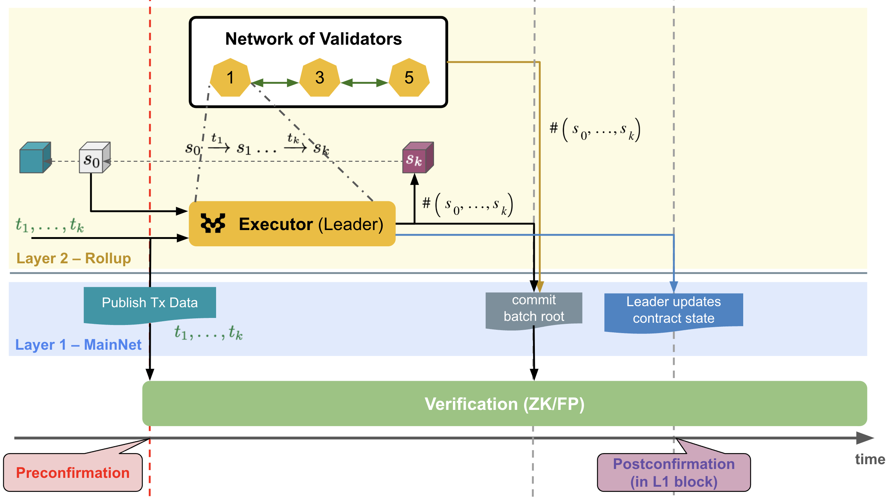

# MIP-\<number\>: FFS-Postconfirmation
- **Description**: L1-confirmation of L2Blocks. A sub-protocol of FFS.
- **Authors**: [Andreas Penzkofer](mailto:andreas.penzkofer@movementlabs.xyz)
<!-- - **Desiderata**: [MIP-\<number\>](../MIP/mip-\<number\>) -->


<!--
  READ MIP-1 BEFORE USING THIS TEMPLATE!

  This is the suggested template for new MIPs. After you have filled in the requisite fields, please delete these comments.

  Note that an MIP number will be assigned by an editor. When opening a pull request to submit your MIP, please use an abbreviated title in the filename, `mip-draft_title_abbrev.md`.

  The title should be 44 characters or less. It should not repeat the MIP number in title, irrespective of the category.

  TODO: Remove this comment before finalizing.
-->

## Abstract

Fast-Finality-Settlement (FFS) is proposed in [MIP-???](), with two confirmation mechanisms. This MIP details the mechanism on Layer 1 (L1), which is called ***postconfirmation***.

At certain intervals validators commit a _sequence of L2Blocks_, which is called ***superBlock***, to L1. The L1 contract will verify if >2/3 of the validators have attested to a given superBlock height. For a given superBlock height the accepter will initiate the process of confirmation on the contract.

This provides an L1-protected guarantee that the superBlock (i.e. a sequence of blocks) is confirmed and correctly executed. This anchoring mechanism increases the security of the L2 as it protects the L2-state against long range attacks and can provide a way to slash validators that have attested against the majority.

<!--
  The Abstract is a multi-sentence (short paragraph) technical summary. This should be a very terse and human-readable version of the specification section. Someone should be able to read only the abstract to get the gist of what this specification does.

  TODO: Remove this comment before finalizing.
-->

#### Definitions

- **superBlock** : a sequence of L2Blocks to which the postconfirmation protocol commits to on L1.
- **accepter**: A specific validator selected for a some interval by using parameters from the L1, with the role to activate the postconfirmation functionality on the L1 contract.


## Motivation

We require from the FFS protocol that it is secure and efficient, yet simple in its _initial_ design. In order for the protocol to fullfill the requirement for simplicity, validators only communicate to the L1-contract and not with each other. This is a key design decision to reduce the complexity of the protocol, but can be improved in the future.

We also request that rewards and costs are made more predictable for validators. For this, we propose a special role -- the accepter -- to perform the postconfirmation process.

<!--
  The motivation section should include a description of any nontrivial problems the MIP solves. It should not describe how the MIP solves those problems.

  TODO: Remove this comment before finalizing.
-->

## Specification

The key words "MUST", "MUST NOT", "REQUIRED", "SHALL", "SHALL NOT", "SHOULD", "SHOULD NOT", "RECOMMENDED", "NOT RECOMMENDED", "MAY", and "OPTIONAL" in this document are to be interpreted as described in RFC 2119 and RFC 8174.

##### Domains - One contract to rule them all

The L1 contract is intended to handle multiple chains. We differentiate between the chains by their unique identifier `domain` (of type `address`).

##### L2Blocks

L2Blocks are deterministically derived from the sequencer-batches, which are called protoBlocks, see the [glossary](../../GLOSSARY.md). Validators calculate the next deterministic transition (imposed through the sequence of transactions $txs$) $B \xrightarrow{\ txs \ } B'$, where $B$ and $B'$ are L2Blocks.

##### superBlock

The postconfirmation protocol cannot attest to each individual L2Block. This restriction derives from the high frequency at which protoBlocks can be created, the low frequency of L1Blocks and the cost of L1 transactions. Therefore, after a certain number of blocks (the _superBlock_), the validators commit individually the hash of this superBlock to the L1-contract. The L1-contract will verify if >2/3 of the validators have attested to the superBlock height.

##### Commitment

Validators commit the hash of the superBlock to the L1-contract. It commits the validator to a certain superBlock with no option for changing their opinion. (This is intentional - validators should not be able to revert).

```solidity
struct BlockRangeCommitment {
  uint256 height;
  bytes32 commitment;
  bytes32 blockRangeId;
}
```

##### Epochs

We require epochs in order to facilitate `staking` and `unstaking` of # validators, as well as rewards and penalties. The `epochDuration` is set when initializing a chain.

There are three relevant epochs names

1. **`presentEpoch`** is the epoch that is currently active on L1 and it determines the current `accepter`.

```solidity
uint256 presentEpoch = getEpochByL1BlockTime();
```

where

```solidity
function getEpochByL1BlockTime(address domain) public view returns (uint256) {
    return block.timestamp / epochDuration;
}
```

2. **`assignedEpoch`**. If a superBlock height is new, the L1-contract will assign the superBlock height to the `presentEpoch`.


```solidity
/// map each block height to an epoch
mapping(uint256 blockHeight => uint256 epoch) public blockRangeHeightToAssignedEpoch;
BlockRangeCommitment memory blockRangeCommitment

if (blockRangeHeightToAssignedEpoch[blockCommitment.height] == 0) {
  blockRangeHeightToAssignedEpoch[blockCommitment.height] = getEpochByL1BlockTime();
}
```


> [!NOTE]
> Note this is susceptible to an attack where the adversary could commit to far in the future blockRanges. However, since no honest attester would attest to it, the rollover function should update to the correct epoch for a given superBlock height.

> !!! . Any validator can commit the hash of a superBlock, the height of the superBlock should not be able to be set too far into the future.
> !!! . TODO leading Block Tolerance. why do we need it? I assume it was meant as a protection against posting too far into the future block-heights but is this really necessary. But what in particular does this protect against. Could this impose a cost on the honest validators or accepter in any way? 

```solidity
if (lastAcceptedBlockHeight + leadingBlockTolerance < blockCommitment.height) revert AttesterAlreadyCommitted();
```

> [!NOTE]
> The validator has to check if the current superBlock height (off-L1) is within the above window otherwise the commitment of the (honest) validator will not be added to the L1 contract. 


3. **`acceptingEpoch`**

Votes are counted in the current `acceptingEpoch`. If there are enough commitments for a `blockRangeId` the superBlock height receives a postconfirmation. 

```solidity
??? relevant code
```

##### Staking and Unstaking

????

##### Rollover

The protocol increases the `acceptingEpoch` incrementally by one, i.e. the protocol progresses from one accepting epoch to the next. Whenever, such an incrementation happens, the stakes of the validators gets adjusted to account for `staking` and `unstaking` events. On the default path the `rolloverEpoch` function is called by the accepter.

This transition is called _Rollover_. A rollover can occur in two types of paths:

1. If the timestamp of a superBlock falls into the next epoch, the protocol progresses to the next epoch.

```solidity
uint256 NextBlockHeight
uint256 NextBlockEpoch = blockRangeHeightToAssignedEpoch[NextBlockHeight];
while (getAcceptingEpoch() < NextBlockEpoch) {
  rollOverEpoch();  // this also increments the acceptingEpoch
}
```

2. If the votes in the current `acceptingEpoch` are not sufficient but there are votes in the subsequent epochs and they are sufficient, the rollover function should be initiated.

> [!NOTE]
> this is a requirement to protect against liveness issues. can this be done? do we have enough information for this, in particular are the stakes known.

##### Accepter

Every interval `accepterTerm` one of the validators takes on the role to accept superBlocks. This accepter is selected via L1-randomness provided through L1Block hashes. This accepter is responsible for updating the contract state once a super-majority is reached for an superBlock. The accepter is rewarded for this service.

The L1-contract determines the current valid `accepter` by considering the current L1Block time (`block.timestamp`) and randomness provided through L1Block hashes. For example,

```solidity
function getCurrentAccepter() public view returns (address) {
  uint256 currentL1BlockHeight = block.number;
  // -1 because we do not want to consider the current block.
  uint256 relevantL1BlockHeight = currentL1BlockHeight - currentL1BlockHeight % accepterTerm - 1 ; 
  bytes32 blockHash = blockhash(relevantL1BlockHeight);
  address[] memory attesters = getAttesters();
  // map the blockhash to the attesters
  uint256 accepterIndex = uint256(blockHash) % attesters.length;
  return attesters[accepterIndex];        
}
```

> [!note]
> If the accepter does not update the contract state for some time, this is negative for the liveness of the protocol. In particular if the `accepterTerm` is in the range for the time that is required for the `leadingBlockTolerance`.


**Liveness**. In order to guarantee liveness the protocol ensures that anyone can voluntarily provide the service of the accepter. However, no reward is being issued for this service.


*Figure 1: Leader-independent (deterministic) block generation process.*


<!--The key words "MUST", "MUST NOT", "REQUIRED", "SHALL", "SHALL NOT", "SHOULD", "SHOULD NOT", "RECOMMENDED", "NOT RECOMMENDED", "MAY", and "OPTIONAL" in this document are to be interpreted as described in RFC 2119 and RFC 8174.-->


## Reference Implementation

<!--
  The Reference Implementation section should include links to and an overview of a minimal implementation that assists in understanding or implementing this specification. The reference implementation is not a replacement for the Specification section, and the proposal should still be understandable without it.

  TODO: Remove this comment before submitting
-->

## Verification

<!--

  All proposals must contain a section that discusses the various aspects of verification pertinent to the introduced changes. This section should address:

  1. **Correctness**: Ensure that the proposed changes behave as expected in all scenarios. Highlight any tests, simulations, or proofs done to validate the correctness of the changes.

  2. **Security Implications**: Address the potential security ramifications of the proposal. This includes discussing security-relevant design decisions, potential vulnerabilities, important discussions, implementation-specific guidance, and pitfalls. Mention any threats, risks, and mitigation strategies associated with the proposal.

  3. **Performance Impacts**: Outline any performance tests conducted and the impact of the proposal on system performance. This could be in terms of speed, resource consumption, or other relevant metrics.

  4. **Validation Procedures**: Describe any procedures, tools, or methodologies used to validate the proposal against its requirements or objectives. 

  5. **Peer Review and Community Feedback**: Highlight any feedback from peer reviews or the community that played a crucial role in refining the verification process or the proposal itself.


  TODO: Remove this comment before submitting
-->

Needs discussion.

---

## Errata
<!--
  Errata should be maintained after publication.

  1. **Transparency and Clarity**: An erratum acknowledges any corrections made post-publication, ensuring that readers are not misled and are always equipped with the most accurate information.

  2. **Accountability**: By noting errors openly, we maintain a high level of responsibility and ownership over our content. It’s an affirmation that we value precision and are ready to correct oversights.

  Each erratum should briefly describe the discrepancy and the correction made, accompanied by a reference to the date and version of the proposal in which the error was identified.

  TODO: Maintain this comment.
-->

---

## Appendix
<!--
  The Appendix should contain an enumerated list of reference materials and notes.

  When referenced elsewhere each appendix should be called out with [A<number>](#A<number>) and should have a matching header.

  TODO: Remove this comment before finalizing.

-->

### A1
Nothing important here.

---
## Copyright

Copyright and related rights waived via [CC0](../LICENSE.md).