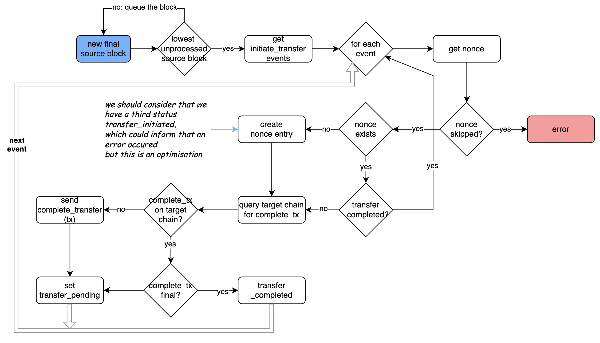
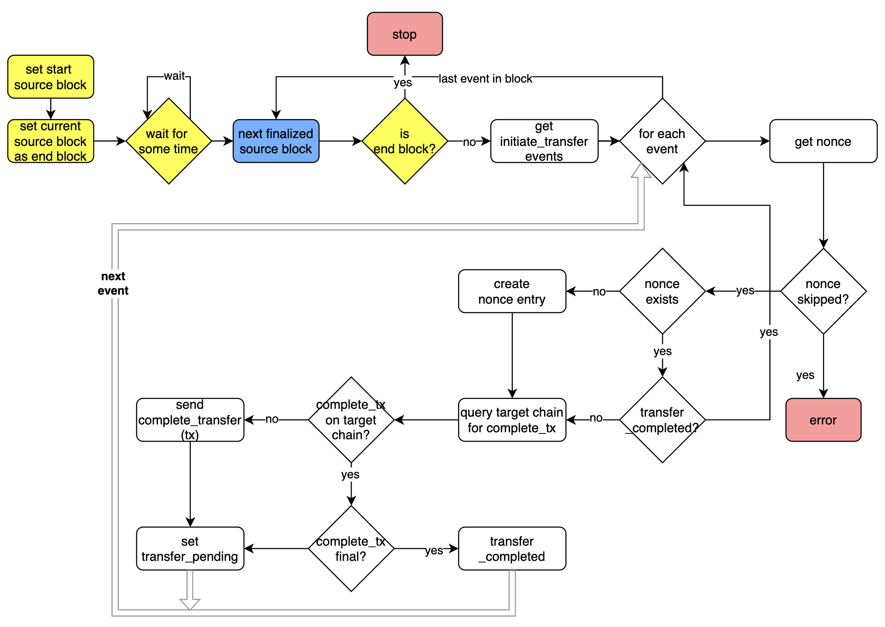

# MIP-\<number\>: Relayer in the lock/mint bridge - Bootstrapping and Rebooting
- **Description**: This MIP describes the reboot algorithm for the relayer in the lock/mint bridge. Furthermore, we must consider that the relayer may loose memory or cannot be restarted. In this case a bootstrap algorithm is required.
- **Authors**: [Andreas Penzkofer](mailto:andreas.penzkofer@movementlabs.xyz), [Phillipe]()

**Reboot algo scenario:**

* get last finalized nonce and saved block number (`finalized_L1nonce`, `L1block`) from persistent storage.
* get current block number `current_L1block` from the chain L1.
* start the event-pulling process at the saved `L1block` block number for the chain L1
* it's the same process as normal pulling but before sending the RelayEvent, the nonce is verified (see later the nonce verification process).
* The verification is done until the process reaches the `current_L1block` block on L1.
*  Set the `last_L1nonce`, the nonce of the last process event before the `current_L1block` block.
* start the normal L1 Event processing (see above)
* start the nonce verification process.
  * Verify all nonce between `finalized_L1nonce` (exclude) and `last_L1nonce` (exclude) :
     *  query L1 contract `L1nonce->L1L2_transfer_id` map and test if the `L1L2_transfer_id` is present.
     *  if not, it means there's an issue. A `L1nonce` before the current `L1nonce` has no transfer: log error.
     *  if yes, verify on L2 that the transfer has been completed. _Rem: This data can be not finalized_.
     *  if not, query the L1 `L1L2_transfer_id` -> `details` map to get the transfer data.
     *  process the missing transfer as a normal transfer.

In this process, L1 and L2 can be rebooted in //.
This algo suppose that the contract's complete transfer function verify that a transfer hasn't been already done because the relayer can call complete_transfer more than one time for the same transfer.

This algo is compatible with using finalized blocks (see the remark on L2 complete verification). By pulling only finalized block, the `finalized_L1nonce` and `last_L1nonce` nonce are always update on finalization so
* only finalized event are processed by the normal pulling event
* only finalized `L1nonce` are verified.

## Describe alternatives you've considered
Use the indexer DB. It creates a dependency to another component. For example, if the postgres db has an issue, the relayer has an issue event if the relayer doesn't need the db to process.
We can use only the nonce and initiate the `last_L1nonce` with it. The difficulty is we are not sure that this value correspond to the current block and the event pulling use block so we can miss an transfer if we don't validate the first block we get correspond to this nonce. That why the algo use only block to update nonce.

## Additional context
This algo is defined using the new Native Bridge protocol with 2 functions call `Initiate_transfer` and `Complete_transfer`.

-----------

> [!WARNING]
> This issue describes a similar approach to #871 and thus it is recommended to discuss at the other issue !

**Is your feature request related to a problem? Please describe.**

The relayer can go offline or crash. It needs to automatically understand from where it should start with sending messages to the target chains, i.e. what is the lowest nonce for which the transfer is not complete.

The relayer MUST ONLY rely on the chains and itself. No other trust assumptions should be utilized.

Several complications:
- Complete-messages to the target chain for bridge transfers may fail, get lost, or other. Hence we cannot rely on delivery. 
- The relayer may loose local memory.
- The relayer may have to be replaced.
- The relayer MUST not forget a single transfer.
- The relayer MUST deliver eventually all transfers.
- The solution MUST consider our finality criterias on L1 `isL1final` and on L2 `isL2final`.

**Describe the solution you'd like**

- The source chain maintains a list (e.g. hash map) of bridgeTransfer identifiers, e.g. `L1L2BridgeTransferIds`.  
- The source chain maintains a list of `L1L2nonces` that increments for every added `L1L2BridgeTransferId`. There is a map with `L1L2nonce` --> `L1L2BridgerTransferId`
- The target chain maintains a list (e.g. hash map) of bridge Transfer identifiers, e.g. `L1L2BriedgeTransferIds`.
- The relayer loads FINAL `L1L2BridgeTransferIds_fromL1` and keeps reading events from L1 to keep the list up to date. I.e. the relayer MUST only consider events that have `isL1final==true`.
- The relayer loads the final `L1L2BridgeTransferIds_fromL2` and keeps reading events from L2 to keep the list up to date. 

To enable restart with a brand new relayer, unaware of any state the following options come to mind:

1. **Start at Genesis**: The relayer has to compare the finalized `L1L2BridgeTransferIds` list from L1 with the submitted (included in a L2block) `L1L2BridgeTransferIds` list from L2 . Start at genesis time of Movement Network.
2. **Start at configurable L2_height**: Do 1) but use a closer date for start, e.g. tnow-2 days.. a bit more risky to miss bridge transfers.
3. **Relayer records checkpoints in regular intervals**: The relayer records in regular interval (e.g. once per 30min) on-L2-chain the highest `L1L2nonce` for which all previous transfers are completed and FINALZED on L2. While the relayer updates on-L2-chain these checkpoints (cheap because not frequent), the relayer finds out off-chain through some efficient algorithm what is the lowest `L1L2nonce` for which every transfer with lower nonce number is completed and finalized.  (This solution has an unresolved problem: Checkout the investigation below)
4. **Trustless but this is unnecessary**: in-contract finding the right nonce: In regular intervals the relayer sends a `bootstrap transaction`. The bootstrap transaction runs an algorithm that checks what is the highest completed and FINALIZED (is this doable?) transfer below which all transfers (`L1L2nonces`) are completed. 

**To be investigated**

- On L2 the relayer SHOULD consider all events, including those that are NOT final. What are the implications of this?
- If L2 reorgs, option 3. above is flawed as the relayer checkpoint update should not pass. Any ideas?

<!--
  READ MIP-1 BEFORE USING THIS TEMPLATE!

  This is the suggested template for new MIPs. After you have filled in the requisite fields, please delete these comments.

  Note that an MIP number will be assigned by an editor. When opening a pull request to submit your MIP, please use an abbreviated title in the filename, `mip-draft_title_abbrev.md`.

  The title should be 44 characters or less. It should not repeat the MIP number in title, irrespective of the category.

  The author should add himself as a code owner in the `.github/CODEOWNERS` file for the MIP.

  TODO: Remove this comment before finalizing.
-->

## Abstract

<!--
  The Abstract is a multi-sentence (short paragraph) technical summary. This should be a very terse and human-readable version of the specification section. Someone should be able to read only the abstract to get the gist of what this specification does.

  TODO: Remove this comment before finalizing.
-->

## Motivation

Currently, when the relayer starts, it doesn't reload the state that it has when it shuts down. If transfers are processed when the relayer stops, the transfers are lost and the relayer is not able to continue the transfer.

Moreover, even if the data would be stored on where to continue, the relayer may crash for a variety of reasons. It needs to automatically understand from where it should start with sending messages to the target chains.

Lastly, we would like to minimize the number of trusted components. In a minimal solution the relayer should only trust the chains and itself. Other trusted sources can be proposed optionally.

<!--
  The motivation section should include a description of any nontrivial problems the MIP solves. It should not describe how the MIP solves those problems.

  TODO: Remove this comment before finalizing.
-->

## Specification

<!--
  The Specification section should describe the syntax and semantics of any new feature. The specification should be detailed enough to allow competing, interoperable implementations.

  It is recommended to follow RFC 2119 and RFC 8170. Do not remove the key word definitions if RFC 2119 and RFC 8170 are followed.

  TODO: Remove this comment before finalizing
-->

The key words "MUST", "MUST NOT", "REQUIRED", "SHALL", "SHALL NOT", "SHOULD", "SHOULD NOT", "RECOMMENDED", "NOT RECOMMENDED", "MAY", and "OPTIONAL" in this document are to be interpreted as described in RFC 2119 and RFC 8174.

In this MIP we consider the lock/mint Native Bridge, see [MIP-60](https://github.com/movementlabsxyz/MIP/pull/60). We will discuss a single direction of transfer - from **source chain** to **target chain**.

!!! . The algorithm is the same in both directions. Hence each algorithm has to be implemented twice. Once for the transfer direction L1 --> L2, and once for the L2 --> L1 direction.

The relayer can get its state from the source chain and target chain. The algo has three parts:

**1. Continuous-Processing**: The relayer pulls transfer events from the source chain and processes them. For each transfer the relayer has to check if the transfer is completed on the target chain, and if not it has to complete the transfer.

**2. Bootstrap:** The relayer initiate the event polling at some point in the past. This point is either the genesis, some configurable source block height, or some checkpoint (possibly on-chain)

#### Continuous-Processing

The relayer manages only one state of transfer: pending, which exists during the time between the reception of the `initiate_transfer` event from the source chain and the success of the `complete_transfer` tx on the target chain.

The Native Bridge protocol MUST implement the assignment on the source chain of an incrementing `nonce`. Since there are two directions there MUST be two counters - one for each direction. The `nonce` is used to order the transfers.

!!! . TODO insert structure example from target chain here

First we describe the processing of source blocks and the completion of a transfer on the target chain, assuming the relayer is always online. Since this is a strong assumption, we reduce this requirement in the next section.

!!! . Only finalized source blocks should be considered. So there is need for implementing a trigger for when a block is finalized.

1. Get non-processed finalized `source_block`.
1. If a block height is missing put the block into a queue. DO NOT process blocks out of order.
1. Get `initiate_transfer` events from the `source_block`.
1. For each `initiate_transfer` event
    1. Get the `nonce`.
    1. If a nonce has been skipped this should not happen and we should report / throw an error.
    1. If nonce already is recorded check the `status_transfer`.
        1. If status transfer is `transfer_completed` check next event / `nonce`.
        1. Else create `nonce` entry locally and query target chain if `complete_transfer` transaction has been submitted.
            1. If `complete_transfer` transaction is on target chain
                1. If the transaction is final, set `transfer_complete` for the status of the `nonce`
                1. Else set status us `transfer_pending`.
            1. Else send `complete_transfer` transaction to target chain and set the status as `transfer_pending`.
1. Set the block height as `block_processed`.

**Procedure to consider error in the above**

This step is potentially optional but should be considered.

Introduce a status `transfer_init` to differentiate a state between nonce creation locally and sending successfully a `complete_transfer` transaction.

### Bootstrap

Next we describe how the reboot algorithm works and differs from the above.

!!! . A node that is rebooting MUST start the [Continuous-Processing](#continuous-processing) algorithm in parallel.

The Algorithm differs from the Continuous-Processing in that it runs in parallel and will catch up with missing transfers eventually. While not hindering the Continuous Operation of the Relayer. It implements a delay to start at the beginning, which conveniently prevents that `complete_transfer` transactions would be sent accidentally twice to the target chain.

1. Start the Continuous-Processing protocol.
1. Set the first processed source block by the Continuous-Processing protocol as `first_continuous_processed_block`.
1. Set `end_source_block = first_continuous_processed_block - 1`
1. Set `start_source_block` according to some input.
1. Wait for some time `wait_time`, e.g. 10 minutes. This is to ensure that all relevant source blocks have arrived. It may be not necessary but it also does not hurt.
1. For each source block between `start_source_block` and `end_source_block` perform the same algorithm as Continuous-Processing (apart from using the next source block height in the loop rather than a new source block)

### Bootstrap input types

**Manual input**
Based on knowledge of when the relayer stopped, we can inject a parameter about the source block height from which the relayer should start to bootstrap.

**Reading from local memory**
In the Continuous-Processing Algorithm the Relayer also records the most recent source block height of `block_processed` in a file. When rebooting the node, the relayer can start from the last point it left.

**Reading from chain**
The relayer records on the source or target chain (whichever is cheaper) the current highest completed source block. This can happen infrequent. A separate algorithm needs to be spelled out which records the highest source block, below which all source blocks with transfers are completed.

## Reference Implementation

<!--
  The Reference Implementation section should include links to and an overview of a minimal implementation that assists in understanding or implementing this specification. The reference implementation is not a replacement for the Specification section, and the proposal should still be understandable without it.

  TODO: Remove this comment before submitting
-->

## Verification

Needs discussion.

---

## Errata

## Appendix
---
## Copyright

Copyright and related rights waived via [CC0](../LICENSE.md).