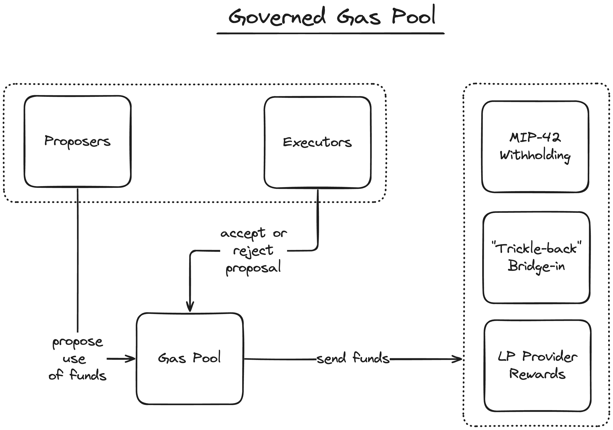

# MIP-42: AB-FFS Governed Gas Pool
- **Description**: Introduces a governed gas pool for AB-FFS which allows for initial period wherein used gas is not recirculated.
- **Authors**: [Liam Monninger](mailto:liam@movementlabs.xyz)
- **Reviewer**: Andreas Penzkofer
- **Desiderata**: [MD-38](https://github.com/movementlabsxyz/MIP/pull/38)

## Abstract
We propose a governed gas pool both as provisional and potentially permanent solution to the supply problem described in [MD-38](https://github.com/movementlabsxyz/MIP/pull/38). This solution consists of depositing funds into a pool on the L2, and holding votes against actions for the recirculation of said funds.

The concept of a governed gas pool can be applied generally to manage migrations between systems. For example, the governed gas pool could be used to transition from the "Trickle-back" mechanism referenced in [MD-38](https://github.com/movementlabsxyz/MIP/pull/38) to [MIP-42](https://github.com/movementlabsxyz/MIP/pull/42), as is used as an example amongst others herein.

## Motivation
The AB-FFS under fixed supply presents several challenges presented in [MD-38](https://github.com/movementlabsxyz/MIP/pull/38). This MIP seeks to address the question of where used gas funds should be deposited with a simple and flexible solution. By simply depositing funds into a pool and holding votes against actions for the recirculation of said funds, we can create a system that can provide a short-term solution to the supply problem and generalize to other systems. 

## Specification

1. Gas used on the L2 MUST be deposited into the Governed Gas Pool.
2. The Governed Gas Pool MUST disperse deposited funds according to a proposal made by Proposers which is enacted by a vote of Executors.
3. The Governed Gas Pool SHOULD define a maximum emissions rate for the pool s.t. the governing body cannot engage in Byzantine or other malicious behavior.

### Proposers and Executors
The Governed Gas Pool will have two roles: Proposers and Executors. Proposers will be able to propose actions for the pool, and Executors will be able to vote on these actions. 

The rationale behind these two separate roles is to encapsulate the decision-making process. This separation of concerns can allow off-chain services which are less-secure to propose actions which do not immediately affect the pool. Executors, who are more secure, can then vote on these actions.

### Actions
1. For simplicity, we suggest that all synchronous and atomic actions performed by the pool SHOULD be formulated as dispersals from the pool into other accounts. 

2. For security, we propose the constraint that all of these dispersals SHOULD be $O(1)$. 

For example, the pool can securely--without risk of gas attack--disperse into [MIP-42](https://github.com/movementlabsxyz/MIP/pull/42) withholdings if said action only involves depositing funds into the account controlling that account. In the case that this action were linear in the size of the approved liquidity providers, for example, gas pool proposals good be subject to gas attacks which would prevent critical actions for recirculating funds to take place at the appropriate time.

3. When considering mechanisms which are not synchronous and atomic, we propose that the Governed Gas Pool SHOULD only be considered responsible for the security of the synchronous and atomic step constituting the initial dispersal. 

For example, the "Trickle-back" mechanism referenced in [MD-38](https://github.com/movementlabsxyz/MIP/pull/38) could be performed with an initial dispersal into the bridge pool. However, the ultimate effect of those funds returning to L1 settlement rewards would not be guaranteed once set dispersal occurs. Thus, when analyzing the security of the "Trickle-back" mechanism, one would consider the actions of the Governed Gas Pool as secure insofar as the dispersal into the bridge pool is secure. The remainder of the mechanism would be considered separately.

### Recommendations for Governance of the Governed Gas Pool
We provide a series of recommendations for the governance of the Governed Gas Pool to account for common phenomena in this system. More detailed proposals, however, such be set forth in MIPs governing a specific Governed Gas Pool implementation.

### Migrating via the Governed Gas Pool
The Governed Gas Pool can be used to manage migrations between systems. For example, the Governed Gas Pool could be used to transition from the "Trickle-back" mechanism referenced in [MD-38](https://github.com/movementlabsxyz/MIP/pull/38) and [MIP-42](https://github.com/movementlabsxyz/MIP/pull/42)

## Reference Implementation

## Verification

## Errata

## Appendix
