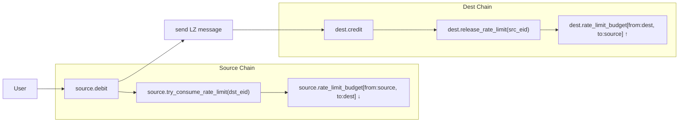
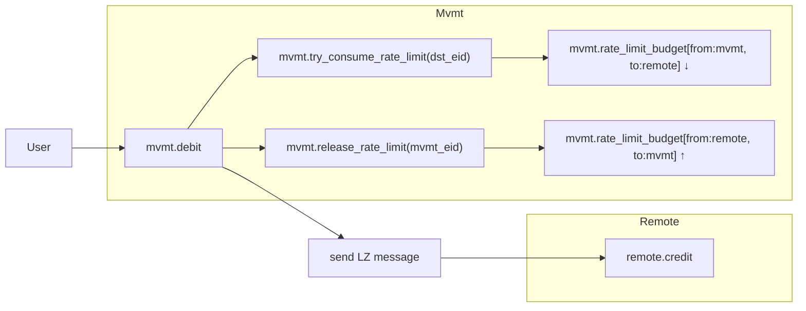
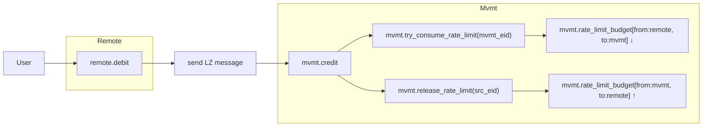
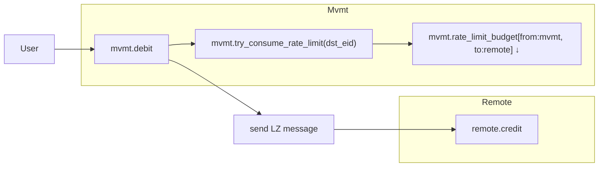
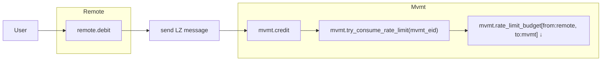

# MIP-X: Non-Offsettable Gross Inflow Rate Limiting

- **Description**: Replace net-flow rate limiting with a strict gross inflow cap on Movement.
- **Authors**: [Primata](), Ru, Andreas
- **Desiderata**: TBD
- **Approval**: <!--Either approved (:white_check_mark:), rejected (:x:), stagnant or withdrawn by the governance body. To be inserted by governance. -->

## Abstract

This proposal modifies Movement's bridge rate limiting to enforce a strict, non-offsettable gross inflow cap. The current baseline uses net-flow accounting where outflows release inflow capacity. This proposal intentionally abandons net-flow semantics to prevent inflow capacity from growing beyond configured limits, regardless of outflow activity.

## Motivation

The current rate limiting implementation tracks net exposure: when funds flow out of Movement, inflow capacity increases proportionally. While this is valid for systems tracking net supply movement, it means the effective inflow cap can exceed the configured limit if significant outflows occur.

The security goal for Movement is to enforce a hard ceiling on gross inflow that cannot be inflated by outflows. This requires abandoning net-flow semantics in favor of consume-only rate limiting. The rate limit resets daily.

## Design Context

Bidirectional offsetting (where outflows release inflow capacity and vice versa) is a feature for systems that track **net exposure** or **net supply movement**. If 100M flows out and 100M flows in, the net change is zero, and the rate limit correctly reflects this.

This proposal **intentionally rejects offsetting** as a design choice. The security goal for Movement is to enforce a **strict, non-offsettable gross inflow cap**. Inflow capacity should not increase just because funds flowed out—even if net exposure remains unchanged.

The alternatives below represent a conscious tradeoff: abandoning net-flow semantics to achieve a hard ceiling on gross inflow.

## Specification

_The key words "MUST", "MUST NOT", "REQUIRED", "SHALL", "SHALL NOT", "SHOULD", "SHOULD NOT", "RECOMMENDED", "NOT RECOMMENDED", "MAY", and "OPTIONAL" in this document are to be interpreted as described in RFC 2119 and RFC 8174._

### Legend

- `mvmt.*` → code executing on Movement
- `remote.*` → code executing on a remote chain (e.g. Ethereum)
- `source.*` / `dest.*` → code executing on the respective chain
- `X.rate_limit_budget[from:Y, to:Z]` → rate limit budget stored on chain X for transfers from Y to Z
- `dst_eid` → destination endpoint id
- `src_eid` → source endpoint id
- `mvmt_eid` → Movement endpoint id
- ↓ consume capacity
- ↑ release capacity

---

### BASELINE (Current Production)

**Rule (applies symmetrically on all chains)**

- `source.debit`: `source.try_consume_rate_limit(dst_eid)`
- `dest.credit`: `dest.release_rate_limit(src_eid)`

Each chain enforces only its own local rate limits.



**Baseline Behavior: Net-flow accounting via bidirectional offsetting**

```text
Mvmt → Remote:
  mvmt.rate_limit_budget[from:mvmt, to:remote] ↓
  remote.rate_limit_budget[from:remote, to:mvmt] ↑

Remote → Mvmt:
  remote.rate_limit_budget[from:remote, to:mvmt] ↓
  mvmt.rate_limit_budget[from:mvmt, to:remote] ↑
```

Outgoing flow creates incoming capacity and vice versa. This is correct net-flow accounting, but it means Movement inflow caps can grow beyond the configured limit if outflows occur.

---

### ALTERNATIVE 1 (Mvmt-Centric, Supply-Coupled)

**Idea**

- Remove rate limiters from foreign chains entirely
- All rate limiting happens on Movement
- Outflows release Movement inflow capacity (supply-coupled)

**Rule (Movement only)**

- `mvmt.debit`: `mvmt.try_consume_rate_limit(dst_eid)` + `mvmt.release_rate_limit(mvmt_eid)`
- `mvmt.credit`: `mvmt.try_consume_rate_limit(mvmt_eid)` + `mvmt.release_rate_limit(src_eid)`

**Mvmt → Remote (Outgoing)**



**Remote → Mvmt (Incoming)**



**Behavior: Bidirectional offsetting preserved**

```text
Mvmt → Remote:
  mvmt.rate_limit_budget[from:mvmt, to:remote] ↓
  mvmt.rate_limit_budget[from:remote, to:mvmt] ↑    ← outflow increases inflow capacity

Remote → Mvmt:
  mvmt.rate_limit_budget[from:remote, to:mvmt] ↓
  mvmt.rate_limit_budget[from:mvmt, to:remote] ↑  ← inflow increases outflow capacity
```

If 100M flows out and 100M flows in, both limits return to their original values. This is valid net-flow accounting, but incompatible with the goal of a strict gross inflow cap.

Alternative 1 preserves net-flow semantics, which are incompatible with the desired non-offsettable inflow limit.

---

### ALTERNATIVE 2 (Mvmt-Centric, No Releases)

**Idea**

- Same as Alternative 1, but remove all `release_rate_limit` calls
- Only consume capacity, never release
- Outflows cannot increase inflow capacity

**Rule (Movement only)**

- `mvmt.debit`: `mvmt.try_consume_rate_limit(dst_eid)` only
- `mvmt.credit`: `mvmt.try_consume_rate_limit(mvmt_eid)` only

**Mvmt → Remote (Outgoing)**



**Remote → Mvmt (Incoming)**



**Behavior: No bidirectional offsetting (gross inflow cap enforced)**

```text
Mvmt → Remote:
  mvmt.rate_limit_budget[from:mvmt, to:remote] ↓
  (no release)

Remote → Mvmt:
  mvmt.rate_limit_budget[from:remote, to:mvmt] ↓
  (no release)
```

Limits only decrease. Capacity replenishes daily (rate limit resets), not through offsetting flows.

**Where Rate Limits Live**

| Flow Direction | Enforced On | Storage |
|---------------|------------|---------|
| Remote → Mvmt | Mvmt | `mvmt.rate_limit_budget[from:remote, to:mvmt]` |
| Mvmt → Remote | Mvmt | `mvmt.rate_limit_budget[from:mvmt, to:remote]` |
| Cross-offset | ❌ | ❌ |

**Security Invariant**

```text
For all time t:
  total_inflow_to_mvmt(t) ≤ mvmt.rate_limit_budget[from:remote, to:mvmt]
```

---

### Summary

**Baseline:**
- Mvmt→Remote: `mvmt.rate_limit_budget[from:mvmt, to:remote] ↓`, `remote.rate_limit_budget[from:remote, to:mvmt] ↑`
- Remote→Mvmt: `remote.rate_limit_budget[from:remote, to:mvmt] ↓`, `mvmt.rate_limit_budget[from:mvmt, to:remote] ↑`
- Behavior: Net-flow accounting with offsetting across chains. Valid, but incompatible with gross inflow cap goal.

**Alternative 1:**
- Mvmt→Remote: `mvmt.rate_limit_budget[from:mvmt, to:remote] ↓`, `mvmt.rate_limit_budget[from:remote, to:mvmt] ↑`
- Remote→Mvmt: `mvmt.rate_limit_budget[from:remote, to:mvmt] ↓`, `mvmt.rate_limit_budget[from:mvmt, to:remote] ↑`
- Behavior: All on Mvmt, but preserves net-flow semantics. Still incompatible with gross inflow cap goal.

**Alternative 2:**
- Mvmt→Remote: `mvmt.rate_limit_budget[from:mvmt, to:remote] ↓`
- Remote→Mvmt: `mvmt.rate_limit_budget[from:remote, to:mvmt] ↓`
- Behavior: All on Mvmt, no releases, no offsetting. Enforces strict gross inflow cap.

## Changelog

<!--
  The Changelog should be maintained after publication.

  The format should be as follows:
  - **YYYY-MM-DD**: Description of change. [PR#](link-to-PR)

-->
