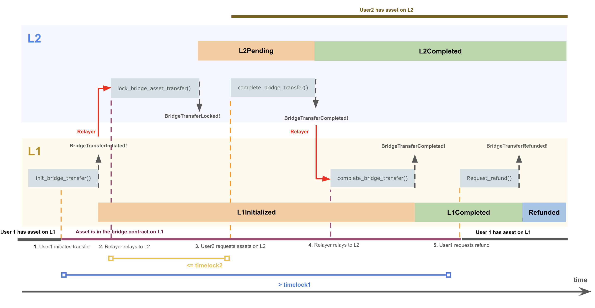

# MIP-\<number\>: MOVE Token -- Bridge Design

- **Description**: Architecture of the bridge for Move token.
- **Authors**: [Franck Cassez](mailto:franck.cassez@movementlabs.xyz)
- **Desiderata**: [MIP-\<number\>](../MIP/mip-\<number\>)

## Abstract

This MIP describes the high-level architecture of the MOVE token bridge. The architecture describes the main bridge components and high-level requirements.

## Definitions

- `$MOVE` (or `$L1MOVE`) : ERC-20 type token with the source contract on L1
- `$wMOVE` (or `$L2MOVE`) : wrapped `$MOVE` token that has been bridged from L1 to L2. Publicly may also be called `$MOVE` but as this causes confusion, here we stick to `$L2MOVE` to make clear this token lives on L2.

## Motivation

The Movement chain (L2) uses the `$L2MOVE` token to pay for gas fees. As a result users need to hold `$L2MOVE` tokens to pay for their transactions.
The _native_ `$L1MOVE` token is an ERC-20 contract on Ethereum (L1).  By native, we mean that this is the location where the token is minted and burned and where the total supply is set and possibly modified (inflation/deflation). The `$L1MOVE` token reserve is in the L1 contract.

To use the Movement chain and pay for gas fees, a user will acquire `$L1MOVE` (native) tokens on L1, lock them on L1 and bridge them to L2, where an equivalent amount of `$L2MOVE` is created. On the L2 users can use the `$L2MOVE` token to pay for gas fees or use it with any other dApp that transact the `$L2MOVE` token.
A user can choose to migrate their `$L2MOVE` tokens back to the L1 at any time.
Cross-chain transfers are usually done through a bridge.

### A standard bridge architecture

The process of transferring tokens across different chains is implemented with a _bridge_ (between the chains).

There are several choices for the architecture of a bridge, and we describe here a classical bridge with a  _lock-mint_ protocol (see Chainlink's [What Is a Cross-Chain Bridge?](https://chain.link/education-hub/cross-chain-bridge) for a quick introduction to types of bridges).

> [!WARNING]  
> The transfer of tokens is one-to-one: a user locks $k$ `$L1MOVE` tokens on L1, they bridge them to L2, and they receive $k$ L2`$L2MOVE` tokens. The same one-to-one ratio applies from L2 to L1.  The bridge does not allow for _swapping_ tokens.

**Lock-Mint**. The main idea of the _lock-mint_ protocol is as follows. For the sake of simplicity, assume the two chains (L1 and L2) have only one user and the user has an account `l1acc` on L1, and another account `l2acc` on L2.  We also assume that each transfer is for one token.

If the user wants to bridge one `$L1MOVE` to L2, then

- they _lock_ (one) `$L1MOVE` into a (escrow) contract `L1SideBridge` on the L1 side. To do so they transfer (one) `$L1MOVE` from `l1acc` to the `L1SideBridge` contract;
- once the contract `L1SideBridge` receives the `$L1MOVE` it emits a corresponding event `FundReceivedFrom(l1acc)` to the L1 (append-only) logs,
- a _relayer_ monitors the logs on the L1 side, and when they see the `FundReceived(l1acc)` event, they send a transaction to an L2 contract, `L2SideBridge` asking the contract to mint (one)  `$L2MOVE`,
- the user requests the transfer of the newly minted `$L2MOVE` to their account `l2acc` on L2.

**Burn-Release**. The transfer from L2 to L1 is similar:

- the user transfers (one) `$L2MOVE` to the `L2SideBridge` contract. The `L2SideBridge` burns (destroys) the token and emits an event
`TokenBurned(l2acc)` to the L2 (append-only) logs,
- a relayer monitors the L2 logs and when they see the event `TokenBurned(l2acc)`, they send a transaction to the L1 contract `L1SideBridge` to _unlock_ an `$L1MOVE` token for account `l1acc`,
- the user (on L1)  requests transfer of one `$L1MOVE` from the  `L1SideBridge` to their account on L1,   `l1acc`.

This protocol can be implemented with three main components:

- a contract on the L1 side,
- a contract on the L2 side,
- a relayer.

### Attacks on bridges

As can be seen the protocol above has distinct phases, and many things can go wrong. For example

- **User becomes unable to retrieve funds**. The user locks their funds in the L1 contract, but the relayer never issues the minting transaction. In that case the user may never be able to retrieve their funds. What we want is some _atomicity_ between the steps: if the user locks their funds, then either the corresponding minting transaction occurs, or if it does not (and we may set a time bound), the funds are returned to the user on L1.
- **Crediting the wrong user**. Another source of difficulty is to make sure that only the user `l2acc` can redeem the wrapped `$L2MOVE` tokens. i.e. they are not credited to another user.

Many of the possibly issues have been thoroughly studied and bridges have been in operation for several years. However hacks related to bridges account for more than 1/3 of the total hacks value which tends to indicate that bridges are vulnerable, frequently attacked, and should be designed carefully. Infamous attacks are two Ronin bridge attacks and a Nomad bridge attack

- [2022: Crypto Hackers Exploit Ronin Network for $615 Million](https://www.bankinfosecurity.com/crypto-hackers-exploit-ronin-network-for-615-million-a-18810) 
- [2024: Ronin Bridge Paused, Restarted After $12M Drained in Whitehat Hack](https://www.coindesk.com/tech/2024/08/06/ronin-bridge-paused-after-9m-drained-in-apparent-whitehat-hack/)
- [August 2022: Hack Analysis: Nomad Bridge ($192M)](https://medium.com/immunefi/hack-analysis-nomad-bridge-august-2022-5aa63d53814a)

Some solutions [XChainWatcher](https://arxiv.org/abs/2410.02029) rely on monitoring bridges and detect attacks.

Designing a safe bridge is a hard problem.

## Specification

<!--

  The Specification section should describe the syntax and semantics of any new feature. The specification should be detailed enough to allow competing, interoperable implementations.

  It is recommended to follow RFC 2119 and RFC 8170. Do not remove the key word definitions if RFC 2119 and RFC 8170 are followed.

  TODO: Remove this comment before finalizing
-->

The key words "MUST", "MUST NOT", "REQUIRED", "SHALL", "SHALL NOT", "SHOULD", "SHOULD NOT", "RECOMMENDED", "NOT RECOMMENDED", "MAY", and "OPTIONAL" in this document are to be interpreted as described in RFC 2119 and RFC 8174.

## Reference Implementation

### Bridging from L1 to L2

The contracts involved are:

- Solidity contract [AtomicBridgeInitiatorMOVE.sol](https://github.com/movementlabsxyz/movement/blob/main/protocol-units/bridge/contracts/src/AtomicBridgeInitiatorMOVE.sol) on L1.
- Move Module [atomic_bridge_counterparty.move](https://github.com/movementlabsxyz/aptos-core/blob/061155119258caab512aec6aa860b086e5f312e0/aptos-move/framework/aptos-framework/sources/atomic_bridge.move#L1163) on L2.

The current implementation is a _lock-mint_ bridge. The user locks their `$L1MOVE` tokens in the `AtomicBridgeInitiatorMOVE` contract, and the `atomic_bridge_counterparty.move` module mints the corresponding `$L2MOVE` tokens.

An overview of the _happy_ path for normal operation is as follows:

> [!WARNING]
If the value of the parameter `timeLockL2` is larger than `timeLockL1`, the following scenario can happen:

- the `completeBridgeTransfer` tx completes on L2 and funds are transferred to the target address on L2,
- the relayer does not relay the event fast enough,
- the user on L1 asks for a refund, and the `refund` tx is executed on L1.

User gets funds on L2, and gets their fund back on L1.

<!--
  The Reference Implementation section should include links to and an overview of a minimal implementation that assists in understanding or implementing this specification. The reference implementation is not a replacement for the Specification section, and the proposal should still be understandable without it.

  TODO: Remove this comment before submitting
-->

## Verification

<!--

  All proposals must contain a section that discusses the various aspects of verification pertinent to the introduced changes. This section should address:

  1. **Correctness**: Ensure that the proposed changes behave as expected in all scenarios. Highlight any tests, simulations, or proofs done to validate the correctness of the changes.

  2. **Security Implications**: Address the potential security ramifications of the proposal. This includes discussing security-relevant design decisions, potential vulnerabilities, important discussions, implementation-specific guidance, and pitfalls. Mention any threats, risks, and mitigation strategies associated with the proposal.

  3. **Performance Impacts**: Outline any performance tests conducted and the impact of the proposal on system performance. This could be in terms of speed, resource consumption, or other relevant metrics.

  4. **Validation Procedures**: Describe any procedures, tools, or methodologies used to validate the proposal against its requirements or objectives. 

  5. **Peer Review and Community Feedback**: Highlight any feedback from peer reviews or the community that played a crucial role in refining the verification process or the proposal itself.

  TODO: Remove this comment before submitting
-->

Needs discussion.

---

## Errata
<!--
  Errata should be maintained after publication.

  1. **Transparency and Clarity**: An erratum acknowledges any corrections made post-publication, ensuring that readers are not misled and are always equipped with the most accurate information.

  2. **Accountability**: By noting errors openly, we maintain a high level of responsibility and ownership over our content. It’s an affirmation that we value precision and are ready to correct oversights.

  Each erratum should briefly describe the discrepancy and the correction made, accompanied by a reference to the date and version of the proposal in which the error was identified.

  TODO: Maintain this comment.
-->

---

## Appendix
<!--
  The Appendix should contain an enumerated list of reference materials and notes.

  When referenced elsewhere each appendix should be called out with [A<number>](#A<number>) and should have a matching header.

  TODO: Remove this comment before finalizing.

-->

### A1

Nothing important here.

---

## Copyright

Copyright and related rights waived via [CC0](../LICENSE.md).
